<p align="center">
  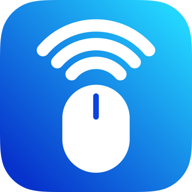
</p>

<h1 align="center">Air Control</h1>

<p align="center">
  <strong>Your iPhone. Now a trackpad for your Mac.</strong><br>
  Also an air mouse, keyboard and presenter remote, all over your own Wi‑Fi.
</p>

<p align="center">
  <a href="https://www.devashish.cc/air-control">Website</a> ·
  <a href="https://github.com/devashish2531/air-control/releases/latest">Download for Mac</a> ·
  <a href="https://github.com/devashish2531/air-control/issues/new?title=iOS+waitlist&body=Please+let+me+know+when+the+Air+Control+iPhone+app+is+available+for+testing.">iPhone waitlist</a> ·
  <a href="docs/protocol.md">Protocol</a> ·
  <a href="SECURITY.md">Security</a>
</p>

<p align="center">
  <a href="https://github.com/devashish2531/air-control/actions/workflows/ci.yml"></a>
  <a href="https://github.com/devashish2531/air-control/actions/workflows/site.yml"></a>
  <a href="LICENSE"></a>
  
  
  
</p>

Air Control turns your iPhone or iPad into a trackpad, air mouse, keyboard and presenter
remote for your Mac. It is free, open source, and never leaves your local network: no relay,
no cloud, no account, no telemetry.

> **Naming.** The public product is **Air Control**. The source tree, bundle identifiers
> (`com.airmouse.*`) and internal docs still use the working name *Air Mouse*; a rename pass
> is tracked in [`docs/00-decisions.md`](docs/00-decisions.md) (Addendum F1).

---

## A look inside

Every mode, in light and dark. Screenshots from the iPhone app.

| Touchpad | Air Mouse | Keyboard |
| :---: | :---: | :---: |
| 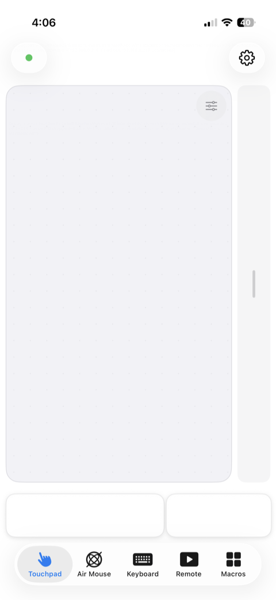 |  | 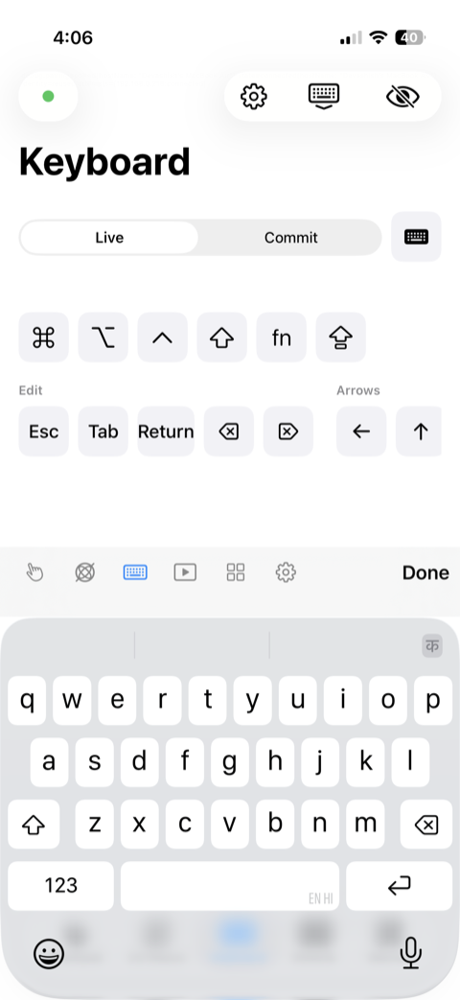 |
| 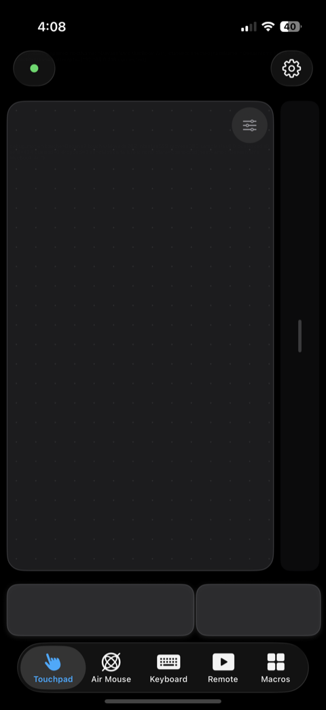 |  | 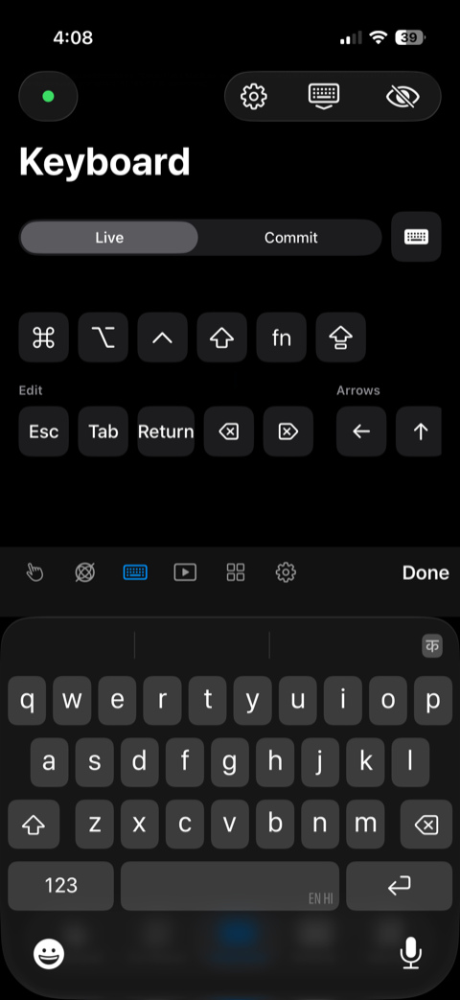 |

| Remote | Macros | Settings |
| :---: | :---: | :---: |
| 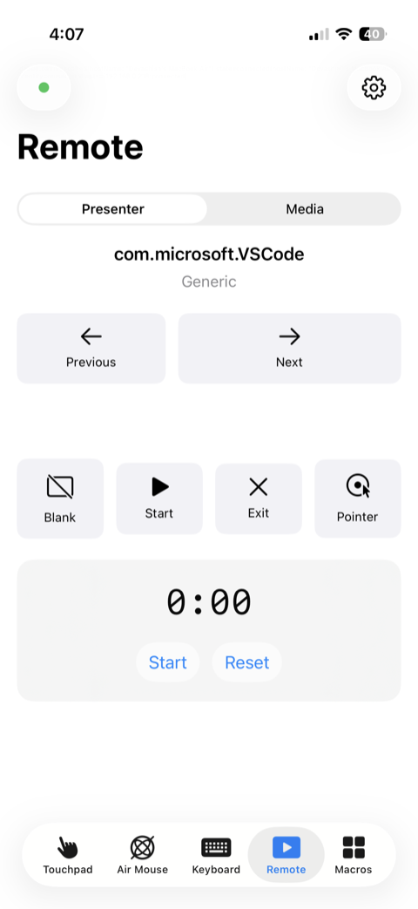 | 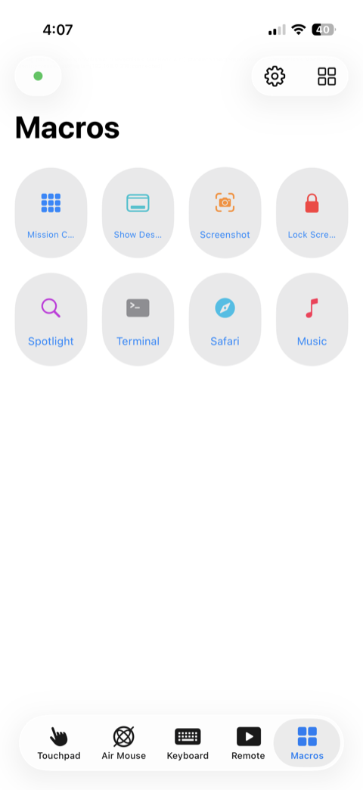 | 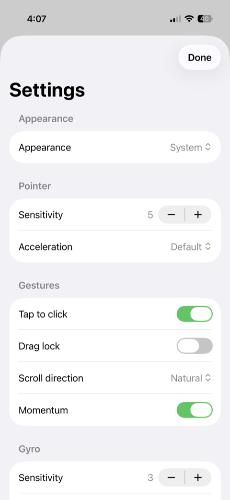 |
| 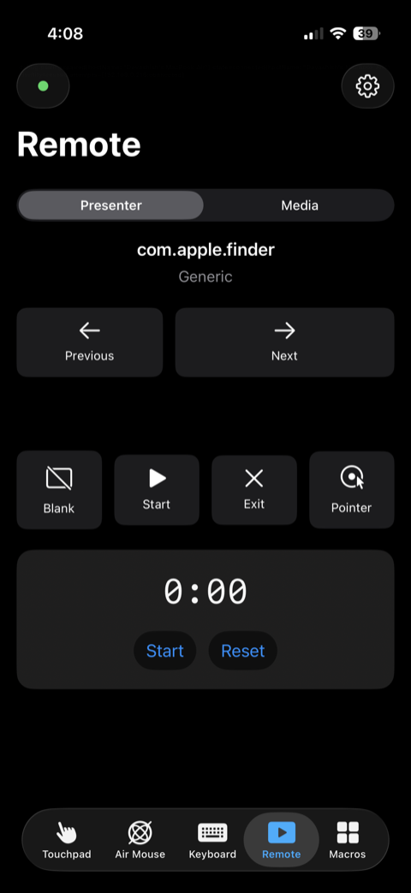 | 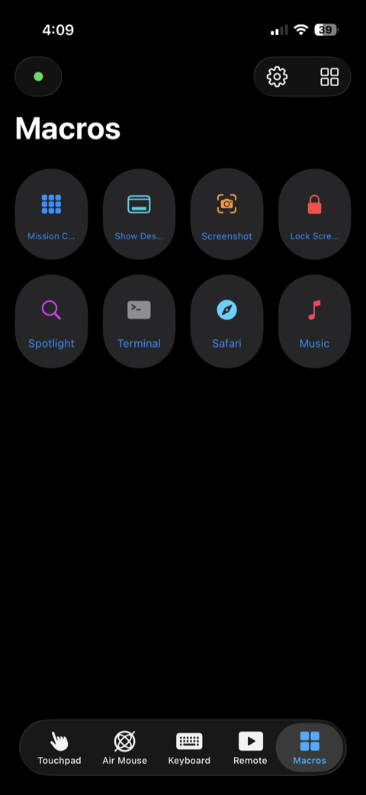 | 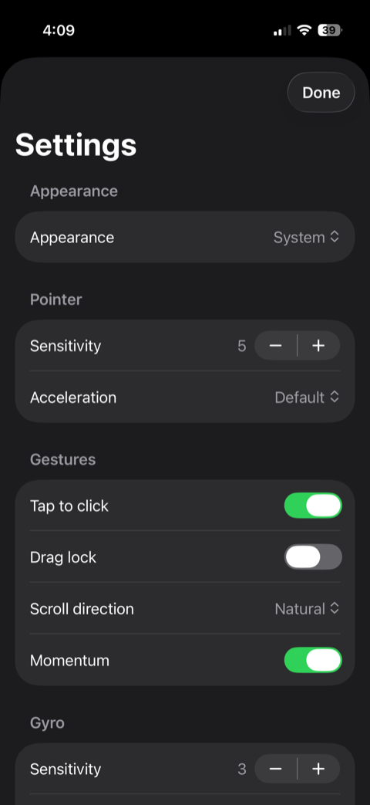 |

## What it does

| Mode | In one line |
| --- | --- |
| **Touchpad** | Slide to move the cursor, tap to click, two-finger scroll with momentum, pinch to zoom, three-finger swipes for Mission Control. |
| **Air Mouse** | Point the phone and the cursor follows. Gyroscope and accelerometer fusion with drift correction and a clutch button that holds the pointer still while you gesture. |
| **Keyboard** | Type straight into whatever app is frontmost on the Mac, with modifier chords, arrow and function keys, and a dedicated row for ⌘ ⌥ ⌃ ⇧. |
| **Presenter & media remote** | Big next, previous and blank-screen buttons you can hit without looking, plus volume, play-pause and track skip. |
| **Macros** | Define buttons on the Mac, such as a key combo, an app to launch or a Shortcut to run, and they appear as a one-tap deck on the phone. Scripts stay behind an explicit opt-in. |
| **iPad layout** | Landscape iPad shows an oversized touchpad beside a persistent keyboard and shortcut bar, and passes an attached hardware keyboard straight through. |

Everything is in the box. Nothing sits behind a subscription, an account or an upgrade prompt.

## How it works

1. **Install the Mac helper.** A small menu-bar app. Grant it Accessibility once, its only permission, and it starts at login and stays out of the way.
2. **Scan the QR code.** The helper shows a QR code carrying its address, its certificate fingerprint and a one-time secret that expires in 60 seconds.
3. **Take control.** The phone lands on the touchpad and reconnects on its own from then on.

The project measures itself against a design target of **under 20 ms** end-to-end motion
latency on 5 GHz Wi‑Fi. That is a target, not a guarantee: your router and your distance from
it get a vote. The app ships a latency HUD so you can see the real number on your own network.

## Requirements

| | Minimum |
| --- | --- |
| Mac | macOS 15 Sequoia |
| iPhone / iPad | iOS 18 / iPadOS 18 |
| Network | Both devices on the same Wi‑Fi, or the Mac joined to the phone's hotspot. No internet needed. |

Bluetooth is not used. iOS does not let an app act as a Bluetooth HID peripheral, and Wi‑Fi
is considerably faster anyway.

## Get Air Control

**Mac.** Download the latest release from
[GitHub Releases](https://github.com/devashish2531/air-control/releases/latest), open the
`.dmg`, and drag `AirMouseHelper.app` to Applications. A Homebrew cask
(`brew install --cask devashish2531/tap/air-control`) is planned; the cask definition lives
in [`Formula/Casks`](Formula/Casks) and the tap is not published yet.

**iPhone and iPad.** Not on the App Store yet.
[Join the waitlist](https://github.com/devashish2531/air-control/issues/new?title=iOS+waitlist&body=Please+let+me+know+when+the+Air+Control+iPhone+app+is+available+for+testing.)
to hear when it ships, or build it from source (below) and install it on your own device with
Xcode.

## Privacy and security

Built like it has to earn your trust.

- **Local Wi‑Fi only.** The phone talks to your Mac directly. There is no relay, no cloud,
  no server in the middle, and nothing to sign in to.
- **Mutual TLS 1.3.** Both ends hold their own self-signed P-256 identity and each verifies
  the other's certificate, pinned by the SHA-256 fingerprint exchanged in the pairing QR
  code. There is no certificate authority and no "trust any device" mode.
- **Authenticated encryption on every motion packet.** The low-latency UDP path uses
  ChaCha20-Poly1305 with per-session keys derived via HKDF and a sliding replay window, so a
  LAN attacker can neither read nor inject pointer or keyboard input.
- **One-time pairing.** The QR secret is valid for 60 seconds and used exactly once. Only
  paired devices are accepted, and you can revoke a device from either end.
- **One permission: Accessibility.** The helper never requests Input Monitoring or Screen
  Recording, so it cannot read your keystrokes or see your screen.
- **Zero telemetry.** Nothing is collected, counted or phoned home. The latency HUD and the
  diagnostics export exist for you.

The full threat model is in [`SECURITY.md`](SECURITY.md) and
[`docs/03-specifications.md`](docs/03-specifications.md) §7. Please report vulnerabilities
through the process in `SECURITY.md`.

---

## For engineers

Native Swift on both ends. No Electron, no web views.

### Stack

| | |
| --- | --- |
| Language | Swift 6, strict concurrency on, actors and `Sendable` value types throughout |
| UI | SwiftUI on iOS, iPadOS and macOS |
| Crypto | CryptoKit (P-256 identities, HKDF, ChaCha20-Poly1305), [swift-certificates](https://github.com/apple/swift-certificates) for X.509 |
| Transport | Network.framework: TLS 1.3 control channel plus an authenticated UDP motion path |
| Motion | CoreMotion sensor fusion for air-mouse mode |
| Tests | Swift Testing with golden vectors under `Tests/*/Vectors/*.json` |
| Tooling | XcodeGen for the app projects, `swift-argument-parser` for the CLI, a Makefile for every loop |
| Website | Next.js static export in [`site/`](site), deployed to GitHub Pages by [`site.yml`](.github/workflows/site.yml) |

### Architecture

```
Packages/AirMouseKit/            SwiftPM kit, layered strictly bottom-up:
  AirMouseProtocol               wire format, byte layouts, constants (Foundation only)
  AirMouseCrypto                 identities, pairing, TLS + packet encryption
  AirMouseFilters                sensor fusion, smoothing, acceleration curves
  AirMouseCore                   session state machines, macros, diagnostics (never imports Network)
  airmouse-cli                   headless client/host for tests and debugging
apps/AirMouse-iOS/               SwiftUI app: Touchpad, Air Mouse, Keyboard, Remote, Macros
apps/AirMouse-Mac/               menu-bar helper: pairing window, input posting, macro host
site/                            landing page (Next.js, static export)
docs/                            decisions, requirements, research, spec, architecture, plan
```

Only the CLI and the two apps import Network.framework; the kit stays platform-agnostic so
the protocol and crypto are testable without a device. Module boundaries, threading and every
architecture decision record are in [`docs/04-architecture.md`](docs/04-architecture.md).
The wire protocol, byte layouts and state machines are in
[`docs/03-specifications.md`](docs/03-specifications.md), with a shorter contributor-facing
extract in [`docs/protocol.md`](docs/protocol.md) for anyone implementing a client or host.

### Build and test

Requires Xcode 26 and macOS 15. No `sudo`, no `xcode-select`.

```sh
scripts/bootstrap.sh   # fetches XcodeGen into tools/bin
make gen               # regenerate the .xcodeproj files (git-ignored)
make kit-test          # fastest loop: the SwiftPM kit's Swift Testing suites
make ios-build         # iOS app, simulator, unsigned
make mac-build         # Mac helper, unsigned
make build             # all three
make test              # kit + app test bundles
make mac-run           # build and launch the helper
```

There are no code-signing identities in CI; builds run with `CODE_SIGNING_ALLOWED=NO`. For
on-device testing add your team to the git-ignored `Config/Local.xcconfig`.

### Website

```sh
cd site
npm install
npm run dev            # http://localhost:3000
npm run build          # static export to site/out
```

Every push to `main` that touches `site/` builds the export with the `/air-control` base path
and publishes it to GitHub Pages. Details in [`site/README.md`](site/README.md).

### Repository map

| Path | What lives there |
| --- | --- |
| [`docs/00-decisions.md`](docs/00-decisions.md) | Fixed decisions and addenda. Read first; it overrides everything else. |
| [`docs/01-requirements.md`](docs/01-requirements.md) | Product requirements per mode. |
| [`docs/02-technical-research.md`](docs/02-technical-research.md) | Platform constraints and research notes. |
| [`docs/03-specifications.md`](docs/03-specifications.md) | Wire protocol, byte layouts, state machines, constants, security spec. |
| [`docs/04-architecture.md`](docs/04-architecture.md) | Module boundaries, threading, build and release architecture, ADRs. |
| [`docs/05-plan.md`](docs/05-plan.md) | Milestone roadmap. |
| [`docs/07-landing-page.md`](docs/07-landing-page.md) | Landing page design and deployment notes. |
| [`CHANGELOG.md`](CHANGELOG.md) | Release history. |

## Project status

Air Control is in active development. The Mac helper and the iOS app pair and work on real
devices today; there is no App Store listing yet and releases are pre-1.0. Follow
[`docs/05-plan.md`](docs/05-plan.md) for the roadmap, or pick up a
[good first issue](docs/ISSUES-initial.md).

## Contributing

See [`CONTRIBUTING.md`](CONTRIBUTING.md) for local setup, how to add a message type or macro
action, and the PR checklist. Please also read the
[`CODE_OF_CONDUCT.md`](CODE_OF_CONDUCT.md).

## License

[MIT](LICENSE).

Air Control is an independent open-source project and is not affiliated with, endorsed by, or
sponsored by Apple Inc. Apple, iPhone, iPad, Mac, macOS, Swift and SwiftUI are trademarks of
Apple Inc.
