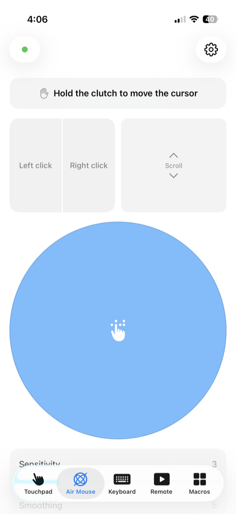
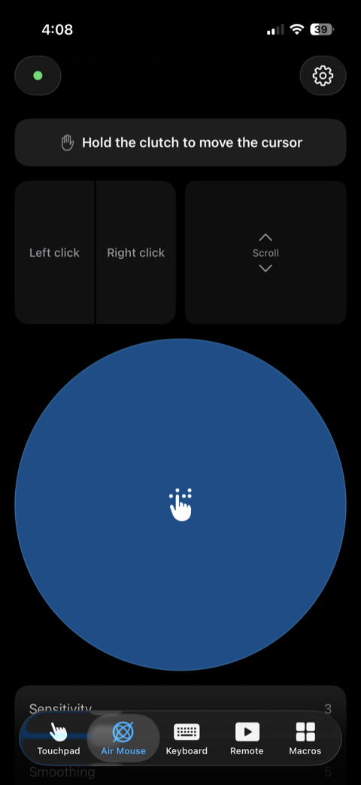

<p align="center">
  
</p>

<h1 align="center">Air Control</h1>

<p align="center">
  <strong>Turn your iPhone into a trackpad, air pointer, keyboard and remote for your Mac.</strong>
</p>

<p align="center">
  Free and open source · Local Wi‑Fi only · No accounts
</p>

<p align="center">
  <a href="https://github.com/devashish2531/air-control/actions/workflows/ci.yml"></a>
  <a href="LICENSE"></a>
</p>

<p align="center">
  <a href="https://devashish2531.github.io/air-control/">Landing page</a> ·
  <a href="https://github.com/devashish2531/air-control/releases/latest">Download for Mac</a> ·
  <a href="https://github.com/devashish2531/air-control/issues/new?title=iOS+waitlist&body=Please+let+me+know+when+the+Air+Control+iPhone+app+is+available+for+testing.">iPhone waitlist</a> ·
  <a href="docs/protocol.md">Protocol</a> ·
  <a href="SECURITY.md">Security</a>
</p>

> The landing page link goes live once the repository owner enables GitHub Pages
> (Settings → Pages → Build and deployment → Source: **GitHub Actions**).

Air Control turns your iPhone or iPad into a trackpad, air pointer, keyboard and presenter
remote for your Mac. It's free, open source, and it never leaves your local Wi‑Fi network:
no relay, no cloud, no account, no telemetry.

---

## What it does

| Mode | In one line |
| --- | --- |
| **Touchpad** | Slide to move the cursor, tap to click, two-finger scroll, pinch to zoom, and three-finger swipes for Mission Control. |
| **Air Pointer** | Point the phone and the cursor follows. Gyroscope and accelerometer fusion with drift correction and a clutch button hold the pointer still while you gesture. |
| **Keyboard** | Types straight into whatever app is frontmost, with modifier chords, arrow and function keys, and a dedicated row for ⌘ ⌥ ⌃ ⇧. |
| **Presenter & media remote** | Large next, previous and blank-screen buttons you can hit without looking, plus volume, play-pause and track skip. |
| **Macros** | Define a key combo, an app or a Shortcut on the Mac, and it appears as a button on the phone. Scripts stay behind an explicit opt-in. |
| **iPad layout** | An oversized touchpad plus a persistent keyboard and shortcut bar in landscape, with hardware keyboard pass-through. |

## Screenshots

Every mode, in light and dark.

<table>
<tr><th align="center">Touchpad</th></tr>
<tr><td align="center">
  
  
</td></tr>
<tr><td align="center">Slide. Tap. Scroll. Pinch.</td></tr>

<tr><th align="center">Air Pointer</th></tr>
<tr><td align="center">
  
  
</td></tr>
<tr><td align="center">Point the phone. The cursor follows.</td></tr>

<tr><th align="center">Keyboard</th></tr>
<tr><td align="center">
  
  
</td></tr>
<tr><td align="center">Type from the couch.</td></tr>

<tr><th align="center">Remote</th></tr>
<tr><td align="center">
  
  
</td></tr>
<tr><td align="center">Next slide, without looking.</td></tr>

<tr><th align="center">Macros</th></tr>
<tr><td align="center">
  
  
</td></tr>
<tr><td align="center">Your shortcuts, as buttons.</td></tr>

<tr><th align="center">Settings</th></tr>
<tr><td align="center">
  
  
</td></tr>
<tr><td align="center">Every mode, in light or dark.</td></tr>
</table>

The Mac app screenshot is coming — it's a regular Dock app now, with a main window
(Overview, Devices, Macros, Diagnostics, Settings) alongside the menu-bar extra.

## How it works

1. **Install the Mac helper.** It asks for Accessibility once, its only permission, then
   starts at login and stays out of the way.
2. **Scan the QR code.** Point your phone at the QR code the helper shows, carrying a
   one-time secret that expires in 60 seconds.
3. **Take control.** The phone lands on the touchpad and reconnects on its own from
   then on.

Under the hood: a mutual-TLS 1.3 control channel (both sides hold a self-signed P-256
identity, pinned by the fingerprint exchanged in the QR code) plus an authenticated,
encrypted UDP path for motion, with an automatic fallback to the TCP channel when UDP
is blocked.

## Download

**Mac.** Download the latest release from
[GitHub Releases](https://github.com/devashish2531/air-control/releases/latest). Requires
macOS 15 Sequoia or later. On first launch, grant Accessibility when prompted — it's the
only permission the helper asks for.

**iPhone and iPad.** Not on the App Store yet.
[Join the waitlist](https://github.com/devashish2531/air-control/issues/new?title=iOS+waitlist&body=Please+let+me+know+when+the+Air+Control+iPhone+app+is+available+for+testing.)
to hear when it ships. In the meantime, build it from source (below) and install it on
your own device with Xcode.

## Build from source

Requires Xcode and macOS. No `sudo`, no `xcode-select`.

```sh
scripts/bootstrap.sh   # fetches XcodeGen into tools/bin
make gen               # regenerate the .xcodeproj files (git-ignored)
make kit-test          # fastest loop: the SwiftPM kit's Swift Testing suites
make ios-build         # iOS app, simulator, unsigned
make mac-build         # Mac helper, unsigned
make build             # all three
```

Builds run with `CODE_SIGNING_ALLOWED=NO` — there are no code-signing identities on a
stock checkout. For on-device testing, add your team ID and bundle identifier to the
git-ignored `Config/Local.xcconfig` (`DEVELOPMENT_TEAM`, `IOS_BUNDLE_ID`).

## Security model

Built like it has to earn your trust.

- **Local Wi‑Fi only.** Nothing leaves your network.
- **Mutual TLS 1.3.** Both ends verify each other's certificate.
- **One-time pairing code.** Valid for 60 seconds, used exactly once.
- **Zero telemetry.** Nothing is collected, counted or phoned home.
- **Open source.** Every line is public and MIT licensed.

The full threat model and disclosure process are in [`SECURITY.md`](SECURITY.md); the
wire format is in [`docs/protocol.md`](docs/protocol.md).

## Project status

Air Control is in active development. The Mac helper and the iOS app pair and work on
real devices today. Not yet done:

- Immediate reconnect on a Wi‑Fi path change (it currently falls back to the normal
  retry path instead of reconnecting right away).
- Sparkle-based auto-updates for the Mac app (deferred; releases are manual for now).
- Auto-reconnect to the last-paired Mac on a cold app launch.

## Documentation

| # | File | Purpose |
| --- | --- | --- |
| 00 | [`docs/00-decisions.md`](docs/00-decisions.md) | Stakeholder decisions from the requirements interview, plus addenda |
| 01 | [`docs/01-requirements.md`](docs/01-requirements.md) | PRD: personas, user stories, functional/non-functional requirements, risk register |
| 02 | [`docs/02-technical-research.md`](docs/02-technical-research.md) | Apple API feasibility research, latency budget, prior art |
| 03 | [`docs/03-specifications.md`](docs/03-specifications.md) | Wire protocol, byte layouts, state machines, constants, security spec |
| 04 | [`docs/04-architecture.md`](docs/04-architecture.md) | Module boundaries, threading, build/release architecture, ADRs |
| 05 | [`docs/05-plan.md`](docs/05-plan.md) | Delivery plan: milestone roadmap, task breakdown, quality gates |
| 06 | [`docs/06-implementation-log.md`](docs/06-implementation-log.md) | Running record of the build: environment, bootstrap, integration results |
| 07 | [`docs/07-landing-page.md`](docs/07-landing-page.md) | Landing page: Next.js static export, GitHub Pages deploy, local dev |
| 08 | [`docs/08-ui-revamp.md`](docs/08-ui-revamp.md) | UI revamp: connection indicators, keyboard tab strip, theming, Mac main window |

## Landing page

The marketing site lives in [`site/`](site) (Next.js, static export) and is published to
GitHub Pages at <https://devashish2531.github.io/air-control/> by
[`site.yml`](.github/workflows/site.yml). See [`site/README.md`](site/README.md) and
[`docs/07-landing-page.md`](docs/07-landing-page.md) for local dev and deploy details.

## Contributing

[`CLAUDE.md`](CLAUDE.md) is the agent and contributor guide: module layout, build and test
commands, and repo conventions (Swift 6 strict concurrency, Swift Testing for tests, one
type per file). See also [`CONTRIBUTING.md`](CONTRIBUTING.md) for setup steps and the PR
checklist, and [`CODE_OF_CONDUCT.md`](CODE_OF_CONDUCT.md).

## License

[MIT](LICENSE).

Air Control is an independent open-source project and is not affiliated with, endorsed by,
or sponsored by Apple Inc. Apple, iPhone, iPad, Mac, macOS, Swift and SwiftUI are trademarks
of Apple Inc.
