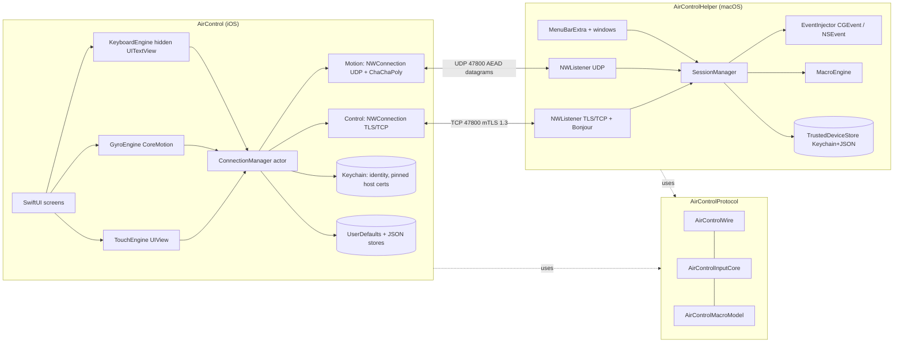
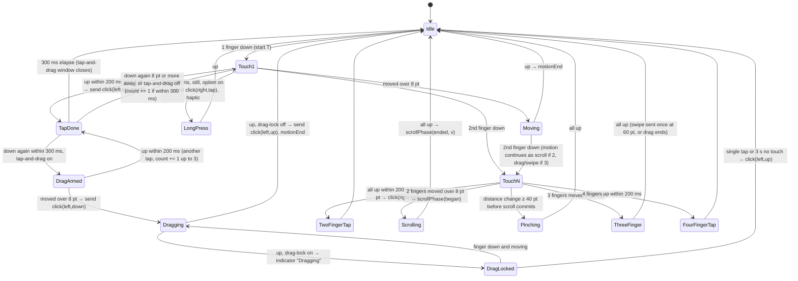
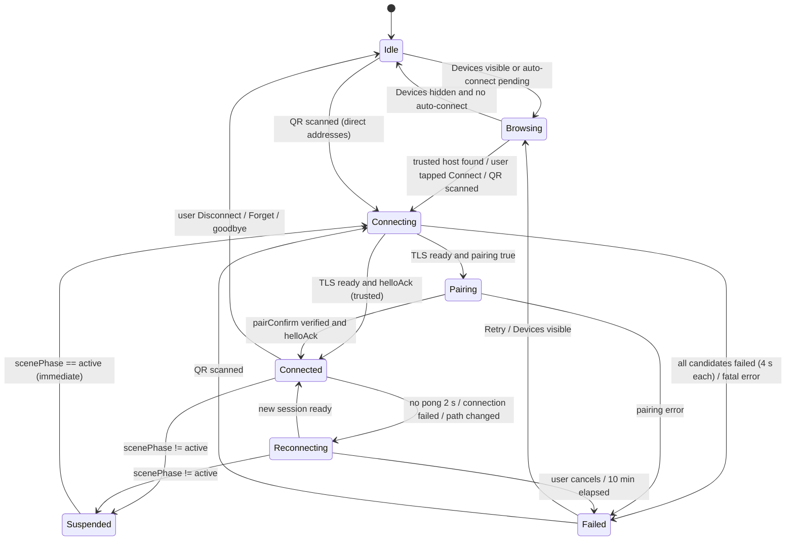

# Air Control — Functional & Technical Specification (v1)

| Field | Value |
|---|---|
| Document | 03-specifications.md |
| Status | Draft for owner review |
| Date | 2026-09-03 |
| Upstream (authoritative) | `docs/00-decisions.md` incl. Addendum A · `docs/01-requirements.md` (PRD) · `docs/02-technical-research.md` |
| Downstream | 04-architecture, 05-plan, `docs/protocol.md` (extracted from §3 at repo launch) |
| Audience | Implementers of the iOS client, the Mac helper and the shared package; security reviewers |

**Conventions.** SHALL / SHOULD / MAY have RFC 2119 meaning. "Client" = the iPhone/iPad app, "Host" = the Mac menu-bar helper. All multi-byte integers on the wire are **little-endian** (§3.0). Times are milliseconds unless suffixed `µs`. Where the upstream documents leave a choice open, this document decides and marks the sentence **(spec decision)**; where Addendum A and the PRD disagree, Addendum A wins (e.g. transport is TCP + mTLS control plus app-layer-encrypted UDP motion, not QUIC). Every constant named in prose is collected once more, with its allowed range, in Appendix 11.3.

---

## 1. Scope & traceability

### 1.1 Scope

In scope for v1 (per `00-decisions.md`): iPhone/iPad client (iOS 18+) and Mac helper (macOS 15+) over local Wi-Fi; Bonjour discovery; QR + mutual-TLS pairing; touchpad, gyro air-pointer, keyboard, presenter/media remote, host-authored macros, iPad split layout with hardware-keyboard passthrough; open-source (MIT) monorepo with a shared `AirControlProtocol` Swift package. Out of scope: multi-Mac switching, Apple Watch, Bluetooth, cloud relay, screen streaming, clipboard/file transfer, phone-side macro editing, Mac App Store build (PRD §7.1).

### 1.2 Traceability matrix

| Requirement | Satisfied in |
|---|---|
| FR-DP-001 | §3.1.1, §3.1.2 |
| FR-DP-002 | §4.5 (Browsing state), §4.5.3 |
| FR-DP-003 | §3.1.3 |
| FR-DP-004 | §3.1.4, §3.2.5, §7.6 |
| FR-DP-005 | §3.2.1–§3.2.3, §7.3 |
| FR-DP-006 | §3.2.4, §4.7, §5.6 |
| FR-DP-007 | §3.2.6, §5.6 |
| FR-DP-008 | §3.0 (limits), §5.6, §7.6 |
| FR-DP-009 | §3.3.2, §4.5.4 |
| FR-DP-010 | §5.2, §5.3.9 |
| FR-TP-001 | §3.5, §4.2.1 |
| FR-TP-002 | §4.2.3, §4.2.5, §3.6 |
| FR-TP-003 | §5.4 |
| FR-TP-004 | §5.4 |
| FR-TP-005 | §5.3.2 |
| FR-TP-006 | §5.3.2, §5.3.8 |
| FR-TP-007 | §4.2.3, §4.2.6 |
| FR-TP-008 | §3.4.5 (`click`), §5.3.3 |
| FR-TP-009 | §4.2.3 |
| FR-TP-010 | §4.2.3, §4.1.4 |
| FR-TP-011 | §3.4.5 (`scrollPhase`), §3.6, §5.3.4 |
| FR-TP-012 | §3.4.5 (`hostState.naturalScroll`), §3.6.4 |
| FR-TP-013 | §3.6.3, §5.3.4 |
| FR-TP-014 | §4.2.5 |
| FR-TP-015 | §4.2.3 (suppression) |
| FR-TP-016 | §4.1.4 |
| FR-TP-017 | §4.1.4 |
| FR-TP-018 | §4.2.5, §5.3.5 |
| FR-TP-019 | §4.2.5, §5.3.5 |
| FR-TP-020 | §4.6 |
| FR-GY-001 | §4.3.1 |
| FR-GY-002 | §4.3.2 |
| FR-GY-003 | §4.3.3 |
| FR-GY-004 | §4.3.5 |
| FR-GY-005 | §4.3.4, §6.3 |
| FR-GY-006 | §4.3.6, §3.5.5 (`motionEnd`) |
| FR-GY-007 | §3.4.5 (`recenter`), §5.3.8 |
| FR-GY-008 | §4.1.5 |
| FR-GY-009 | §4.3.2 |
| FR-GY-010 | §4.1.5 |
| FR-GY-011 | §4.3.5, §9 |
| FR-GY-012 | §4.1.5 |
| FR-KB-001 | §4.4.1, §4.4.2 |
| FR-KB-002 | §4.4.2 |
| FR-KB-003 | §3.4.5 (`key`, `text`), §4.4.3, §5.3.6 |
| FR-KB-004 | §4.4.3 |
| FR-KB-005 | §4.4.4, §5.3.6 |
| FR-KB-006 | §4.4.5, §5.3.6 (repeat) |
| FR-KB-007 | §3.4.5 (`mediaKey`), §5.3.7 |
| FR-KB-008 | §4.4.5 |
| FR-KB-009 | §3.4.5 (`text`), §5.3.6 (pacing) |
| FR-KB-010 | §3.4.5 (`hostState.inputSource`), §5.3.6 |
| FR-KB-011 | §4.4.2, §4.7 |
| FR-KB-012 | §4.4.4 |
| FR-KB-013 | §4.4.6 |
| FR-PR-001 | §4.1.7 |
| FR-PR-002 | §4.1.7, §5.7.3 (frontmost app) |
| FR-PR-003 | §4.1.7 |
| FR-PR-004 | §4.1.7 |
| FR-PR-005 | §3.4.5 (`volume`), §5.3.7 |
| FR-PR-006 | §4.1.7, §5.5.1 |
| FR-PR-007 | §4.1.7, §4.6 |
| FR-MC-001 | §5.5.1, §6.1 |
| FR-MC-002 | §3.4.5 (`macroList`), §5.5.6 |
| FR-MC-003 | §5.5.1 |
| FR-MC-004 | §5.5.3 |
| FR-MC-005 | §5.5.4 |
| FR-MC-006 | §5.5.5, §7.2 |
| FR-MC-007 | §3.4.5 (`macroResult`) |
| FR-MC-008 | §5.5.2 |
| FR-MC-009 | §4.7, §5.5.6 |
| FR-MC-010 | §5.5.2 |
| FR-IP-001 | §4.1.10 |
| FR-IP-002 | §4.1.10 |
| FR-IP-003 | §4.1.10, §3.5.2 (source = pointer) |
| FR-IP-004 | §4.4.6 |
| FR-IP-005 | §4.1.10 |
| FR-IP-006 | §4.2.6 |
| FR-MB-001 | §5.1.1 |
| FR-MB-002 | §5.1.2 |
| FR-MB-003 | §5.2 |
| FR-MB-004 | §5.7.1 |
| FR-MB-005 | §5.1.3, §5.6 |
| FR-MB-006 | §3.4.5 (`hostState.paused`), §5.3.10 |
| FR-MB-007 | §5.7.2 |
| FR-MB-008 | §5.1.3 (Diagnostics), §8.3 |
| FR-MB-009 | §5.3.11 |
| FR-MB-010 | §5.1.3, §9 |
| FR-MB-011 | §5.3.8 |
| FR-ST-001 | §3.4.5 (`settings`), §4.7 |
| FR-ST-002 | §4.7.3 |
| FR-ST-003 | §4.1.9 |
| FR-ST-004 | §4.1.9 |
| FR-CR-001 | §3.4, §3.5 (per Addendum A1/A2) |
| FR-CR-002 | §3.5.4, §3.5.6 |
| FR-CR-003 | §3.4.5 |
| FR-CR-004 | §3.4.6, §5.3.11 |
| FR-CR-005 | §4.5.2 |
| FR-CR-006 | §3.3 |
| FR-CR-007 | §4.5.4 |
| FR-CR-008 | §3.5.8 |
| FR-CR-009 | §4.1.4, §4.6 |
| FR-CR-010 | §5.3.2 (prediction) |
| FR-CR-011 | §4.5.4 |
| FR-OB-001 | §4.1.1 |
| FR-OB-002 | §4.1.1, §4.5.5 |
| FR-OB-003 | §4.1.2 |
| FR-OB-004 | §5.2 |
| FR-OB-005 | §4.1.4 (tutorial) |
| FR-OB-006 | §4.3.7 |
| NFR-PERF-001 | §8.1 |
| NFR-PERF-002 | §3.5.7 |
| NFR-PERF-003 | §8.1, §8.2 |
| NFR-PERF-004 | §8.1 |
| NFR-PERF-005 | §3.3, §8.1 |
| NFR-PERF-006 | §8.4 |
| NFR-PERF-007 | §8.3, §4.3.1 |
| NFR-REL-001 | §3.3, §4.5.2 |
| NFR-REL-002 | §3.4.6, §5.3.11 |
| NFR-REL-003 | §5.7.1, §10.1 |
| NFR-REL-004 | §8.4, §10.4 |
| NFR-REL-005 | §3.7, §9 |
| NFR-SEC-001 | §3.2.1, §7.3 |
| NFR-SEC-002 | §3.2, §7.3 |
| NFR-SEC-003 | §3.1.4, §3.2.3 |
| NFR-SEC-004 | §3.5.3, §3.5.4, §3.5.5 |
| NFR-SEC-005 | §4.7, §5.6, §7.3 |
| NFR-SEC-006 | §7.5, §5.7.2 |
| NFR-SEC-007 | §5.5.5, §7.2 |
| NFR-SEC-008 | §3.2.6, §7.6 |
| NFR-SEC-009 | §6.2, §10.1 |
| NFR-SEC-010 | §5.7.3, §7.4 |
| NFR-SEC-011 | §7.7 |
| NFR-SEC-012 | §7.1 |
| NFR-PRIV-001 | §7.4 |
| NFR-PRIV-002 | §2.3 (Info.plist), §9 |
| NFR-PRIV-003 | §5.2 |
| NFR-PRIV-004 | §4.4.2, §7.4 |
| NFR-PRIV-005 | §5.7.3, §7.4 |
| NFR-A11Y-001 – 006 | §4.8 |
| NFR-A11Y-007 | §5.1.4 |
| NFR-L10N-001 – 003 | §4.8.2 |
| NFR-OSS-001 – 007 | §2.4, §6, §10.6 |
| NFR-MAC-001 | §5.1.1 |
| NFR-MAC-002 | §5.7.1 |
| NFR-MAC-003 | §5.1.1, §5.7.2 |
| NFR-MAC-004 | §2.3, §5.1.5 |
| NFR-MAC-005 | §5.1.3, §9 |
| NFR-MAC-006 | §5.3.1 |
| NFR-MAC-007 | §5.3.11, §5.1.5 |

---

## 2. System overview

> **Amendment (2026-09-04):** `04-architecture.md` ADR-001 renames the shared package to `AirControlKit` with targets `AirControlProtocol`, `AirControlCrypto`, `AirControlFilters`, `AirControlCore` and an `aircontrol-cli` executable, and generates the Xcode projects with XcodeGen instead of a hand-maintained `.xcodeproj`. Wire format, constants and behaviour in this document are unchanged; read the module names in §2.1, §2.4 and §6.1 through the mapping table in ADR-001.


### 2.1 Components

| Component | Target / product | Responsibilities |
|---|---|---|
| **AirControl (iOS)** | `AirControl.app`, iOS/iPadOS 18+, SwiftUI + UIKit input views | Discovery, pairing UI, touch/gyro/keyboard engines, connection manager, settings, macro buttons |
| **AirControlHelper (macOS)** | `AirControlHelper.app`, macOS 15+, `LSUIElement` *(superseded by `docs/08-ui-revamp.md` §5, 2026-09-06: regular app, Dock icon, main window)*, SwiftUI `MenuBarExtra` + AppKit windows | Bonjour advertising, TLS listener, UDP listener, session management, event injection (`CGEvent`), macro engine, trusted-device store, permissions onboarding, Sparkle updates |
| **AirControlProtocol (SPM package)** | `Packages/AirControlProtocol`, platforms `.iOS(.v18)`, `.macOS(.v15)`, deps: Foundation + CryptoKit only | Library targets `AirControlWire` (framing, JSON envelope, message models, motion datagram codec, AEAD framing, replay window, pairing proof), `AirControlInputCore` (One-Euro filter, acceleration curve, gesture state machine, display clamping), `AirControlMacroModel` (macro `Codable` models and validation). **(spec decision)**: one package, three library targets, so `swift test` exercises everything without Xcode. |

### 2.2 Component diagram



### 2.3 Deployment view

- Both devices on one IP network (same Wi-Fi/AP, or Mac joined to the iPhone's Personal Hotspot). No internet path is ever used except the host's opt-in update check (§5.7.2).
- Host listens on **TCP 47800** (control) and **UDP 47800** (motion) by default **(spec decision)**; if either port is busy the host binds an ephemeral port for *both* and advertises the real values in TXT and QR. Fixed defaults simplify firewall documentation.
- iOS `Info.plist`: `NSLocalNetworkUsageDescription` = "Air Control finds and connects to your Mac on your local network. Nothing is sent over the internet."; `NSBonjourServices` = `["_aircontrol._tcp", "_aircontrol._udp"]`; `NSCameraUsageDescription` = "The camera is used only to scan the pairing QR code shown on your Mac."; `CFBundleURLTypes` registers `aircontrol`; `UIRequiresFullScreen` = NO.
- macOS `Info.plist`: `LSUIElement` = YES, `NSLocalNetworkUsageDescription` (same text), `NSBonjourServices` (same list), `NSAppleEventsUsageDescription` (script macros), `SUFeedURL` (Sparkle, HTTPS), `SUPublicEDKey`. Superseded by `docs/08-ui-revamp.md` §5 (2026-09-06): `LSUIElement` = NO, Dock icon shown.
- Signing: iOS App Store/TestFlight; Mac Developer ID + Hardened Runtime + notarization, not sandboxed (A6), universal binary. Debug builds use a stable Apple Development identity from git-ignored `Config/Local.xcconfig` (A10).

### 2.4 Repository layout

`AirControl.xcodeproj` (Xcode 16 buildable folders) with targets `AirControl` (iOS), `AirControlHelper` (macOS), `AirControlHelperIntegrationTests`; `Packages/AirControlProtocol`; `Config/Base.xcconfig` + `Config/Local.xcconfig` (ignored); `docs/`; `.github/workflows/{ci,release}.yml`; `LICENSE` (MIT), `SECURITY.md`, `CONTRIBUTING.md`, `CODE_OF_CONDUCT.md`.

---
## 3. Wire protocol specification

### 3.0 Conventions and global limits

| Item | Value |
|---|---|
| Byte order | Little-endian for every integer on both channels, including the TCP length prefix **(spec decision: one byte order for contributors; Wireshark dissector is trivial either way)** |
| Protocol version | `1` (integer). Independent of app semantic versions (NFR-OSS-007). |
| Text encoding | UTF-8 everywhere; JSON per RFC 8259 |
| Hashes | SHA-256; "fingerprint" (FP) = SHA-256 over the DER-encoded X.509 certificate (`SecCertificateCopyData`), 32 bytes |
| Base64 | base64url without padding (RFC 4648 §5) wherever "b64u" appears |
| Max control frame | 262 144 bytes (256 KiB) payload; larger → `protocol.frameTooLarge`, connection closed |
| Max UDP datagram | 44 bytes exactly (28-byte AEAD framing + 16-byte payload); any other length is dropped silently |
| Max simultaneous sessions | 4 authenticated + 2 pending (handshaking/pairing); a 7th TCP connection is closed immediately |
| Max trusted devices | 20 per host; 10 trusted hosts per client |
| Control message rate | ≤ 200 messages/s per session (token bucket, burst 400); excess → `rate.limited` then close |

### 3.1 Discovery

#### 3.1.1 Bonjour service types

The host registers **`_aircontrol._tcp`** (control) and **`_aircontrol._udp`** (motion) in the local domain with the **same instance name** and the **same TXT record** (FR-DP-001). The client browses **only `_aircontrol._tcp`**; the UDP record exists so the iOS `NSBonjourServices` list is complete and so third-party tooling can see both ports **(spec decision)**. Instance name = the Mac's computer name (`Host.current().localizedName`), Bonjour appends " (2)" on collision; the host reads the registered name from `serviceRegistrationUpdateHandler` and uses it as its display name in `hello`. `includePeerToPeer = false` on both sides (no AWDL).

Cross-talk guard (R-10): a browse result whose TXT lacks `v` or whose `v` list does not include a version the client speaks is hidden from the Devices list.

#### 3.1.2 TXT record keys

| Key | Value | Encoding | Example |
|---|---|---|---|
| `v` | Supported protocol major versions, comma-separated ascending | ASCII digits | `1` |
| `n` | Host display name (≤ 63 bytes UTF-8, truncated on a grapheme boundary) | UTF-8 | `Devashish's Mac mini` |
| `id` | Host ID: 16 random bytes generated on first launch, stable per install | b64u (22 chars) | `k3Jq…` |
| `fp` | First 16 bytes of the host certificate FP | b64u (22 chars) | `Zx8…` |
| `m` | Machine model identifier | ASCII | `Mac15,6` |
| `tp` | TCP control port | ASCII decimal | `47800` |
| `up` | UDP motion port | ASCII decimal | `47800` |

Each key/value pair ≤ 255 bytes; total TXT ≤ 400 bytes. The client uses `id` to match a trusted-host record (badge "Paired") and `fp` only as a hint; trust is decided by the full pinned certificate during TLS (§3.2.4).

#### 3.1.3 QR payload

The QR encodes exactly one URL (FR-DP-003). Error correction level **M**, rendered ≥ 300 × 300 pt with a 4-module quiet zone on a white background regardless of appearance mode.

```
aircontrol://pair?v=1&id=<hostID>&n=<name>&a=<addr1,addr2,…>&p=<tcpPort>&u=<udpPort>&fp=<certFP>&s=<secret>
```

| Param | Required | Encoding | Size | Semantics |
|---|---|---|---|---|
| `v` | yes | decimal | 1–3 chars | Protocol major version the QR format belongs to; client rejects unknown values with E-PAIR-VERSION |
| `id` | yes | b64u of 16 bytes | 22 | Host ID (same as TXT `id`) |
| `n` | yes | percent-encoded UTF-8 | ≤ 63 bytes decoded | Host display name |
| `a` | yes | comma-separated literal IPv4 / IPv6 (no brackets, no zone) | 1–6 addresses | Ordered: hotspot/bridge (`bridge*`, `172.20.10.x`) → Wi-Fi (`en0`) → Ethernet → link-local IPv6 last. Client tries in order (§3.3.2). |
| `p` | yes | decimal | ≤ 5 | TCP port |
| `u` | no | decimal | ≤ 5 | UDP port; default = `p` |
| `fp` | yes | b64u of 32 bytes | 43 | Full host certificate FP (pinned before the first byte of TLS) |
| `s` | yes | b64u of 16 bytes | 22 | One-time pairing secret (128-bit CSPRNG) |

Total URL length SHALL be ≤ 512 bytes (fits QR version 15 at ECC-M); the host truncates the address list, not the secret, to stay within the limit. A URL with missing/malformed required params → E-PAIR-URL. The same URL is registered as a custom scheme so a screenshot or Camera-app scan opens the app directly; a "paste pairing link" field accepts it (FR-OB-003). Manual fallback shown under the QR: `<addr1>:<port>` and the first 8 characters of `s` are **not** sufficient for pairing — the manual fallback is the full URL as copyable text **(spec decision: no shortened numeric code in v1; it would weaken the 128-bit secret)**.

#### 3.1.4 One-time secret semantics

- Generated when the Pairing window opens; **lifetime 60 s**, countdown shown; when it reaches 0 while the window is visible a **new** secret and QR are generated automatically **(spec decision)**.
- Consumed on the first successful `pairConfirm`; invalidated when the window closes, on expiry, and after **3 failed proofs** for that secret **(spec decision)**.
- Never logged, never sent on the wire (§3.2.3); the host keeps it only in memory.
- Failed pairing attempts are rate-limited to **5 per minute per source IP** (FR-DP-004); further attempts get TCP closed after the TLS handshake with no message.

### 3.2 Pairing handshake

#### 3.2.1 Identities and TLS configuration

| Aspect | Host | Client |
|---|---|---|
| Key | P-256 (`SecKeyCreateRandomKey`, `kSecAttrTokenID` none), login Keychain, non-exportable, `kSecAttrAccessible…AfterFirstUnlock` | P-256 in Secure Enclave when available (`kSecAttrTokenIDSecureEnclave`), else Keychain; `kSecAttrAccessibleAfterFirstUnlockThisDeviceOnly` |
| Certificate | Self-signed X.509 v3 built with `swift-certificates`: CN = `AirControl Host <hostID b64u>`, validity 10 years, serial random 16 bytes, EKU serverAuth+clientAuth, no SAN | Same, CN = `AirControl Client <clientID b64u>`, EKU clientAuth+serverAuth |
| Generated | First launch | First pairing (lazily) |
| TLS | `NWProtocolTLS.Options`; `sec_protocol_options_set_min_tls_protocol_version(.TLSv13)`; `sec_protocol_options_set_local_identity`; `sec_protocol_options_set_peer_authentication_required(true)`; `sec_protocol_options_set_verify_block` | Same; server-name indication disabled (no hostname validation) |
| Cipher suites | TLS 1.3 AEAD only (AES-128-GCM, AES-256-GCM, ChaCha20-Poly1305); the OS default 1.3 set already satisfies this | Same |
| Resumption | Left enabled (OS default). Not relied upon for correctness; measured in §8. | Same |

**Verify blocks.**
- Client: extract leaf via `sec_trust_copy_ref` → `SecTrustCopyCertificateChain`; compute FP; accept iff FP == pinned FP for this host (from QR during pairing; from Keychain afterwards). Chain length must be exactly 1.
- Host: chain length must be 1; parse leaf; accept iff (a) FP is in the trusted store and not revoked → session state `authenticated`, or (b) a Pairing window is open **and** the pending-connection count < 2 → session state `unauthenticated` (only `hello` with `pairing:true` and `pair*` messages are accepted; anything else closes the connection with `auth.untrusted`). Otherwise reject the handshake.

#### 3.2.2 Sequence

```mermaid
sequenceDiagram
  autonumber
  participant P as Phone (Client)
  participant M as Mac (Host)
  M->>M: Pairing window opens: secret S (16 B), expiry 60 s, QR = aircontrol://pair?…
  P->>P: Scan QR, parse URL, pin fp, order addresses
  P->>M: TCP connect (addr order §3.3.2)
  P->>M: TLS 1.3 ClientHello (+ client cert on request)
  M->>P: TLS ServerHello, host cert, CertificateRequest
  Note over P,M: Both verify blocks run. Phone: FP == QR fp. Mac: unknown cert but window open → unauthenticated
  P->>M: hello { pairing: true, device, protocol {min,max} }
  M->>P: pairChallenge { nonce (16 B), hostID, hostName }
  P->>P: exporter = TLS-Exporter("EXPORTER-aircontrol-pairing-v1", 32 B)
  P->>M: pairProof { proof = HMAC-SHA256(S, 0x01 ‖ exporter ‖ nonce ‖ clientFP ‖ hostFP ‖ hostID) }
  M->>M: Recompute, constant-time compare, check expiry/attempts/rate limit
  M->>M: Persist client cert + metadata (trusted); consume S
  M->>P: pairConfirm { hostProof = HMAC-SHA256(S, 0x02 ‖ exporter ‖ nonce ‖ clientFP ‖ hostFP ‖ hostID) }
  P->>P: Verify hostProof; persist host cert + metadata (trusted)
  M->>P: helloAck, sessionKey, hostState, macroList
  P->>M: settings
  Note over P,M: Session is now authenticated; identical to a reconnect from here on
```

Timing target: QR scanned → touchpad screen usable in ≤ 3 s (AM-DP-02); the protocol part (steps 3–15) is 3 RTTs ≈ 15–40 ms on a LAN.

#### 3.2.3 Proof construction (channel binding)

```
exporter  = TLS 1.3 exporter, label "EXPORTER-aircontrol-pairing-v1", empty context, 32 bytes
            (Network.framework: sec_protocol_metadata_create_secret(metadata, labelLen, label, 32))
binding   = exporter(32) ‖ nonce(16) ‖ clientFP(32) ‖ hostFP(32) ‖ hostID(16)      // 128 bytes
proof     = HMAC-SHA256(key = S, data = 0x01 ‖ binding)                              // client → host
hostProof = HMAC-SHA256(key = S, data = 0x02 ‖ binding)                              // host → client
```

Both values are transmitted b64u-encoded in JSON. The secret S never leaves the QR. The exporter binds the proof to this TLS session (a proof captured from one session is useless on another); the certificate fingerprints bind it to the identities that authenticated in the handshake; the nonce gives freshness even if the exporter were constant. **Contingency (spec decision, to be closed by spike R-1):** if `sec_protocol_metadata_create_secret` proves unavailable on either platform, `exporter` is replaced by 32 zero bytes and both sides set `capabilities` to include `"pair-binding-certs"`; because mutual TLS already proved possession of both private keys and the nonce is fresh, the certificate-fingerprint binding remains sound (analogous to `tls-server-end-point`).

#### 3.2.4 Trusted-device persistence

| Side | Store | Record |
|---|---|---|
| Host | Keychain (`kSecClassCertificate`, label `AirControl Trusted Client <clientID>`) + `~/Library/Application Support/AirControlHelper/TrustedDevices.json` | `clientID` (FP), `name`, `model`, `osVersion`, `firstPaired`, `lastSeen`, `localAlias?`, `allowScripts` (false), `revoked` (false) |
| Client | Keychain (`kSecClassCertificate`, label `AirControl Trusted Host <hostID>`) + `Application Support/AirControl/TrustedHosts.json` | `hostID`, `hostFP`, `name`, `model`, `firstPaired`, `lastConnected`, `lastKnownAddresses[]` (≤ 6, with timestamps), `tcpPort`, `udpPort`, `qrAddresses[]`, `perHostSettingsOverride?`, `macroCacheRevision` |

The certificate is the source of truth for trust; the JSON file holds metadata only. On load, any JSON record without a matching Keychain certificate is dropped.

#### 3.2.5 Trusted reconnect

See §3.3; after TLS the client sends `hello { pairing: false }` and receives `helloAck` directly.

#### 3.2.6 Failure cases and error codes

| Situation | Detected by | Wire behaviour | Client shows (§9) |
|---|---|---|---|
| Host FP ≠ QR fp | Client verify block | Client aborts TLS | E-PAIR-FP |
| Pairing window closed / secret expired | Host after `pairProof` (checked before HMAC) | `error { code: "pairing.expired", fatal: true }`, close | E-PAIR-EXPIRED |
| Wrong proof | Host | attempts++, `error "pairing.invalidProof"`, close; after 3 → secret invalidated | E-PAIR-EXPIRED (generic; FR-DP-003 no sensitive detail) |
| Rate limit exceeded (5/min/IP) | Host before TLS accept completes | Close without message | E-PAIR-RATELIMIT (client infers from `pairChallenge` timeout 3 s) |
| 20 trusted devices already | Host | `error "pairing.tooManyDevices"` | E-PAIR-FULL |
| Host proof wrong | Client | Client closes, deletes nothing (host record not yet saved) | E-PAIR-HOSTPROOF |
| Unknown client cert, no window | Host verify block | TLS alert `certificate_unknown` | E-AUTH-UNTRUSTED or E-AUTH-REVOKED (if the client had a record) |
| Non-pair message while unauthenticated | Host | `error "auth.untrusted"`, close | — |
| Version mismatch | Either side at `hello`/`helloAck` | `error "protocol.versionMismatch"` incl. `min`/`max` | E-VERSION-APP / E-VERSION-HELPER |

### 3.3 Reconnect of a trusted device

#### 3.3.1 Sequence and timing

1. Client resolves target (§3.3.2) and opens TCP + TLS with the pinned host FP; host verify block finds the client FP in the trusted store.
2. Client sends `hello` immediately after `.ready` (same flight as TLS Finished on the application side).
3. Host replies with `helloAck`, `sessionKey`, `hostState`, `macroList` (if `hello.macroRevision` ≠ current) **back-to-back without waiting**.
4. Client sends `settings`, opens the UDP connection to `helloAck.udpPort`, sends the first probe (§3.5.8) and begins heartbeats.

| Target | Value |
|---|---|
| TCP+TLS handshake (warm LAN) | ≤ 60 ms p95 (2 RTT + crypto) |
| `hello` → `helloAck` | ≤ 20 ms p95 |
| Foreground → first motion datagram accepted | ≤ 1 s p95 (FR-CR-006, AM-CR-02) |
| App cold start → touchpad ready, trusted host in range | ≤ 2 s (NFR-PERF-005, AM-DP-04) |
| Wi-Fi return → session restored | ≤ 3 s in ≥ 99 % (NFR-REL-001) |

A new `sessionKey` is issued on every TLS connection (NFR-SEC-004 re-key on resumption); UDP keys are never reused across TCP connections.

#### 3.3.2 Address selection

Candidate order: (1) the endpoint of the current Bonjour result for this `hostID` (if browsing), (2) `lastKnownAddresses` newest first, (3) `qrAddresses` in QR order. The client starts the first candidate; if not `.ready` within **700 ms**, it starts the next in parallel (staggered happy-eyeballs, spec decision); first `.ready` wins, others are cancelled; per-candidate timeout **4 s**. Addresses in non-private ranges (not RFC 1918, not `fe80::/10`, `fc00::/7`, `169.254/16`, `172.20.10/28`) are skipped unless they came from a QR scan (FR-CR-011).

### 3.4 Control channel (TCP / TLS)

#### 3.4.1 Framing

Implemented as an `NWProtocolFramer` above TLS.

```
offset  size  field
0       4     length   u32 LE — number of bytes following this field (1 + body), 1 ≤ length ≤ 262 145
4       1     kind     u8: 0x01 = JSON message, 0x02 = motion batch (binary, §3.5.9)
5       n     body
```

Unknown `kind` → `protocol.badFrame`, close. A `kind = 0x02` frame body is a concatenation of 1–16 motion payloads (16 bytes each; length must be 1 + 16·n).

#### 3.4.2 Envelope

Every `kind = 0x01` body is one JSON object:

```json
{ "v": 1, "t": "click", "i": 1042, "p": { "button": "left", "action": "tap", "count": 1, "modifiers": [] } }
```

| Field | Type | Meaning |
|---|---|---|
| `v` | int | Protocol major version of this message (always the negotiated version after `helloAck`) |
| `t` | string | Message type (camelCase, table §3.4.5) |
| `i` | uint32 | Sender-local monotonically increasing message id; referenced by `error.ref` and `macroResult.ref` |
| `p` | object | Payload; MAY be omitted when empty |

Unknown `t` within the negotiated version → ignored and counted (diagnostics), never fatal. Unknown fields → ignored (`Codable` with optionals). Missing required fields → `protocol.badMessage`, message dropped; three in 10 s → close.

#### 3.4.3 Encoding choice

**JSON `Codable` for control messages (spec decision, per research D1).** Justification: control traffic is < 200 msg/s and typically < 20; a 120-byte JSON message costs microseconds to encode on both platforms; it is readable in Wireshark's TLS-decrypted view and reproducible with `nc`+`openssl s_client` for contributors; there is no schema toolchain to install; unknown-field tolerance gives painless forward compatibility. The latency-critical path (motion) is binary (§3.5) and never JSON. `JSONEncoder` settings: `outputFormatting = [.sortedKeys, .withoutEscapingSlashes]`, dates as `Int` ms since epoch, enums as their `rawValue` strings, binary fields as b64u strings.

#### 3.4.4 Version negotiation

`hello.protocol = { "min": 1, "max": 1 }`; the host picks `max(clientMin, hostMin) … min(clientMax, hostMax)` → highest common; if empty → `error protocol.versionMismatch { min, max, helperVersion }` and close. `helloAck.protocol` carries the chosen version; all subsequent `v` fields equal it. Optional features are advertised as strings in `capabilities` on both sides (v1 set: `"tcp-motion-fallback"`, `"pair-binding-certs"`, `"udp-probe"`, `"unicode-text"`, `"macro-scripts"`).

#### 3.4.5 Message catalogue

Direction: C→H client to host, H→C host to client. Types: `str`, `int`, `num` (double), `bool`, `b64u`, `[…]` array, `enum(a|b)`. `?` = optional.

**`hello`** (C→H, first message)

| Field | Type | Notes |
|---|---|---|
| `protocol.min`, `protocol.max` | int | Supported range |
| `capabilities` | [str] | |
| `device.name` | str ≤ 63 | `UIDevice.current.name` |
| `device.model` | str | e.g. `iPhone16,1` |
| `device.os` | str | e.g. `iOS 18.6` |
| `device.app` | str | app version |
| `pairing` | bool | true → expect `pairChallenge` |
| `macroRevision` | int? | cached macro list revision for this host; host skips `macroList` if equal |
| `displayHz` | int | 60 or 120; informational |

**`pairChallenge`** (H→C): `nonce` b64u(16), `hostID` b64u(16), `hostName` str, `expiresInMs` int.
**`pairProof`** (C→H): `proof` b64u(32).
**`pairConfirm`** (H→C): `hostProof` b64u(32), `hostModel` str.

**`helloAck`** (H→C)

| Field | Type | Notes |
|---|---|---|
| `protocol` | int | chosen version |
| `capabilities` | [str] | |
| `host.name`, `host.model`, `host.os`, `host.helper` | str | |
| `host.id` | b64u(16) | |
| `udpPort` | int | |
| `heartbeatMs` | int | 500 |
| `sessionTimeoutMs` | int | 2000 |
| `maxTextBytes` | int | 16384 |
| `sessionCount` | int | other connected devices |

**`sessionKey`** (H→C): `sessionID` int (u32), `secret` b64u(32), `validForMs` int (14 400 000). See §3.5.3.

**`settings`** (C→H; on connect and on any change; full snapshot)

| Field | Type | Range / default |
|---|---|---|
| `sensitivity` | int | 1–10, default 5 |
| `acceleration` | enum(off\|precise\|default\|fast) | default `default` |
| `scrollSpeed` | int | 1–10, default 5 |
| `scrollDirection` | enum(host\|natural\|inverted) | default `host` |
| `momentum` | bool | default true |
| `doubleClickIntervalMs` | int | 150–600, default 300 |
| `pinchMode` | enum(keys\|zoomScroll\|off) | default `keys` |
| `textRateCharsPerSec` | int | 50–2000, default 500 |

**`click`** (C→H)

| Field | Type | Notes |
|---|---|---|
| `button` | enum(left\|right\|middle) | |
| `action` | enum(down\|up\|tap) | `tap` = host posts down, waits ≥ 15 ms, posts up |
| `count` | int | 1–3 → `mouseEventClickState`; host clamps to 1 if the previous click of the same button was > 1.5 × `doubleClickIntervalMs` ago |
| `modifiers` | [enum(cmd\|opt\|ctrl\|shift\|fn)] | applied as event flags |

**`scrollPhase`** (C→H): `phase` enum(began\|ended\|cancel), `vx`, `vy` num? (px/s at lift, only with `ended`), `momentum` bool? (with `ended`; false suppresses momentum). Deltas themselves travel on the motion channel (§3.6).

**`modifiers`** (C→H): `flags` [enum(cmd\|opt\|ctrl\|shift\|fn\|capsLock)] — absolute set currently held/locked; host diffs against its current set and posts `flagsChanged` for each changed modifier key.

**`key`** (C→H)

| Field | Type | Notes |
|---|---|---|
| `code` | int | macOS virtual keycode (ANSI table, Appendix 11.2) |
| `char` | str? | Single character when the key is printable; host re-resolves to a keycode on its current input source (§5.3.6) |
| `action` | enum(down\|up\|tap) | held keys auto-repeat host-side |
| `modifiers` | [enum] | as in `click` |

**`text`** (C→H): `s` str (1–16 384 bytes UTF-8, grapheme clusters never split across messages), `secure` bool (host disables its own debug echo; no other effect on the wire).
**`deleteBackward`** (C→H): `count` int 1–1000, `forward` bool (default false).
**`mediaKey`** (C→H): `key` enum(playPause\|next\|previous\|fastForward\|rewind\|volumeUp\|volumeDown\|mute\|brightnessUp\|brightnessDown\|illuminationUp\|illuminationDown), `action` enum(tap\|down\|up).
**`volume`** (C→H): `level` num 0.0–1.0 (host quantises to 1/16 when using key events), `mute` bool?.
**`macroInvoke`** (C→H): `id` str (UUID), `confirmed` bool.
**`recenter`** (C→H): no payload.
**`motionEnd`** (C→H): no payload; also carried as a UDP flag; idempotent.
**`heartbeat`** (C→H): `seq` int, `t1` int (client monotonic µs).
**`pong`** (H→C): `seq`, `t1` (echoed), `t2` int (host monotonic µs at receive), `t3` int (host µs at send), `motion.clientTs` int? (timestamp field of the most recent accepted motion datagram), `motion.hostTs` int? (host µs when it was received), `injectP50Us` int? (host receive→post p50 over the last second).
**`hostState`** (H→C; full snapshot on connect and on any change)

| Field | Type | Notes |
|---|---|---|
| `paused` | bool | "Pause input" |
| `accessibility` | bool | `AXIsProcessTrusted()` |
| `naturalScroll` | bool | `com.apple.swipescrolldirection` |
| `displays` | [{`id` int, `x`,`y`,`w`,`h` int (CG global points), `scale` num, `main` bool}] | |
| `frontmostApp` | {`bundleID` str, `name` str}? | |
| `inputSource` | {`id` str, `ansi` bool} | `TISCopyCurrentKeyboardLayoutInputSource` |
| `scriptsAllowed` | bool | global AND per-device |
| `sessionCount` | int | |

**`macroList`** (H→C): `revision` int, `macros` [Macro] (§5.5.1). Full replacement.
**`macroResult`** (H→C): `ref` int (the `i` of the `macroInvoke`), `id` str, `ok` bool, `message` str ≤ 120, `code` enum(ok\|notFound\|blockedByPolicy\|confirmationRequired\|timeout\|failed).
**`error`** (both): `code` str (dotted namespace: `protocol.*`, `auth.*`, `pairing.*`, `rate.*`, `host.*`, `macro.*`, `internal`), `message` str (English, developer-facing; the client maps `code` to localized copy), `ref` int?, `fatal` bool (true → sender closes after flushing).
**`goodbye`** (both): `reason` enum(userQuit\|background\|revoked\|replaced\|hostQuit\|sleep\|error).

#### 3.4.6 Heartbeat and session timeout

Client sends `heartbeat` every **500 ms** from the moment `helloAck` arrives; host answers `pong` immediately on the receiving queue. Host: no `heartbeat` for **2 000 ms** → release all held buttons/modifiers/keys (§5.3.11), mark the session `stale`, stop accepting its motion; no heartbeat for **6 000 ms** → close TCP. Client: no `pong` for **2 000 ms** → state `Reconnecting` (§4.5), keep the old connection open until the new one is `.ready` or 6 s pass. RTT is `t4 − t1 − (t3 − t2)`; the client keeps a 32-sample ring for the HUD (§8.2).

#### 3.4.7 Swift sketch

```swift
public enum Message: Codable, Sendable {
    // C→H
    case hello(Hello), pairProof(PairProof), settings(Settings), click(Click)
    case scrollPhase(ScrollPhase), modifiers(Modifiers), key(Key), text(Text)
    case deleteBackward(DeleteBackward), mediaKey(MediaKey), volume(Volume)
    case macroInvoke(MacroInvoke), recenter, motionEnd, heartbeat(Heartbeat)
    // H→C
    case pairChallenge(PairChallenge), pairConfirm(PairConfirm), helloAck(HelloAck)
    case sessionKey(SessionKey), hostState(HostState), macroList(MacroList)
    case macroResult(MacroResult), pong(Pong)
    // both
    case error(ProtocolError), goodbye(Goodbye)
}
public struct Envelope: Codable, Sendable { public var v: Int; public var i: UInt32; public var message: Message }
// Envelope's custom Codable maps `t` + `p` to the enum case; unknown `t` decodes to `.unknown(type:)` internally.
```

### 3.5 Motion channel (UDP)

#### 3.5.1 Datagram layout (44 bytes)

```
offset  size  field       description
0       4     sessionID   u32 LE, from sessionKey; selects keys + replay window (host indexes by this, not by 5-tuple)
4       8     counter     u64 LE, per-direction, starts at 0, strictly increasing; doubles as sequence number
12      16    ciphertext  ChaCha20-Poly1305 encryption of the 16-byte payload
28      16    tag         Poly1305 tag
```

AAD = bytes 0–11 (header). Anything not exactly 44 bytes, with an unknown `sessionID`, or failing authentication is dropped silently and counted.

#### 3.5.2 Payload layout (16 bytes, plaintext)

```
offset  size  field       description
0       1     flags       bit0 scrollBegan · bit1 scrollEnded · bit2 motionEnd · bit3 predicted · bit4 probe · bit5 echo · bits6–7 reserved (0)
1       1     source      0 touch · 1 gyro · 2 external pointer (iPad trackpad/mouse) · 3 tcpFallback (set by host bookkeeping only) · 255 probe
2       1     samples     number of raw sensor samples coalesced into this datagram, 1–255 (0 for probe)
3       1     reserved    must be 0
4       4     timestamp   u32 LE, client monotonic clock in µs (wraps every 71.6 min; receiver uses modular arithmetic)
8       2     dx          i16 LE, pointer delta X in 1/8 point (±4095.875 pt per datagram)
10      2     dy          i16 LE, pointer delta Y (positive = down)
12      2     scrollX     i16 LE, scroll delta X in 1/8 point (finger-travel units; host applies speed and direction)
14      2     scrollY     i16 LE, scroll delta Y
```

**(spec decision)** Fixed-point i16 instead of f32 keeps the payload at 16 bytes while leaving room for scroll deltas and flags; 1/8 pt resolution is below the host's sub-pixel accumulator granularity. The 32-bit "sequence number" required by FR-CR-002 is the low 32 bits of the header `counter`.

#### 3.5.3 Keys and nonces

```
kC2H = HKDF-SHA256(ikm = secret, salt = sessionID as u32 LE (4 B), info = "aircontrol-udp-c2h-v1", L = 32)
kH2C = HKDF-SHA256(ikm = secret, salt = sessionID as u32 LE (4 B), info = "aircontrol-udp-h2c-v1", L = 32)
nonce = 0x00 0x00 0x00 0x00 ‖ counter as u64 LE (8 B)            // 12 bytes
```

Separate keys per direction make the counters independent; a nonce is therefore never reused under one key within a session. A sender that reaches counter 2³² SHALL stop sending and request/issue a new key (§3.5.5).

#### 3.5.4 Replay window (RFC 6479 style)

Per (sessionID, direction): `highest: UInt64`, `bitmap: UInt64` (window W = 64).

```
if counter > highest:            shift bitmap left by (counter − highest) (saturating), set bit0, highest = counter, accept
elif highest − counter ≥ 64:     drop (too old)
elif bitmap bit (highest − counter) set: drop (replay)
else:                            set bit, accept
```

The check runs **after** AEAD authentication succeeds (an attacker must not be able to poison the window). Application-level staleness (FR-CR-002) is separate: an accepted motion datagram whose counter is more than **8** below the highest applied counter is not applied (its deltas are discarded) — relative deltas that arrive very late would otherwise produce a visible jump. Datagrams within the 8-window are applied in arrival order (delta sums are order-independent).

#### 3.5.5 Key rotation

- A new `sessionKey` (new `sessionID`, new secret) is issued on every TCP connection.
- The host additionally rotates when either direction's counter reaches **2³¹** or **4 h** after issue **(spec decision)**. The client switches to the new key on receipt; the host keeps accepting the previous `sessionID` for **2 s** then discards it. Two keys maximum are live per session.
- Old `sessionID`s are never reissued during the helper's process lifetime (u32 random, collision checked against live sessions).

#### 3.5.6 Loss, reordering, gaps

- No retransmission. Lost deltas are lost; because deltas are relative the visible effect is slightly shorter travel.
- Host motion pause: if no motion datagram arrives for **100 ms** while a stream was active, the host treats the stream as paused (stops any prediction, ends any implicit scroll after 120 ms — §3.6.2).
- Prediction (FR-CR-010): the host MAY extrapolate one sample interval (≤ 16 ms) using the last velocity when the next datagram is late; **default off in v1 (spec decision)**, behind a Diagnostics toggle, because overshoot on direction change was judged worse than one late frame.
- `motionEnd` flag (also a control message): finger lifted / clutch released; host zeroes velocity and remainder.

#### 3.5.7 Coalescing rules (client)

- Touch: one datagram per display frame (`CADisplayLink`-free: the `touchesMoved` callback is already per frame), summing all coalesced touches of that frame; `samples` = count.
- Gyro: one datagram per `CMDeviceMotion` sample (100 Hz).
- Back-pressure: at most **2** datagrams may be in flight (send completion not yet called). If both slots are busy, the new deltas are added into a pending accumulator and sent as one datagram when a slot frees (`samples` incremented). Never queue beyond that; never start a timer to batch.
- Zero-delta frames are not sent, except one final datagram with `motionEnd` on lift/release, and `scrollBegan`/`scrollEnded` flags always ride on a datagram (zero deltas allowed).

#### 3.5.8 UDP probe and TCP fallback

Probe datagram: payload `flags.probe = 1`, `source = 255`, `timestamp` = client µs, deltas 0. Host reflects it within 1 ms on the H→C key with `flags.echo = 1`, `timestamp` unchanged, `dx` = low 16 bits of host receive→send µs.

| Rule | Value |
|---|---|
| Probe interval, connected | 250 ms (4 Hz) |
| Probe window | last 12 probes (3 s) |
| Enter fallback | ≥ 11 of 12 unanswered (≥ 90 %) **and** a `pong` received in the last 1 s (TCP healthy) — or the first 8 probes after connect all unanswered (2 s) |
| In fallback | motion payloads sent as `kind = 0x02` frames, coalesced to ≤ 60 frames/s (≥ 16.7 ms apart, several payloads per frame allowed); client shows "Elevated latency" badge; probes continue at 1 Hz |
| Exit fallback | 5 consecutive probes answered |

The probe RTT series also feeds the latency HUD (§8.2).

#### 3.5.9 TCP motion batch frame

`kind = 0x02`, body = n × 16-byte payloads (1 ≤ n ≤ 16) in the plaintext layout of §3.5.2 with `source` unchanged; no AEAD (TLS protects it); no counter (TCP is ordered). The host feeds them to the same motion pipeline with `channel = tcp` for diagnostics.

### 3.6 Scroll and gesture semantics over the wire

#### 3.6.1 Units

Scroll deltas are **finger travel in points × 8** (i16). The host converts to pixels: `px = pt × scrollGain(scrollSpeed)` where `scrollGain(1…10)` is geometric from **0.5 to 3.0** (default 5 → 1.22) (FR-TP-011), then applies direction (§3.6.4).

#### 3.6.2 Phases

| Phase | Carried by | Host action |
|---|---|---|
| began | UDP flag `scrollBegan` on the first scroll datagram **and** control `scrollPhase{began}` | First to arrive opens a scroll session: post a zero-delta pixel scroll event with `scrollPhase = .began`; subsequent deltas post `.changed` |
| changed | UDP deltas | `.changed` per datagram (or per 60 Hz tick in TCP fallback) |
| ended | control `scrollPhase{ended, vx, vy, momentum}` (also UDP flag) | Post `.ended`; if `momentum` and √(vx²+vy²) ≥ 300 pt/s → start momentum synthesis (§3.6.3) |
| cancel | control `scrollPhase{cancel}` | Stop momentum: post momentum `.end`; no more events |
| implicit end | host timer | No delta for 120 ms while a session is open → behave as `ended` with zero velocity |

#### 3.6.3 Momentum

Reconciling FR-TP-013 with research A2 **(spec decision)**: the **client** decides (fling velocity at lift, its `momentum` setting, cancel-on-touch) and the **Mac synthesizes the events** so momentum survives datagram loss and needs no 60 Hz stream from the phone. Host algorithm: at 60 Hz (`DispatchSourceTimer`, leeway 1 ms) `v ← v · exp(−Δt/τ)`, τ = 350 ms; delta = v · Δt · scrollGain, accumulated with sub-pixel remainders; first tick posts momentum `.begin`, then `.continue`, stop when |v| < 0.5 px/frame → `.end`. Any new motion datagram from the same session with non-zero scroll or a `scrollPhase{cancel}` stops it.

#### 3.6.4 Natural scroll

`settings.scrollDirection = host` → host applies `naturalScroll` from `com.apple.swipescrolldirection` (re-read on `NSUserDefaults` change notification). `natural`/`inverted` override explicitly. The host inverts the sign of both axes for natural = content follows finger. Whether WindowServer already applies the preference to synthesized events at `.cghidEventTap` is spike R-3; the injector has a single `invertForNatural` boolean switch so the outcome is a one-line change.

#### 3.6.5 Other gestures

Pinch (keys mode), three-finger swipes, four-finger tap are sent as `key` messages with the corresponding chord (§4.2.5). Three-finger drag is `click{left, down}` + motion + `click{left, up}`.

### 3.7 Protocol versioning and compatibility policy

- **Major version** (`v`) changes only for incompatible framing, envelope or crypto changes. Both sides support at least the current and the previous major for 12 months after a major bump.
- **Additive changes** (new message types, new optional fields, new enum values, new capabilities) do not bump the version; receivers ignore what they do not know; senders MUST NOT rely on a new field unless the peer advertised the matching capability.
- **Motion payload** layout is frozen within a major; new sources use spare `source` values; spare `flags` bits must be zero when sent and ignored when received.
- Deprecations are announced in `docs/protocol.md` CHANGELOG; the helper's Diagnostics window shows the negotiated version and the peer's range.
- Mismatch UX: E-VERSION-* (§9) tells the user which side to update, never a silent failure (NFR-REL-005).

---
## 4. iOS client specification

### 4.1 App structure and navigation map

Root: `TabView` with five tabs — **Touchpad**, **Air Pointer**, **Keyboard**, **Remote**, **Macros** — plus a toolbar with a **connection pill** (host name + status dot, tap → Devices) on the left and **Settings** (gear) on the right. *Superseded by `docs/08-ui-revamp.md` §2.1 (2026-09-06): the toolbar pill is replaced by a single status dot.* Onboarding and Scan QR are presented as full-screen covers. The Air Pointer tab is hidden when `CMMotionManager().isDeviceMotionAvailable == false` (FR-GY-012). Default tab is configurable (FR-ST-004). Navigation:

```
Onboarding (first launch) → [Local Network pre-prompt] → Scan QR → Touchpad
Any tab ── connection pill (now status dot, docs/08 §2.1) ──► Devices ──► Scan QR
Any tab ── gear ──► Settings ──► {Pointer, Gestures, Gyro, Keyboard, Remote, Macs, Appearance, Feedback, Tutorial, About}
```

#### 4.1.1 Onboarding (3 pages, `TabView(.page)`)
1. *"Your iPhone is now a trackpad, air pointer and keyboard for your Mac."* — illustration; **Continue**.
2. *Install the Mac helper* — QR to the GitHub Releases page, `brew install --cask air-control` in a copyable code block (**Copy** button), **I've installed it**.
3. *Local network access* — copy: "Air Control needs to see devices on your Wi-Fi to find your Mac. iOS will ask you next. Nothing leaves your network." **Continue** → triggers the first `NWBrowser` (system prompt) and pushes Scan QR. **Skip** exists on every page. Completion stored in `UserDefaults.onboardingCompleted`.

#### 4.1.2 Scan QR
`DataScannerViewController` (fallback `AVCaptureSession` when `!isSupported || !isAvailable`) full-screen with a reticle; on recognising a URL starting with `aircontrol://pair?` the scanner stops, haptic `.success`, and the pairing sheet appears ("Pairing with **<n>**…" progress → success "Paired" checkmark → auto-dismiss to Touchpad after 600 ms). Controls: **Close**, **Paste pairing link** (text field, validates §3.1.3), **Torch** toggle. Camera denied → E-CAMERA (§9) with Settings deep link and the paste field.

#### 4.1.3 Devices
List of trusted hosts (name, model glyph, "Connected"/"Available"/"Not found" status, last connected relative time) followed by "Other Macs on this network" (browse results without a trusted record, "Not paired" badge, tapping → explains that pairing needs the QR and offers **Scan QR**). Toolbar: **Scan QR**. Swipe actions on trusted hosts: **Connect**, **Forget** (confirmation alert, deletes Keychain cert + record + macro cache). Empty state after 5 s of browsing: guidance list (helper running? same Wi-Fi? local network permission?) with **Scan QR** and **Check permission** buttons (AM-DP-01).

#### 4.1.4 Touchpad
- **Surface**: `TouchpadView` (UIKit, §4.2) fills the safe area minus optional bars; subtle dot-grid texture; a **mode ribbon** at the top (host name, latency dot, "Dragging" indicator when drag-lock is active, "Paused on Mac" / "Elevated latency" banners).
- **Modifier strip** (optional, top): ⌘ ⌥ ⌃ ⇧ toggle buttons with latch/lock semantics (§4.4.4); sends `modifiers`.
- **Click buttons** (optional, bottom, ≥ 44 pt tall, left 60 % / right 40 % (mirrored for left-handed)): press = `click{down}`, release = `click{up}`; hold + drag on the surface = drag.
- **Sensitivity quick-slider**: long-press the mode ribbon reveals a 1–10 slider; live preview (changes send `settings` immediately).
- Status bar and home indicator hidden while touching (`prefersHomeIndicatorAutoHidden`, `.persistentSystemOverlays(.hidden)`, `preferredScreenEdgesDeferringSystemGestures = .all`).
- Idle dim: after 30 s without touch the whole tab's UI opacity animates to 0.25 (never system brightness); restores on any touch. `isIdleTimerDisabled = true` while Connected and foregrounded.
- First-connect **gesture tutorial** overlay (5 steps: move, tap, two-finger tap, scroll, pinch), each advanced when the engine recognises the gesture; **Skip**; replay from Settings › Tutorial.

#### 4.1.5 Air Pointer (gyro)
Layout (portrait): top third = status card (calibration indicator, "hold like a remote" hint on first use), middle = **Click area** split left (primary) / right (secondary) — tap = click, hold ≥ 250 ms = drag while held; two-finger drag on the click area scrolls (FR-GY-010); bottom = **Clutch** button ≥ 96 pt, thumb position (mirrored for left-handed). Clutch modes: Hold (default) / Toggle (AM-GY-08). Double-tap clutch = `recenter`. Shake-to-recenter optional (`UIEvent.subtype == .motionShake`). Landscape moves the clutch to the trailing edge. If no gyro: tab hidden; Settings › Gyro shows "This device has no gyroscope."

#### 4.1.6 Keyboard
Top: hidden `UITextView` host with a **trail label** (last 40 chars, fading, hidden in Secure entry) or, in commit mode, a visible multi-line editor with **Send**. Segmented **Live / Commit**. **Extended key bar** (scrollable): Esc, Tab, ⇥, ↑↓←→, ⌫, ⌦, Home, End, PgUp, PgDn, F1–F12 (fn toggle switches F-keys ↔ media glyphs). **Modifier row**: ⌘ ⌥ ⌃ ⇧ fn Caps. **Shortcut palette** sheet (FR-KB-008 defaults). Toggles in the toolbar: **Secure entry** (eye-slash), **Return sends** (commit mode).

#### 4.1.7 Remote
Segmented **Presenter / Media**.
- Presenter: header shows `hostState.frontmostApp.name` and the active profile (Keynote / PowerPoint / Generic); big **Previous** (left 40 %) and **Next** (right 60 %) in the lower half; row: **Blank** (B), **Start** (⌥⌘P Keynote, ⇧⌘Return PowerPoint, generic F5), **Exit** (Esc), **Pointer** (hold = gyro clutch). Timer card: stopwatch with Start/Pause/Reset, optional countdown picker; haptic at 5:00 and 1:00 remaining. Presenter dims the UI to 20 % after 10 s idle (configurable).
- Media: Play/Pause, Previous, Next, −10 s / +10 s (← / → generic; J / L when frontmost app is a browser), **volume slider** (0–1, sends `volume` at ≤ 20 Hz, coalesced), **Mute**, launcher row of up to 8 `launchApp` macros flagged `showOnMediaPage`.

#### 4.1.8 Macros
Pages 0–5 as horizontally paged grids (4 columns; **Large buttons** toggle → 2 columns); each button = icon (SF Symbol, fallback `command`), name, tint, script badge (⚠︎ overlay) for script kinds. Tap → `macroInvoke`; `requiresConfirmation` → alert "Run <name>?" first. `macroResult` → toast (success/failure, message). Empty state: "Add macros in the Air Control menu on your Mac." Cached set renders instantly on reconnect (FR-MC-009).

#### 4.1.9 Settings
Sections and controls (each with inline explanation; touchpad settings have a live preview area that shows the recognised gesture):

| Section | Controls |
|---|---|
| Pointer | Sensitivity 1–10; Acceleration Off/Precise/Default/Fast; Prediction (Labs, off) |
| Gestures | Tap to click; Tap and drag; Drag lock; Double-click interval 150–600 ms; Tap duration 100–400 ms; Long-press right-click + duration 300–1000 ms; Two-finger tap right-click; Three-finger: Swipes / Drag / Off; Four-finger tap Show Desktop; Pinch: Keys / Zoom scroll / Off; Axis lock; Momentum; Scroll speed 1–10; Scroll direction Host/Natural/Inverted; Show click buttons; Show modifier strip; Palm rejection |
| Gyro | Sensitivity 1–10; Smoothing 0–10; Dead zone 0–3 °/s; Clutch Hold/Toggle; Recenter Double-tap/Shake/Both; Lock orientation; Recalibrate now |
| Keyboard | Default mode Live/Commit; Return sends; Smart punctuation; Hardware keyboard passthrough (iPad) + list of non-passable keys; Use iPad trackpad |
| Remote | Presenter idle dim seconds; Countdown haptics |
| Macs | Trusted hosts list → per-host: rename, per-host overrides (any Pointer/Gestures/Gyro value), Forget |
| Appearance | Light/Dark/System; Left/Right-handed; Default tab; Auto-connect to last Mac |
| Feedback | Haptics; Sounds; Keep screen awake; Idle dim seconds |
| Tutorial | Replay gesture tutorial; Replay gyro intro |
| Advanced | Latency HUD; Export settings (JSON, Files); Import; Reset to defaults; Diagnostics log export |
| About | Version, protocol version, license, GitHub link, privacy summary |

#### 4.1.10 iPad layout
Driven by `horizontalSizeClass` **and** measured size (never `userInterfaceIdiom` alone).
- Regular width, landscape: `HStack` — Touchpad ≥ 60 % width (min 320 × 240 pt) + **Side panel** with tabs Keys / Macros / Presenter; the side panel collapses to a 44 pt rail below 700 pt width.
- Regular width, portrait: Touchpad above a resizable **drawer** (drag handle; heights 30 % / 50 %) hosting the same tabs.
- Compact width (Split View ⅓, Slide Over): phone layout.
- Keyboard shortcuts ⌘1–⌘5 switch tabs, ⌘K focuses the keyboard field; suspended while Passthrough is on (FR-IP-005).
- **Use iPad trackpad** (FR-IP-003): `GCMouse.current` deltas → motion datagrams with `source = 2`; the system pointer is hidden over the surface via `UIPointerInteraction` with `.hidden` style; buttons → `click`.

### 4.2 Touch input engine

#### 4.2.1 View and sampling
`TouchpadView: UIView` inside `UIViewRepresentable`; `isMultipleTouchEnabled = true`; overrides `touchesBegan/Moved/Ended/Cancelled`. For each moved touch, iterate `event.coalescedTouches(for:)`, using `preciseLocation`/`precisePreviousLocation`; sum per frame into `frameDelta` for the primary finger set. `predictedTouches(for:)`: when **Prediction** is enabled (off by default, spec decision), take the last predicted point, use ≤ 1 frame of extrapolation, blend 50 %, and mark the datagram `flags.predicted`; the next real frame subtracts the predicted contribution so the integral stays exact. Engine runs on the main thread (touch delivery), hands `MotionSample` values to a `DispatchQueue(label: "motion", qos: .userInteractive)` that encrypts and sends. Zero allocations on the hot path (preallocated buffers).

#### 4.2.2 Timing constants (defaults; ranges in Appendix 11.3)

| Constant | Default |
|---|---|
| `tapMaxDuration` | 200 ms |
| `tapMaxMovement` | 8 pt |
| `doubleTapInterval` | 300 ms |
| `tapAndDragWindow` | 300 ms |
| `fingerCountSettle` | 80 ms (wait after first landing before committing 1- vs 2-finger interpretation, unless movement > 8 pt occurs first) |
| `longPressDuration` | 500 ms |
| `motionSuppressAfterTap` | 80 ms |
| `dragLockTimeout` | 3 000 ms |
| `holdToDrag` (buttons / gyro click area) | 250 ms |
| `scrollAxisLockAngle` / `scrollAxisLockDistance` | 20° / 30 pt |
| `pinchThreshold` | 40 pt of inter-finger distance change per zoom step |
| `threeFingerSwipeDistance` | 60 pt |
| `flingMinVelocity` | 300 pt/s |

#### 4.2.3 Tap / drag state machine



Rules: finger count for a gesture = maximum concurrent touches during it; a second finger landing before lift cancels a pending single tap (two-finger tap takes precedence, FR-TP-007); after any tap the engine suppresses motion for 80 ms (FR-TP-015); `count` increments only while consecutive taps are within `doubleTapInterval` and 16 pt of each other, capped at 3; every tap sends `click{tap, count}` immediately (macOS resolves double-click from `clickState`, so no waiting).

#### 4.2.4 Sensitivity and acceleration model
The client sends **raw finger deltas in points** (× 8). Gain and acceleration are applied on the host (FR-TP-004) using `settings` (§5.4). The client's only shaping is coalescing and the 1/8 pt quantisation. This keeps the two implementations from double-scaling and lets the host use display geometry.

#### 4.2.5 Multi-finger gestures → wire
| Gesture | Wire |
|---|---|
| Two-finger move | motion datagrams with `scrollX/Y`, `scrollBegan` on first; axis lock: within 20° of an axis for the first 30 pt → the minor axis is zeroed until lift |
| Two-finger lift | `scrollPhase{ended, vx, vy, momentum}` (velocity = mean of last 3 frames) |
| Pinch (keys mode) | per 40 pt distance increase `key{code: 0x18 (=), modifiers:[cmd], tap}`, decrease `key{0x1B (-), cmd}`; zoomScroll mode: motion datagrams `scrollY` with `ctrl` held via `modifiers` |
| Three-finger swipe (Swipes mode) | up `key{0x7E, ctrl}`, down `key{0x7D, ctrl}`, left/right `key{0x7B/0x7C, ctrl}` (left/right swapped when scroll direction is inverted), once per gesture at 60 pt |
| Three-finger drag (Drag mode) | `click{left,down}` on movement, motion datagrams, `click{left,up}` on lift |
| Four-finger tap | `key{0x67 (F11), modifiers:[fn]}` (Show Desktop default binding) |

#### 4.2.6 Palm rejection and Pencil
Ignore a touch if `majorRadius > 30 pt` (spec decision), if it begins within 4 pt of a screen edge, or if the concurrent touch count exceeds 4 (all touches of that set ignored until all lift). Apple Pencil (`type == .pencil`) is treated as a one-finger touch with no pressure semantics; hover is ignored.

### 4.3 Gyro engine

#### 4.3.1 CoreMotion configuration
`CMMotionManager.deviceMotionUpdateInterval = 1/100`; `startDeviceMotionUpdates(using: .xArbitraryCorrectedZVertical, to: OperationQueue(qos: .userInteractive))`. Updates run **only** while the Air Pointer tab (or Presenter Pointer button) is visible and the app is active; stopped otherwise (NFR-PERF-007). Use `rotationRate` (bias-corrected) and `gravity`.

#### 4.3.2 Mapping
With `g = normalize(gravity)`, `w = rotationRate` (rad/s), device X axis `ex = (1,0,0)` re-oriented per interface orientation (portrait: `ex`; landscapeLeft: `ey`; landscapeRight: `−ey`; upside-down: `−ex`; suspended when "Lock orientation" is on):

```
yawRate   = −dot(w, g)                                  // rotation about world up → cursor x
hx        = normalize(ex − dot(ex, g)·g)                // device horizontal axis flattened
pitchRate = −dot(w, hx)                                 // → cursor y
dx = G · f(yawRate) · Δt ;  dy = G · f(pitchRate) · Δt   // f = dead zone + filter (§4.3.3–4.3.4)
```

`G₀ = 1920 px / (40° · π/180) ≈ 2750 px/rad`; sensitivity s ∈ 1…10 → `G = G₀ · 0.5 · 5^((s−1)/9)` (0.5× … 2.5×, geometric). Δt = actual sample interval clamped to 5–20 ms. Deltas are quantised to 1/8 pt and sent with `source = 1`; the host applies **no** acceleration to gyro datagrams (spec decision: angular pointing already has the user's arm as its acceleration curve).

#### 4.3.3 Dead zone
`dz` default 0.5 °/s (0…3): `f₁(ω) = 0 if |ω| < dz else sign(ω)·(|ω| − dz)` — continuous at the boundary.

#### 4.3.4 One-Euro filter
Applied to the **integrated angle** per axis (θ = Σ f₁(ω)·Δt) so the filter's speed term is the angular rate, as in Casiez 2012; the output delta is `θ̂ₖ − θ̂ₖ₋₁`. Parameters: `minCutoff(slider)` geometric from 10 Hz (slider 1) to 0.5 Hz (slider 10); slider 0 bypasses the filter; `beta = 1.0 Hz per (°/s)`; `dCutoff = 1.0 Hz`. Acceptance: at ≥ 20 °/s the effective cutoff is ≥ 20 Hz, i.e. added lag ≤ 8 ms even at maximum smoothing (FR-GY-005); verified by the golden-vector test in §10.1.

#### 4.3.5 Stillness bias estimation and calibration state
- While `|f₁| == 0` on both axes for ≥ 300 ms, update `bias ← bias + 0.05·(ω − bias)` per sample and subtract `bias` before the dead zone thereafter.
- Auto-freeze: if the standard deviation of `|userAcceleration|` over the last 500 ms < 0.02 g **and** |ω| < dz, output is forced to 0 (phone on a table → 0 px creep, AM-GY-04).
- If `CMDeviceMotion.magneticField.accuracy == .uncalibrated` for > 2 s or `attitude` is unavailable, switch to raw `gyroData` minus `bias` and show the "Calibrating" indicator; never block input (FR-GY-011).

#### 4.3.6 Clutch and recenter
Motion datagrams are sent **only** while the clutch is engaged (Hold: finger down; Toggle: on). Engage → haptic `.rigid`; release → `.light` and one datagram with `motionEnd` + control `motionEnd`. Double-tap on the clutch (two touches within 300 ms) → `recenter`. Shake → `recenter` when enabled (debounced 1 s). Around any click in gyro mode, motion is suppressed for 80 ms (FR-GY-008).

#### 4.3.7 Calibration UX
First use of the tab: card "Hold the phone like a remote and keep it still" with a 1 s progress ring; during that second the bias estimator runs at α = 0.2 to seed `bias`; a shaky hold restarts the ring (|ω| > 5 °/s). **Recalibrate now** in Settings repeats it.

### 4.4 Keyboard engine

#### 4.4.1 Input host
A 1 × 1 pt `UITextView` (`KeyInputHostView`) is first responder while the Keyboard tab is active or ⌘K was pressed. `inputAccessoryView` = extended key bar + modifier row. `textContentType = nil`, `keyboardType = .default`, `returnKeyType = .default`. In live mode: `autocorrectionType = .no`, `spellCheckingType = .no`, `smartQuotesType/smartDashesType/smartInsertDeleteType = .no`, `autocapitalizationType = .none`; in commit mode these follow the user's iOS settings, with a **Smart punctuation** toggle honoured in both modes (FR-KB-002).

#### 4.4.2 Live vs commit mode
- **Live**: the view's text is always the sentinel `"\u{200B}"` (zero-width space) so `deleteBackward` fires on an "empty" field. In `textViewDidChange`: if `markedTextRange != nil` → return (IME composing). Else diff `text` against the sentinel: inserted string → `text{s}` (grapheme-cluster whole; ≤ 16 KB); deletion of the sentinel → `deleteBackward{count:1}`; then reset to the sentinel. Return key (`\n`) → `key{code: 0x24, tap}`. Trail label shows the last 40 sent characters fading over 3 s; hidden in Secure entry. Nothing typed is written to disk (NFR-PRIV-004).
- **Commit**: the field accumulates; **Send** (or Return when "Return sends" is on) sends the whole string as one or more `text` messages (chunked on grapheme boundaries at 4 KB), then clears. Paste up to 16 KB.

#### 4.4.3 Character delivery policy
Printable text with no ⌘/⌃/⌥ modifier → `text` (Unicode path, layout-independent, FR-KB-006). Non-printing keys and any chord with ⌘/⌃/⌥ → `key{code, char?, modifiers}` where `code` is the ANSI virtual keycode and `char` the unmodified character (host remaps to its layout, §5.3.6). Arrow/Delete/Space/Page keys on the bar send `key{down}` on touch-down and `key{up}` on release so the host auto-repeats (400 ms initial, 40 ms interval).

#### 4.4.4 Modifier latch / lock
Each modifier key has states **off → latched (single tap) → off after the next key or click** and **off → locked (double tap within 300 ms) → off (tap)**. Latched: filled background + underline; locked: filled + underline + small lock glyph (never colour alone, NFR-A11Y-004). Any state change sends `modifiers{flags}` (absolute set) immediately so ⌘-click and menu alternates work; the flags are also attached to `click`/`key` messages. **Caps Lock** is a locked ⇧ flag (`capsLock` in `modifiers`), not the hardware LED state (FR-KB-012). `fn` is a client-side toggle that switches the F-row between `key{F#}` and `mediaKey`.

#### 4.4.5 Extended keys, media keys, shortcut palette
Extended keys map to Appendix 11.2 codes. Media buttons send `mediaKey{key, tap}`; volume up/down hold → `down`/`up` for host repeat. Shortcut palette default chords: ⌘Space, ⌘Tab, ⌘Q, ⌘W, ⌘Z, ⌘⇧Z, ⌘C, ⌘V, ⌘⇧4, ⌘⌥Esc, ⌃⌘Q — each one `key{tap}`; user-editable (add/remove/reorder, stored in UserDefaults).

#### 4.4.6 Hardware keyboard passthrough
When **Passthrough** is on and the scene is active, `KeyInputHostView` overrides `pressesBegan/pressesChanged/pressesEnded/pressesCancelled`; each `UIPress.key` → `keyCode` (`UIKeyboardHIDUsage`) → macOS keycode via the table in Appendix 11.2; modifiers arrive as their own presses and are forwarded as `modifiers{flags}`. `key{down}`/`key{up}` are sent for every press (host repeats). `UIKeyCommand`s with `wantsPriorityOverSystemBehavior = true` are registered for arrows, Tab, Esc and every ⌘/⌃/⌥ + letter/digit chord so iPadOS does not swallow them. Not passable (listed in Settings): Globe/fn, ⌘H, ⌘Tab, ⌘Space (when Spotlight is bound), ⌘⇧3/4, volume and power keys. Text from a hardware keyboard without modifiers still flows through the Unicode path via `insertText` so layouts and dead keys work.

### 4.5 Connection manager

`ConnectionManager` is an `actor` wrapping `NWBrowser`, the control `NWConnection` and the motion `NWConnection`, publishing state via `AsyncStream`.

#### 4.5.1 State machine



**(spec decision)** `Suspended` is added to the seven required states to make background handling explicit.

#### 4.5.2 Timeouts and backoff
- Connect attempt: candidate stagger 700 ms, per-candidate 4 s, overall 12 s.
- `Reconnecting`: attempts at 250 ms, 500 ms, 1 s, 2 s, 4 s, 4 s… (cap 4 s) with ±20 % jitter, indefinitely while foregrounded; the old connection is kept until the new one is ready or 6 s pass; on success client re-sends `settings` (host re-sends `hostState`, `macroList` if revision differs).
- Each `Reconnecting` attempt first re-resolves via `NWBrowser` (if active), then last-known addresses, then QR addresses (FR-CR-007), through the §3.3.2 selection.

#### 4.5.3 Browsing
`NWBrowser(for: .bonjour(type: "_aircontrol._tcp", domain: nil))` runs only while Devices is visible or an auto-connect is pending (and for 10 s after foregrounding when auto-connect is on); results are debounced 100 ms.

#### 4.5.4 Direct connect and local-only guard
QR addresses bypass Bonjour entirely (FR-DP-009). Non-private addresses are refused unless from a QR (FR-CR-011). After a hostID has connected successfully, its resolved IP is appended to `lastKnownAddresses` (max 6, LRU).

#### 4.5.5 Background/foreground and permission denial
- `scenePhase → .inactive/.background`: `beginBackgroundTask`, send `modifiers{[]}`, `click{left,up}` if a drag is active, `goodbye{background}`, cancel connections, end task (≤ 2 s). CoreMotion stops.
- `scenePhase → .active`: if a trusted target exists and auto-connect is on → `Connecting` immediately; UDP key is always renewed by the new `sessionKey`.
- Local network denied: `NWBrowser.State.waiting(.dns(-65570 kDNSServiceErr_PolicyDenied))` or `NWConnection.currentPath?.unsatisfiedReason == .localNetworkDenied` → state `Failed(reason: .localNetworkDenied)` → E-LOCALNET (§9) with `UIApplication.openSettingsURLString`. First browse after onboarding retries once after 1 s because iOS may deny before the user answers.
- Network path change (`NWPathMonitor` Wi-Fi ↔ none/cellular): Wi-Fi lost → `Reconnecting` immediately (do not wait 2 s).

### 4.6 Haptics and feedback

| Event | Haptic | Sound (if on) |
|---|---|---|
| Tap recognised (left click) | `UIImpactFeedbackGenerator(.light)` | click |
| Right click / two-finger tap / long-press threshold | `.medium` | click |
| Button press down / up (on-screen click buttons, gyro click area) | `.rigid` / `.light` | — |
| Drag-lock engage / release | `UISelectionFeedbackGenerator` | — |
| Clutch engage / release | `.rigid` / `.light` | — |
| Modifier latch / lock | selection tick | — |
| Macro fired / result | `UINotificationFeedbackGenerator(.success/.error)` | — |
| Pairing success / failure | `.success` / `.error` | — |
| Countdown 5:00 / 1:00 | `.warning` | — |

Generators are `prepare()`d on touch-down. All haptics and sounds are individually togglable; on devices without a Taptic Engine (`CHHapticEngine.capabilitiesForHardware().supportsHaptics == false`, most iPads) a 120 ms visual pulse replaces them. Screen kept awake while `Connected` and foregrounded; idle dim per §4.1.4.

### 4.7 Persistence

#### 4.7.1 Stores

| Data | Store | Notes |
|---|---|---|
| Client identity private key + certificate | Keychain (Secure Enclave key where available), `ThisDeviceOnly`, not in iCloud Keychain | Never exported |
| Trusted host certificates | Keychain `kSecClassCertificate`, label `AirControl Trusted Host <hostID>` | Deleted on Forget |
| Trusted host metadata (`TrustedHostRecord`) | `Application Support/AirControl/TrustedHosts.json` (Codable, atomic write, file protection `.completeUntilFirstUserAuthentication`) | §3.2.4 fields |
| Macro cache | `Application Support/AirControl/Macros/<hostID>.json` | revision + `[Macro]` |
| Settings (global) | `UserDefaults.standard` via `@AppStorage`-backed `SettingsStore` (Codable snapshot also exportable) | keys prefixed `am.` |
| Per-host overrides | inside `TrustedHostRecord.overrides` (partial `Settings`) | layered at read time |
| Shortcut palette, tutorial flags, onboarding flags | `UserDefaults` | |
| Typed text, secrets, pairing secret | **never persisted** | |

#### 4.7.2 Data models

**(spec decision)** No SwiftData in v1: the data is a handful of small Codable documents; JSON files are testable in the package with `swift test` and easy to export. Data models:

```swift
struct TrustedHostRecord: Codable { var hostID: Data; var hostFP: Data; var name: String; var model: String
  var firstPaired: Date; var lastConnected: Date?; var lastKnownAddresses: [KnownAddress]; var tcpPort: UInt16
  var udpPort: UInt16; var qrAddresses: [String]; var overrides: SettingsPatch?; var macroRevision: Int? }
struct KnownAddress: Codable { var host: String; var seen: Date }
```

#### 4.7.3 Layering
Effective settings = global ⊕ per-host patch (non-nil fields win). The `settings` message always carries the effective values.

### 4.8 Accessibility and localization rules

#### 4.8.1 Accessibility
1. Every interactive element has `accessibilityLabel`, `accessibilityHint` where the action is not obvious, and correct traits (`.button`, `.adjustable` for sliders, `.selected` for latched modifiers).
2. The touchpad surface is one `UIAccessibilityElement` labelled "Trackpad, <mode>", hint "Slide to move the pointer, tap to click"; it supports the two-finger Z escape gesture to move focus to the mode ribbon, and VoiceOver's direct-touch trait so it still works as a trackpad.
3. Dynamic Type up to accessibility XXXL: text never clips (`minimumScaleFactor` disallowed on labels; buttons grow; grids drop to fewer columns).
4. Reduce Motion → no decorative animation (trail fade becomes instant, tutorial animations become static images).
5. Colour never sole signal: modifier states use underline + glyph; connection state uses dot + text; script macros use a badge glyph.
6. Contrast ≥ 4.5:1 text, ≥ 3:1 controls, tested in both appearances and Increase Contrast.
7. Timing constants exposed in Settings › Gestures (tap duration, double-click interval, long-press, dead zone) with ranges in Appendix 11.3.
8. Every gesture has a button alternative: click buttons, shortcut palette entries for Mission Control/App Exposé/Show Desktop/Zoom, macros.
9. Haptics/sounds individually togglable; visual pulse fallback.

#### 4.8.2 Localization
1. All strings in `Localizable.xcstrings` (String Catalog); no runtime concatenation; plurals via the catalog; format strings use positional arguments.
2. English at launch; `docs/LOCALIZATION.md` describes the PR process; CI fails on untranslated-but-referenced keys for `en`.
3. RTL: layout mirroring enabled for chrome; disabled for the touchpad surface, click buttons and the gyro click areas (`.flipsForRightToLeftLayoutDirection(false)`); handedness is a separate explicit setting.
4. Key glyphs (⌘⌥⌃⇧⇥⎋⌫⌦) are locale-independent; key *names* localize.

---
## 5. Mac helper specification

### 5.1 App structure

#### 5.1.1 Process model
`LSUIElement = YES` agent app; no Dock icon; no main window after onboarding. **Superseded by `docs/08-ui-revamp.md` §5 (2026-09-06): regular app with Dock icon and main window.** Universal binary (arm64 + x86_64), Hardened Runtime, notarized, **not** sandboxed (NFR-MAC-003). Entitlements: `com.apple.security.automation.apple-events` only. Main actor hosts SwiftUI; networking on a dedicated `DispatchQueue("net", qos: .userInteractive)`; injection on `DispatchQueue("inject", qos: .userInteractive)` (NFR-MAC-006).

#### 5.1.2 Menu (`MenuBarExtra`, `.menu` style)
Icon: `cursorarrow.rays` monochrome when idle; filled/tinted variant when ≥ 1 device connected; `exclamationmark.triangle` badge when Accessibility is missing or input is paused.

| Item | Behaviour |
|---|---|
| Status line (disabled) | "Not connected" / "1 device connected" / "Accessibility permission needed" / "Input paused" |
| Connected devices (submenu per device) | Name · model · latency "12 ms" · **Disconnect** |
| **Pair new device…** | Opens the Pairing window (§5.1.3) |
| **Pause input** (checkbox) | Toggles §5.3.10 |
| **Macros…** | Macro editor window |
| **Trusted Devices…** | §5.6 window |
| **Diagnostics…** | Live counters window |
| **Settings…** (⌘,) | Preferences window |
| **Check for updates…** | Sparkle; hidden when installed via Homebrew (`/opt/homebrew/Caskroom` path detection) — shows "Update with `brew upgrade --cask air-control`" instead |
| **Quit Air Control** (⌘Q) | Release-all, `goodbye{hostQuit}`, exit |

#### 5.1.3 Windows
- **Pairing / QR**: 420 × 520 pt, always-on-top level `.floating`, white background in both appearances; QR ≥ 300 pt; host name; 60 s countdown ring; copyable pairing link (disclosure "Can't scan?"); status text "Waiting…" → "Paired with <device>" (green, 2 s, then window closes unless ⌥ is held). Closing invalidates the secret.
- **Trusted Devices**: table (§5.6).
- **Macro editor**: §5.5.3.
- **Preferences** (`Settings` scene, tabs): *General* (Launch at login, Show latency in menu, Update check opt-in), *Input* (Natural scroll override: Follow system/Natural/Inverted; Prediction (Labs); Minimum click duration 15 ms; Text insert rate cap), *Security* (Allow script macros (global); Require confirmation for all macros; Log level), *Network* (ports, current addresses, firewall guidance link).
- **Diagnostics**: per-session motion datagram rate, RTT histogram (log buckets 1–512 ms), dropped/replayed/stale counters, AEAD failures, negotiated cipher, peer FP (first 8 hex), channel (UDP/TCP fallback), inject p50/p95, **Export diagnostics…** (JSON to a Save panel, no upload).
- **Onboarding** (§5.2).
Firewall detection (FR-MB-010): if ≥ 3 TCP connections in 30 s reach `NWListener.newConnectionHandler` and none completes TLS, or the listener reports `.waiting`, the menu shows "Incoming connections may be blocked — Open Firewall settings" (deep link `x-apple.systempreferences:com.apple.Network-Settings.extension?Firewall`).

#### 5.1.4 Accessibility of the helper UI
All windows keyboard-navigable (full keyboard access), labelled for VoiceOver, table rows expose device names; the QR window exposes the pairing link for VoiceOver users.

#### 5.1.5 Bonjour registration and local network
`NWListener.service` set with the TXT of §3.1.2; on `serviceRegistrationUpdateHandler(.add)` record the registered name. On `.waiting(.dns(PolicyDenied))` show E-MAC-LOCALNET guidance (macOS 15 prompt, NFR-MAC-004). On wake (`NSWorkspace.didWakeNotification`) restart listeners within 2 s; on sleep close sessions with `goodbye{sleep}`.

### 5.2 Permission onboarding (Accessibility only)

Single window, 4 steps, re-enterable from Settings › General › "Run setup again"; completion flag in UserDefaults.

1. **Accessibility** — copy: "Air Control needs Accessibility permission to move the cursor and type on your behalf. It never reads your screen or your keystrokes." Buttons: **Open System Settings** (`x-apple.systempreferences:com.apple.preference.security?Privacy_Accessibility`) and **Request** (`AXIsProcessTrustedWithOptions([kAXTrustedCheckOptionPrompt: true])`). Poll `AXIsProcessTrusted()` every **2 s** while the window is visible (FR-MB-003), also on `NSApplication.didBecomeActive`; the step auto-advances with a checkmark when granted.
2. **Launch at login** — checkbox default on → `SMAppService.mainApp.register()`; if `.requiresApproval` show "Approve in Login Items" → `SMAppService.openSystemSettingsLoginItems()`.
3. **Firewall** (shown only if `/usr/libexec/ApplicationFirewall/socketfilterfw --getglobalstate` reports on) — explain the "Allow incoming connections" prompt.
4. **Pair** — embeds the QR view.

Runtime: the helper re-checks `AXIsProcessTrusted()` every 10 s and on every new session; loss → release-all, `hostState.accessibility=false`, menu warning, onboarding step 1 offered. Pairing, discovery and all windows work without the permission (FR-DP-010); only injection is gated (`host.noAccessibility` error on input messages, at most once per 5 s). Dev note (A10): debug builds are signed with a stable Apple Development identity via `Config/Local.xcconfig`; `CONTRIBUTING.md` documents `tccutil reset Accessibility <bundleID>` and the "one copy of the app" rule.

### 5.3 Event injection module

#### 5.3.1 Structure
`protocol EventInjector` with `CGEventInjector` (production) and `RecordingInjector` (tests, §10.2). One `CGEventSource(stateID: .hidSystemState)` for the process; `localEventsSuppressionInterval = 0`; `setLocalEventsFilterDuringSuppressionState(.permitAllEvents, state: .eventSuppressionStateSuppressionInterval)`. All posts to `.cghidEventTap` from the inject queue; never from the main thread; never `CGWarpMouseCursorPosition`.

#### 5.3.2 Pointer move
State per host (shared by all sessions — last event wins): `virtualPos: CGPoint` (Double), `remainder: CGVector`, `heldButtons: Set<Button>`, `lastMotionAt`. At the start of a burst (first datagram after ≥ 100 ms idle) re-sync `virtualPos = CGEvent(source: nil)!.location`. Per datagram:

```
v      = √(dx²+dy²) / Δt_client                      // pt/s from client timestamps, clamped 0…20 000
gain   = base(sensitivity) · accel(v)                // §5.4; accel = 1 for source == gyro
fx, fy = dx·gain + remainder.dx, dy·gain + remainder.dy
ix, iy = trunc(fx), trunc(fy); remainder = (fx−ix, fy−iy)   // FR-TP-005
target = clamp(virtualPos + (ix, iy))                // §5.3.8
type   = heldButtons.isEmpty ? .mouseMoved : (.left → .leftMouseDragged, .right → .rightMouseDragged, .middle → .otherMouseDragged)
event  = CGEvent(mouseEventSource: src, mouseType: type, mouseCursorPosition: target, mouseButton: primaryHeldOr(.left))
event.setIntegerValueField(.mouseEventDeltaX, ix); (.mouseEventDeltaY, iy); flags = currentModifierFlags
post; virtualPos = target
```

If `ix == iy == 0` no event is posted. Prediction (off by default): when `now − lastMotionAt > 1.25·meanInterval` and stream active, post one extrapolated move of `lastVelocity·min(elapsed, 16 ms)`.

#### 5.3.3 Clicks
`click{down}` → `CGEvent(mouseEventSource:mouseType:.leftMouseDown…)` at `virtualPos`, `.mouseEventClickState = count`, `.mouseEventButtonNumber` (0/1/2), flags = modifiers ∪ latched flags; insert into `heldButtons`. `click{up}` → matching up event, remove. `click{tap}` → down, then up scheduled on a `DispatchSourceTimer` after **15 ms** (never `usleep`). Middle = `.otherMouseDown/Up` with `mouseButton: .center`, button number 2. Sanity: `count` clamped to 1 if the previous click of that button was > 1.5 × `doubleClickIntervalMs` ago or at a position > 16 pt away.

#### 5.3.4 Scroll
`CGEvent(scrollWheelEvent2Source: src, units: .pixel, wheelCount: 2, wheel1: dy, wheel2: dx, wheel3: 0)`, `scrollWheelEventIsContinuous = 1`, `scrollWheelEventScrollPhase` / `scrollWheelEventMomentumPhase` per §3.6.2, posted at `virtualPos`. Pixel conversion: `px = (scrollDelta/8) · scrollGain(scrollSpeed) · (natural ? −1 : 1)`, accumulated with a separate sub-pixel remainder. Momentum synthesis per §3.6.3 on a 60 Hz `DispatchSourceTimer`; cancelled by `scrollPhase{cancel}`, any new scroll delta, session end, or pause.

#### 5.3.5 Gesture shortcuts
Received as ordinary `key` messages (§4.2.5); no special handling. Zoom-scroll mode is scroll with `.maskControl` in flags.

#### 5.3.6 Keyboard
- `key{code, char?, action, modifiers}`: if `char` is present and the current input source is not ANSI-compatible (`hostState.inputSource.ansi == false`), resolve `char` → keycode through a reverse table built with `UCKeyTranslate` over all keycodes × {no modifier, shift} at each input-source change (`kTISNotifySelectedKeyboardInputSourceChanged`); fall back to `code`. Post `CGEvent(keyboardEventSource:virtualKey:keyDown:)` with `flags` = requested modifiers ∪ latched; `down` also starts auto-repeat (400 ms then every 40 ms, using `NSEvent.keyRepeatDelay/Interval` when the user's values are smaller); `up` stops it; `tap` = down + up 8 ms later.
- `text{s}`: chunk into UTF-16 runs of ≤ 16 units (never splitting a surrogate pair or a grapheme cluster where avoidable), `virtualKey: 0` down with `keyboardSetUnicodeString`, then up; pace chunks so the rate ≤ `textRateCharsPerSec` (default 500) with a minimum 1 ms gap; a `text` queue is per session and cancelled on disconnect.
- `deleteBackward{count, forward}`: `count` × keycode 0x33 (or 0x75) taps at 2 ms spacing.
- `modifiers{flags}`: diff with current set; for each newly held modifier post `flagsChanged` keyDown of the modifier keycode (⌘ 0x37, ⌥ 0x3A, ⌃ 0x3B, ⇧ 0x38, fn 0x3F, caps as ⇧ flag) with the cumulative flag mask; for each released, the keyUp. Flags persist onto subsequent clicks/keys/moves.

#### 5.3.7 Media keys and volume
`mediaKey`: `NSEvent.otherEvent(with: .systemDefined, location: .zero, modifierFlags: [0xa00 down | 0xb00 up], timestamp: 0, windowNumber: 0, context: nil, subtype: 8, data1: (NX_KEYTYPE << 16) | (0xa | 0xb) << 8, data2: -1)?.cgEvent?.post(tap: .cghidEventTap)`. NX constants: SOUND_UP 0, SOUND_DOWN 1, BRIGHTNESS_UP 2, BRIGHTNESS_DOWN 3, MUTE 7, PLAY 16, NEXT 17, PREVIOUS 18, FAST 19, REWIND 20, ILLUMINATION_UP 21, ILLUMINATION_DOWN 22. `down`/`up` actions map directly; `tap` posts both 10 ms apart; host repeats volume/brightness while held (100 ms).
`volume{level, mute}`: set via CoreAudio (`kAudioHardwareServiceDeviceProperty_VirtualMainVolume` on the default output device, plus `kAudioDevicePropertyMute`); if that fails (device without master volume), step with SOUND_UP/DOWN key events toward `round(level·16)/16` (max 16 steps, 30 ms apart). Rate-limited to 20 sets/s.

#### 5.3.8 Multi-display, clamping, recenter
Display list from `CGGetActiveDisplayList` + `CGDisplayBounds` (CG global space), refreshed on `NSApplication.didChangeScreenParametersNotification`; also sent in `hostState.displays`. Clamp rule: if `target` lies inside any display → accept; else clamp `target` into the bounds of the display containing `virtualPos` (prevents disappearing into gaps). `recenter` → `virtualPos = center(display containing virtualPos)`, post `mouseMoved` with deltas = the jump, reset remainder.

#### 5.3.9 Gating and rate limiting
Every injection checks: Accessibility granted, not paused, session authenticated and not stale. Per-session caps: motion 250 datagrams/s (excess dropped, counted), clicks 30/s, keys 60/s (excluding repeats), text 16 KB/message, media 20/s. Exceeding a control cap three times in 10 s → `rate.limited` + close.

#### 5.3.10 Pause input
Toggle sets `paused = true`: release-all (§5.3.11), send `hostState` to every session, drop all input messages/datagrams (still answer heartbeats, still sync macros). Clients show the "Paused on Mac" banner. Untoggle → `hostState{paused:false}`.

#### 5.3.11 Release-all and lifecycle
`releaseAll()` posts `mouseUp` for every held button, `flagsChanged` up for every latched modifier, `keyUp` for every repeating key, stops momentum and text queues. Triggered by: session stale (2 s without heartbeat), session close, `goodbye`, revoke, pause, Accessibility loss, `NSWorkspace.willSleepNotification`, `applicationWillTerminate`, and a watchdog: if any button/modifier has been held for > 60 s without any message from its session → release and log. On quit: `goodbye{hostQuit}` to all, listeners closed. On sleep: `goodbye{sleep}`; on wake: listeners restarted within 2 s.

### 5.4 Host-side pointer acceleration curve

```
base(s)  = 0.6 · (4.0 / 0.6)^((s − 1) / 9)          s ∈ 1…10  → 0.60, 0.74, 0.91, 1.13, 1.39, 1.72, 2.12, 2.62, 3.24, 4.00
accel(v) = 1 + a · min(v / v_ref, 1)²                 v in pt/s (finger), v_ref = 1 500 pt/s
a        = 0 (off) · 1.0 (precise) · 2.5 (default) · 4.0 (fast)
gain     = base(s) · accel(v)                         applied to touch and external-pointer deltas; not to gyro
```

`v` is computed from the datagram's own `dx, dy` and the client-timestamp interval to the previous datagram of the same source (clamped 4–50 ms); the first datagram of a burst uses `accel = 1`. The curve lives in `AirControlInputCore.AccelerationCurve` and is unit-tested against the table above.

### 5.5 Macro engine

#### 5.5.1 Data model (`AirControlMacroModel`)

```swift
public struct Macro: Codable, Identifiable, Hashable {
  public var id: UUID; public var name: String /*1–24*/; public var icon: String /*SF Symbol*/
  public var tint: Tint? /*12 named*/; public var action: MacroAction; public var page: Int /*0–5*/
  public var order: Int; public var showOnMediaPage: Bool; public var requiresConfirmation: Bool
  public var createdAt: Date; public var updatedAt: Date
}
public enum MacroAction: Codable, Hashable {
  case keyCombo(modifiers: Set<Modifier>, keyCode: UInt16, keyLabel: String)
  case keySequence(steps: [SequenceStep] /*≤16*/, interStepDelayMs: Int /*0–2000*/)
  case launchApp(bundleID: String, activateIfRunning: Bool)
  case openURL(url: URL /*http, https, file, or registered scheme; ≤ 2 KB*/)
  case runShortcut(name: String /*≤ 100*/)
  case appleScript(source: String /*≤ 8 KB*/)
  case shellCommand(command: String /*≤ 2 KB*/)
}
```

`SequenceStep = .combo(modifiers, keyCode, keyLabel) | .text(String ≤ 256)`. Validation (shared, runs on both sides): limits above; 64 macros; ≤ 12 per page; unique names (case-insensitive); `icon` must be a known SF Symbol on the validating OS or is rendered as `command`; `requiresConfirmation` forced `true` for `appleScript`/`shellCommand`. `isScript` computed property. `MacroList` JSON schema version `"macros/1"`.

#### 5.5.2 Storage, defaults, export/import
`~/Library/Application Support/AirControlHelper/Macros.json` = `{ "schema": "macros/1", "revision": Int, "macros": [Macro] }`, atomic writes, `revision` incremented on every save. First run creates the starter set (FR-MC-010): Mission Control (⌃↑), Show Desktop (fn F11), Screenshot (⌘⇧4), Lock Screen (⌃⌘Q), Spotlight (⌘Space), Terminal (`com.apple.Terminal`), Safari (`com.apple.Safari`), Music (`com.apple.Music`). **Export…** writes the same document via `NSSavePanel`; **Import…** validates the schema, merges by `id` (imported wins; `updatedAt` refreshed), enforces limits, and previews the count before applying. Script macros in an import are imported **disabled** (`requiresConfirmation = true`, and shown with a warning) — execution still requires the opt-ins.

#### 5.5.3 Editor UI
Window with a left page list (Pages 1–6, reorder by drag) and a right grid mirroring the phone layout (drag to reorder across pages). Inspector for the selected macro: Name, Icon (searchable SF Symbol picker with preview), Tint, Show on media page, Requires confirmation, Action kind picker and per-kind fields: **Key combo recorder** (a focused `NSView` with `NSEvent.addLocalMonitorForEvents(matching: [.keyDown, .flagsChanged])` active only while the editor window is key — no global monitor; displays the macOS glyph string, stores `keyCode + modifiers + keyLabel` from the current layout), sequence step list, app picker (enumerates `/Applications` and `~/Applications` via `NSWorkspace`, shows icons), URL field, Shortcut picker (`/usr/bin/shortcuts list`, cached 60 s), script text areas with a red warning header when script macros are globally disabled.

#### 5.5.4 Execution
| Kind | Implementation | Timeout |
|---|---|---|
| keyCombo | `EventInjector` tap with flags (same path as `key`) | — |
| keySequence | steps executed serially on the inject queue with `interStepDelayMs` between | total ≤ 30 s |
| launchApp | `NSWorkspace.shared.urlForApplication(withBundleIdentifier:)` → `openApplication(at:configuration:)` with `activates = true`; if running and `activateIfRunning` → `NSRunningApplication.activate()` | 10 s |
| openURL | `NSWorkspace.shared.open(url)`; only `http`, `https`, `file` and schemes with a registered handler | 5 s |
| runShortcut | `Process("/usr/bin/shortcuts", ["run", name])`, stdout/stderr captured (≤ 4 KB) | 60 s |
| appleScript | `Process("/usr/bin/osascript", ["-"])` with the source on stdin **(spec decision: subprocess, not `NSAppleScript`, so a hung script can be killed and the main thread never blocks)** | 30 s |
| shellCommand | `Process("/bin/zsh", ["-c", command])`, `currentDirectoryURL = ~`, environment reduced to `PATH`, `HOME`, `USER`, `LANG`, `TMPDIR` | 30 s |

At most one script/shortcut process runs at a time per host (others get `macroResult{code: failed, message: "Another script is running"}`). On timeout the process is `terminate()`d then `kill -9` after 2 s. Results → `macroResult` with `message` = first 120 chars of stdout or stderr.

#### 5.5.5 Script gating and confirmation protocol
A `macroInvoke` for a script kind executes only if **all** hold: (1) Preferences › Security › *Allow script macros* is on; (2) the invoking device's *Allow scripts* checkbox is on (§5.6); (3) `confirmed == true` in the message. Failure of (1) or (2) → `macroResult{code: blockedByPolicy, message: "Blocked by Mac policy"}`; failure of (3) → `confirmationRequired`. The client shows the confirmation alert for any macro with `requiresConfirmation` (always true for scripts) before sending `confirmed: true`; a client cannot bypass by sending `confirmed: true` directly for script macros without (1) and (2). The helper never executes code received over the wire — only the `id` is received; the definition lives on the Mac (NFR-SEC-007).

#### 5.5.6 Sync
On every save the host bumps `revision` and sends `macroList` to all authenticated sessions (≤ 1 s, AM-MC-01). On connect the host compares `hello.macroRevision` and sends the list only if it differs. The client replaces its cache wholesale; the phone is read-only (A9).

### 5.6 Trusted device store and revocation

Store per §3.2.4. **Trusted Devices** window: table columns Name (editable local alias), Model, OS, First paired, Last seen, Allow scripts (checkbox, default off, disabled with tooltip when the global toggle is off), Revoke (button → confirmation sheet "Revoke <name>? It will disconnect now and must scan a new QR to reconnect."). Revoke: mark record `revoked`, delete the certificate from the Keychain, `goodbye{revoked}` + close the session within 1 s, release-all, remove the row. Reject at TLS thereafter (FR-DP-007). Cap 20 devices; pairing beyond → `pairing.tooManyDevices`. Unknown-certificate handshake failures are logged locally at most once per 10 s per IP (AM-DP-07).

### 5.7 Launch at login, updates, logging

#### 5.7.1 Launch at login and crash recovery
`SMAppService.mainApp.register()` (default on, set in onboarding, toggle in Preferences and System Settings › Login Items). Crash recovery: login items are relaunched at next login only, so the helper installs a lightweight watchdog `LaunchAgent` **only if** the user enables "Relaunch automatically if it quits unexpectedly" (off by default, spec decision — avoids a second launchd entry for most users); the agent uses `KeepAlive: { SuccessfulExit: false }`.

#### 5.7.2 Update checking
Sparkle 2 framework (EdDSA-signed appcast, HTTPS only, `SUAutomaticallyUpdate = NO`), opt-in during onboarding ("Check for updates automatically" default **off** per FR-MB-007's opt-in); when on, `SUScheduledCheckInterval = 86400`. Homebrew-cask installs (path under a Caskroom) disable Sparkle UI and show the `brew upgrade` hint. This is the only non-LAN network access the helper makes (NFR-SEC-006).

#### 5.7.3 Logging
OSLog subsystem `com.aircontrol.helper`, categories: `net`, `tls`, `pairing`, `session`, `inject`, `macro`, `store`, `ui`. Rules: `.debug` level for per-message traces (off in release builds); all peer identifiers as `privacy: .private` except FP prefixes (8 hex) which are `.public`; **never** logged: typed text, key characters, pairing secrets, session keys, private keys, full certificates, full IP addresses at `.info`+ (masked to /24). `frontmostApp` changes are observed via `NSWorkspace.didActivateApplicationNotification` and emitted as `hostState` within 500 ms (FR-PR-005) and logged at `.debug` only. Diagnostics export contains counters and timing only (NFR-PRIV-005). The iOS app uses subsystem `com.aircontrol.app` with the same categories and rules.

---

## 6. Shared package specification (`Packages/AirControlProtocol`)

### 6.1 Modules and public API surface

| Target | Public types (selected) | Dependencies |
|---|---|---|
| `AirControlWire` | `ProtocolVersion`, `Envelope`, `Message` + payload structs (§3.4.5), `FrameCodec` (length-prefix encode/decode with partial-buffer state), `MotionPayload` (16-byte pack/unpack), `MotionCrypto` (seal/open with `sessionID`, counter, keys), `SessionKeys` (HKDF derivation), `ReplayWindow`, `PairingProof` (binding + HMAC), `QRPayload` (parse/format `aircontrol://pair`), `TXTRecordModel`, `ErrorCode` | Foundation, CryptoKit |
| `AirControlInputCore` | `OneEuroFilter`, `GyroMapper` (gravity-aware mapping, dead zone, bias estimator), `AccelerationCurve`, `ScrollGain`, `GestureRecognizer` (state machine with injected `Clock`), `DisplayClamp`, `MomentumSynthesizer` (pure function of time) | Foundation, simd |
| `AirControlMacroModel` | `Macro`, `MacroAction`, `MacroValidator`, `MacroDocument` (schema `macros/1`) | Foundation |

All public types are `Sendable`; no `@unchecked`; no `Unsafe*` in decoding paths (NFR-SEC-009). Semantic versioning of the package tracks the protocol major.

### 6.2 Encoding utilities
- `FrameCodec.encode(kind:body:) -> Data`; `FrameCodec.Decoder.feed(_:) -> [Frame]` retains partial input up to 256 KiB + 5 then throws `.frameTooLarge`.
- `MotionPayload.pack(into: UnsafeMutableRawBufferPointer)` / `unpack(from:)` — the one allowed unsafe use, confined to a 16-byte fixed buffer and fuzzed.
- `Data.b64u` / `Data(b64u:)`; `UInt32/UInt64.littleEndianBytes`.
- `MotionCrypto.seal(payload:sessionID:counter:key:) -> Data(44)` and `open(datagram:keys:window:) -> MotionPayload?` (nil for any failure; failure reason via a side-channel enum for diagnostics only).

### 6.3 Filters
`OneEuroFilter(minCutoff: Double, beta: Double, dCutoff: Double)`, `filter(_ x: Double, t: TimeInterval) -> Double`; standard formulation: `α(fc, Δt) = 1 / (1 + 1/(2π·fc·Δt))`, derivative filtered with `dCutoff`, `fc = minCutoff + beta·|dx̂|`. Deterministic, allocation-free, `reset()`.

### 6.4 Test vectors
Vectors live in `Tests/Vectors/*.json` and are generated by `Scripts/gen-vectors.swift` (CryptoKit on macOS) so any contributor can regenerate them; CI verifies the checked-in vectors decode and re-encode byte-exactly.

- **Motion payload**: `{flags:0x00, source:0, samples:1, ts:0x00012345, dx:+80 (10 pt), dy:−8 (−1 pt), sx:0, sy:0}` → hex `00 00 01 00 45 23 01 00 50 00 F8 FF 00 00 00 00`.
- **AEAD framing**: inputs `secret = 0x00…1F` (32 bytes counting up), `sessionID = 0x0A0B0C0D`, direction c2h, `counter = 7`; the vector file records `kC2H` (HKDF output), the nonce `00 00 00 00 07 00 00 00 00 00 00 00`, the AAD `0D 0C 0B 0A 07 00 00 00 00 00 00 00`, and the 44-byte datagram. The test asserts `open` returns the payload above, that flipping any bit fails, and that a second `open` of the same datagram is rejected by the replay window.
- **Replay window**: sequence `[0,1,2,1,70,5,6,70,200,136,135]` → accept/reject pattern `[A,A,A,R,A,R,A,R,A,A,R]` (5 and 6 are ≥ 64 behind 70; 136 is exactly 64 behind 200 → rejected; 135 rejected).
- **Pairing proof**: fixed `S`, `exporter`, `nonce`, FPs, `hostID` → expected `proof` and `hostProof` hex; plus a negative vector with one byte of `hostID` changed.
- **One-Euro**: a 200-sample synthetic angle trace (sine 0.5 Hz + white noise σ = 0.3 °) filtered with (1.0, 1.0, 1.0) → expected outputs to 1e-9; a step test asserting lag ≤ 8 ms at 20 °/s for `minCutoff = 0.5`.
- **Acceleration curve**: the `base(s)` table of §5.4 and `accel(v)` at v ∈ {0, 750, 1500, 3000}.
- **QR**: canonical URL ↔ struct round trip, plus malformed cases (missing `s`, 513 bytes, IPv6 with brackets).

---

## 7. Security specification

### 7.1 Threat model (STRIDE)

| # | Threat | Category | Asset | Mitigation |
|---|---|---|---|---|
| T1 | Passive LAN attacker sniffs traffic | Information disclosure | keystrokes, motion | TLS 1.3 for control; ChaCha20-Poly1305 for motion; no plaintext mode |
| T2 | Active attacker injects/replays motion or clicks | Tampering / spoofing | Mac input | Per-datagram AEAD with session key + counter nonce; replay window; clicks/keys only on TLS |
| T3 | Rogue helper impersonates the Mac (evil twin Bonjour) | Spoofing | phone's keystrokes | Host cert pinned from QR / Keychain; TXT hints never establish trust; E-PAIR-FP on mismatch |
| T4 | Unknown phone connects to the Mac | Spoofing / EoP | Mac control | mTLS with trusted-client store; unknown certs rejected at handshake unless a pairing window is open, and then only `pair*` accepted |
| T5 | Photographed / replayed QR | Spoofing | pairing | 60 s lifetime, single use, 3-attempt limit, proof bound to the live TLS session via exporter; secret never on the wire |
| T6 | Malicious QR (phishing URL, public IP) | Spoofing / DoS | phone | URL grammar validation, ≤ 512 B, FP must match the connected host, public IPs only from QR and still pinned |
| T7 | Stolen phone | EoP | Mac | Host-side Revoke (1 s); client identity key in Secure Enclave, `ThisDeviceOnly`; device passcode protects the app |
| T8 | Stolen Mac Keychain / trusted list | Information disclosure | trust | Host key non-exportable; trusted list holds public certs only |
| T9 | Compromised phone runs shell on Mac | EoP | Mac | Script macros off by default, per-device + global opt-in, on-phone confirmation, only Mac-defined macros, 30 s timeouts, minimal env |
| T10 | Handshake flood / pairing brute force | DoS | helper | 5 handshakes/min/IP, 6-connection cap, 3 proof attempts per secret, immediate close |
| T11 | Datagram flood | DoS | helper CPU | 44-byte length check before AEAD; unknown sessionID dropped pre-crypto; 250/s per-session cap |
| T12 | Oversized/malformed frames | DoS / tampering | helper | 256 KiB cap, JSON depth/size limits, fuzzed decoders, no `unsafe` |
| T13 | Stuck buttons/modifiers after phone loss | Tampering (integrity of Mac state) | Mac | 2 s stale → release-all; 60 s watchdog; release on sleep/quit/permission loss |
| T14 | Update tampering | Tampering | helper binary | Sparkle EdDSA signatures over HTTPS; notarized; Homebrew SHA-256 |
| T15 | Repudiation of pairing/revocation | Repudiation | audit | Local OSLog events for pair/revoke/rejected handshake (no network) |
| T16 | Downgrade to weaker protocol | Tampering | channel | TLS min 1.3; protocol negotiation picks the highest common; no fallback to unauthenticated modes exists |

### 7.2 Script execution policy
See §5.5.5. Additionally: Preferences › Security shows the list of devices with scripts allowed; enabling the global toggle shows a modal warning; revoking a device clears its flag; imports never enable scripts.

### 7.3 Key lifecycle

| Key | Created | Stored | Rotated | Destroyed |
|---|---|---|---|---|
| Host P-256 identity | first launch | login Keychain, non-exportable | never automatically; "Reset identity" in Preferences (revokes all devices) | uninstall / reset |
| Client P-256 identity | first pairing | Secure Enclave / Keychain, `ThisDeviceOnly` | never automatically; "Reset identity" in Settings › Advanced | app deletion / reset |
| Pairing secret S | QR shown | memory only | every 60 s while window open | consumed / window closed / 3 failures |
| TLS session keys | every connection | OS TLS stack | per connection (resumption tickets ≤ 24 h, OS-managed) | connection close |
| UDP session secret + kC2H/kH2C | every TLS connection | memory only | every 4 h or 2³¹ datagrams; 2 s overlap | session end |

### 7.4 Logging and privacy
Logged (local only): connection lifecycle, error codes, counters, FP prefixes, masked IPs, macro ids and results (message truncated to 120 chars, script stdout **not** logged). Never logged: text, key characters, secrets, keys, certificates, full IPs above `.debug`. No telemetry, no third-party SDKs except Sparkle (no analytics). App Privacy label: *Data Not Collected*.

### 7.5 Secure defaults
TLS 1.3 minimum; mTLS required; no "accept any device" mode; scripts off; update check off; `includePeerToPeer` off; Local-only address guard; `Pause input` available; new devices start with scripts disallowed; Diagnostics never uploads.

### 7.6 Denial-of-service limits (consolidated)

| Limit | Value |
|---|---|
| TCP connections (total) | 6 (4 authenticated + 2 pending) |
| Handshake attempts per IP | 5 / min; excess closed pre-TLS for 60 s |
| Pairing proof attempts per secret | 3 |
| Pending pairing connections | 2 |
| Control frame | ≤ 256 KiB; JSON nesting ≤ 8; strings ≤ 16 KB |
| Control messages | ≤ 200/s per session (burst 400) |
| UDP datagram | exactly 44 bytes; ≤ 250/s per session applied; unknown sessionID dropped before AEAD |
| Text insert | ≤ 16 KB/message; ≤ 500 chars/s injected (configurable) |
| Trusted devices | 20 |
| Macros | 64 |
| Script processes | 1 concurrent, 30–60 s timeout |

### 7.7 Disclosure policy (`SECURITY.md`)
Private reporting via GitHub Security Advisories (or `security@<project domain>` once one exists); acknowledgement within 72 h; coordinated disclosure 90 days (earlier by agreement); credits in release notes; supported versions = latest minor of the current major on both platforms; PGP key published in the file; explicit statement that the protocol is documented in `docs/protocol.md` and that reports on the spec itself are welcome.

---
## 8. Performance specification

### 8.1 Latency budget (touch/IMU sample → `CGEvent` posted)

| Hop | p50 target | p95 budget | Owner / how bounded |
|---|---|---|---|
| Sensor sample → app callback (touch 120 Hz, IMU 100 Hz) | 4.2 ms | 8 ms | OS; not controllable; ProMotion recommended in onboarding |
| Gesture engine, dead zone, filter, quantise, pack | 0.2 ms | 1 ms | zero allocations; main thread → motion queue hop ≤ 0.3 ms |
| AEAD seal + `NWConnection.send` | 0.1 ms | 0.5 ms | ChaChaPoly on 16 bytes; in-flight cap 2 |
| Wi-Fi + AP forwarding (one way, 5 GHz, same AP) | 3 ms | 6 ms | `includePeerToPeer = false`; heartbeat/probes keep the radio awake |
| Host receive, sessionID lookup, AEAD open, replay check, accel curve | 0.1 ms | 0.5 ms | dedicated `.userInteractive` queue; no locks on the hot path (per-session actor-free struct owned by the queue) |
| `CGEvent.post` → WindowServer | 0.5 ms | 2 ms | synchronous IPC |
| **Total (to post)** | **≈ 8 ms** | **≤ 18 ms** | NFR-PERF-001: p50 ≤ 12 ms, p95 ≤ 20 ms |
| Display scan-out (not counted) | 4.2–8.3 ms | — | Mac refresh rate |

Control actions (click, key): TCP + TLS record + JSON decode ≤ 30 ms p95 (NFR-PERF-004). Cold start to touchpad-ready ≤ 2 s (NFR-PERF-005): app launch ≤ 600 ms, browse result ≤ 500 ms (or last-known address immediately), handshake ≤ 100 ms, `helloAck` ≤ 50 ms. Jitter: p95 inter-event interval on the host ≤ 12 ms at 120 Hz input (NFR-PERF-003); the in-flight cap of 2 and per-frame sending are the controls.

### 8.2 Measurement methodology

- **In-app Latency HUD** (Settings › Advanced, and the Diagnostics window): shows RTT p50/p95 from `heartbeat`/`pong` (`RTT = t4 − t1 − (t3 − t2)`) over the last 32 samples, UDP probe RTT p50/p95 over the last 12, estimated one-way motion latency, datagram loss % (probes), and channel (UDP/TCP). One-way estimate: clock offset `θ = ((t2 − t1) + (t3 − t4)) / 2` from the most recent 8 pongs (median); for the latest `pong.motion` pair, `oneWay = (motion.hostTs − θ) − motion.clientTs`; the HUD shows p50/p95 over 2 s. Host-internal `injectP50Us` (receive → post) is shown separately.
- **Ground truth**: lab procedure §10.4 with a 240 fps camera.
- **Host signposts**: `os_signpost` intervals `udp.receive→inject.post` in the `inject` category; `xctrace` template checked into `Scripts/`.
- **Bench mode**: `AirControlHelper --bench` echoes every datagram immediately; the client's Labs screen runs a 10 s 120 Hz probe stream and prints RTT percentiles.

### 8.3 Battery

Targets (NFR-PERF-007, M6): ≤ 8 %/h touchpad, ≤ 12 %/h gyro, iPhone 15-class, 50 % brightness, idle dim on. Method: fully charged device, airplane mode off, Wi-Fi 5 GHz, scripted 60 min session (touchpad: 45 s of continuous movement then 15 s idle per minute; gyro: clutch held 45 s per minute), read `UIDevice.batteryLevel` at start/end and cross-check in Settings › Battery. Design controls: no datagrams when there is no movement; CoreMotion off outside the gyro tab; browsing stopped when not needed; probes at 4 Hz only while connected; UI dim after 30 s.

### 8.4 CPU and memory ceilings

| Process | CPU | Memory | Check |
|---|---|---|---|
| Helper, idle | ≤ 0.1 % | ≤ 40 MB | Activity Monitor 10 min |
| Helper, 120 Hz input from one device | ≤ 3 % of one core (Apple silicon) | ≤ 60 MB | `xctrace` Time Profiler, 5 min |
| Helper, 30 days unattended | — | growth ≤ 10 MB (NFR-REL-004) | soak test §10.4 with `leaks`/`footprint` snapshots |
| Client, active touchpad | ≤ 15 % | ≤ 120 MB | Instruments Energy Log |
| Client, gyro mode | ≤ 20 % | ≤ 120 MB | same |

---

## 9. Error handling and UX copy

All messages are String Catalog keys; English copy below is final for v1. "Action" is the primary button unless noted.

| ID | Where | Trigger | Title / message | Recovery action |
|---|---|---|---|---|
| E-LOCALNET | iOS, Devices/Onboarding | Local network denied (§4.5.5) | **Local network access is off** / "Air Control can't see your Mac until you allow Local Network access in Settings." | **Open Settings** (deep link) · re-check on return |
| E-CAMERA | iOS, Scan QR | Camera denied | **Camera access needed** / "Allow camera access to scan the pairing code, or paste the pairing link instead." | **Open Settings** · **Paste link** |
| E-NOHOSTS | iOS, Devices (after 5 s) | No browse results | **No Macs found yet** / checklist: "Is the Air Control helper running on your Mac?", "Are both devices on the same Wi-Fi?", "Is Local Network access allowed?" | **Scan QR** · **Check permission** |
| E-ISOLATED | iOS, Connecting | Every address timed out and Bonjour empty | **This network keeps devices apart** / "Devices on this Wi-Fi can't see each other (AP isolation). Turn on Personal Hotspot on this iPhone and join it from your Mac." | **Retry** · **How to use a hotspot** |
| E-CONN-FAILED | iOS, Connecting | Candidates exhausted (12 s) | **Couldn't reach <Mac>** / "Make sure the helper is running and both devices are on the same network." | **Retry** · **Scan QR** |
| E-PAIR-URL | iOS, Scan QR | Malformed URL | **That's not an Air Control code** / "Scan the QR shown by 'Pair new device' in the Air Control menu on your Mac." | **Try again** |
| E-PAIR-VERSION | iOS, Scan QR | Unknown `v` | **Update Air Control** / "This pairing code comes from a newer Mac helper. Update the iPhone app to pair." | **Open App Store** |
| E-PAIR-FP | iOS, Pairing | Host cert ≠ QR fp | **Security check failed** / "The Mac that answered isn't the one that showed this code. Pairing was cancelled." | **Scan again** |
| E-PAIR-EXPIRED | iOS, Pairing | `pairing.expired` / `invalidProof` | **Pairing code expired** / "Codes work for 60 seconds. Click 'Pair new device' on your Mac to show a fresh one." | **Scan again** |
| E-PAIR-RATELIMIT | iOS, Pairing | No `pairChallenge` within 3 s | **Too many attempts** / "Wait a minute, then show a new code on your Mac." | **OK** |
| E-PAIR-FULL | iOS, Pairing | `pairing.tooManyDevices` | **Mac device limit reached** / "This Mac already trusts 20 devices. Remove one in Trusted Devices on the Mac." | **OK** |
| E-PAIR-HOSTPROOF | iOS, Pairing | Host proof invalid | **Security check failed** / "Your Mac couldn't prove it showed this code. Pairing was cancelled." | **Scan again** |
| E-AUTH-UNTRUSTED | iOS, Connecting | TLS rejected, no local record | **Not paired with this Mac** / "Scan the pairing code on the Mac to connect." | **Scan QR** |
| E-AUTH-REVOKED | iOS, Connecting | TLS rejected, local record exists | **This Mac no longer trusts this device** / "Pair again to reconnect, or forget this Mac." | **Scan QR** · **Forget Mac** |
| E-VERSION-APP | iOS | `protocol.versionMismatch`, helper newer | **Update the Air Control app** / "Your Mac's helper speaks a newer protocol." | **Open App Store** |
| E-VERSION-HELPER | iOS | mismatch, app newer | **Update the Mac helper** / "Open Air Control on your Mac and choose Check for Updates, or run brew upgrade --cask air-control." | **OK** |
| E-RECONNECTING | iOS, banner | `Reconnecting` | "Reconnecting to <Mac>…" (non-blocking, spinner) | **Cancel** (→ Devices) |
| E-UDP-FALLBACK | iOS, badge | TCP motion fallback | "Elevated latency" (tap → "Fast motion packets are being blocked on this network; motion is using the reliable channel.") | — |
| E-PAUSED | iOS, banner | `hostState.paused` | "Paused on Mac — input is ignored until you resume it from the Air Control menu." | — |
| E-NOAX | iOS, banner | `hostState.accessibility == false` | **Mac needs Accessibility permission** / "Open Air Control on the Mac and follow the setup to allow it to control the cursor." | — |
| E-MACRO-BLOCKED | iOS, toast | `blockedByPolicy` | "Blocked by Mac policy" | — |
| E-MACRO-FAILED | iOS, toast | `failed` | "<name> failed: <message>" | — |
| E-MACRO-TIMEOUT | iOS, toast | `timeout` | "<name> timed out" | — |
| E-MACRO-NOTFOUND | iOS, toast | `notFound` | "That macro was removed on the Mac" (list refreshes) | — |
| E-TEXT-TOOLONG | iOS, Keyboard | > 16 KB | **Text too long** / "Send up to 16,000 characters at a time." | **Trim** |
| E-RATE | iOS, alert | `rate.limited` | **Disconnected** / "The Mac received too many commands at once and closed the connection." | **Reconnect** |
| E-GYRO-NONE | iOS, Settings › Gyro | No gyroscope | "This device has no gyroscope, so Air Pointer mode isn't available." | — |
| E-GYRO-CAL | iOS, Air Pointer tab | Fusion unreliable | "Calibrating… keep the phone steady for a second." (indicator) | — |
| E-MAC-AX | Mac, menu + onboarding | Accessibility missing/lost | "Accessibility permission needed — Air Control can pair but can't move the cursor yet." | **Open System Settings** |
| E-MAC-LOCALNET | Mac, menu | Bonjour PolicyDenied | "Local network access is off for Air Control. Devices can't discover this Mac; QR pairing still works." | **Open System Settings** |
| E-MAC-FIREWALL | Mac, menu | §5.1.3 heuristic | "Incoming connections may be blocked by the firewall." | **Open Firewall settings** |
| E-MAC-PORT | Mac, Diagnostics | Default port busy | "Port 47800 is in use; using <port>. Devices will still connect via QR and Bonjour." | — |
| E-MAC-UPDATE-BREW | Mac, menu | Homebrew install | "Update with: brew upgrade --cask air-control" | **Copy** |

Fatal `error` messages received from the peer without a mapping fall back to: **Connection problem** / "<code>" with **Reconnect**.

---

## 10. Testing specification

### 10.1 Unit test matrix (`swift test`, runs on CI without signing)

| Area | Tests |
|---|---|
| FrameCodec | round trip; split delivery across arbitrary byte boundaries; 256 KiB + 1 → `frameTooLarge`; unknown kind; fuzz (libFuzzer-style random bytes, 10⁶ iterations nightly, 10⁴ on PR) |
| Envelope / Message | every message type round trip; unknown `t` → `.unknown`; missing required field → error; extra fields ignored; enum unknown value ignored where optional |
| MotionPayload | vector §6.4; boundary values (±32767); reserved byte non-zero tolerated on decode |
| MotionCrypto + SessionKeys | HKDF vector; seal/open vector; bit-flip in each of 44 positions fails; wrong sessionID → nil; counter 2³² boundary |
| ReplayWindow | §6.4 sequence; window saturation with jump > 64; 10⁶ random sequences vs a set-based oracle |
| PairingProof | vectors; constant-time compare used (static check via `CryptoKit.HMAC.isValidAuthenticationCode`) |
| QRPayload | parse/format; address ordering preserved; size limits; malformed cases; percent-encoding of names with `&`/`=` |
| OneEuroFilter | golden vectors; lag test at 20 °/s ≤ 8 ms for every slider value; NaN/Inf input rejected |
| GyroMapper | flat vs upright grips give identical cursor direction for identical world rotation; orientation remap; dead zone continuity; bias estimator converges within 300 ms to a constant offset; auto-freeze |
| AccelerationCurve / ScrollGain | tables §5.4, §3.6.1 |
| GestureRecognizer (injected clock) | every transition of §4.2.3; tap timing edges (199/201 ms, 7.9/8.1 pt); two-finger precedence; tap-and-drag window; drag-lock timeout; count capping at 3; 80 ms suppression; axis lock; pinch step counting; three-finger once-per-gesture |
| DisplayClamp | single, dual side-by-side, L-shaped gap, vertical stack; recenter |
| MomentumSynthesizer | decay to stop within τ·ln(v₀/0.5·60); cancel |
| MacroValidator | all limits; forced confirmation on scripts; import merge/dedupe; unknown symbol fallback |
| ConnectionManager state machine (client, with mock transport) | every edge of §4.5.1; backoff sequence with jitter bounds; Suspended/resume; PolicyDenied detection |
| Host SessionManager (with `RecordingInjector`) | stale at 2 s releases held inputs; close at 6 s; pause drops input; revoke closes in ≤ 1 s; rate limits; key rotation overlap 2 s |

### 10.2 Integration harness
`AirControlHelper --loopback [--port N] [--identity test]` starts the listeners on 127.0.0.1 with an ephemeral in-memory identity, a pre-trusted test client certificate loaded from the test bundle (or a pairing window opened with a known secret via `--pairing-secret`), and `RecordingInjector`, which appends every would-be `CGEvent` (type, position, deltas, flags, clickState, scroll fields, phases, unicode string, NX key) to an in-memory log exposed over a local JSON control socket. `AirControlHelperIntegrationTests` (macOS XCTest) drives the real client transport code (from the iOS target's shared source) against it and asserts on the log: pairing success/failure paths, reconnect with re-key, motion → move events with correct acceleration, clicks with clickState, scroll phases + momentum ticks, text pacing, media keys, macro gating, release-all on stale. No test touches a real `CGEvent` (CI runners have no Accessibility grant).

### 10.3 Manual test plan (per feature, run on iOS 18.6+/26 and macOS 15/26)

- **Discovery & pairing**: fresh install both sides; QR pair ≤ 3 s; scan an expired QR; scan the same QR twice; deny Local Network then fix; pair over Personal Hotspot; pair by pasted link; revoke while connected (≤ 1 s); forget on phone then reconnect.
- **Touchpad**: slow 1-pt movements have no dead spots; tap/double/triple click select word/paragraph in TextEdit; tap-and-drag a Finder icon; drag-lock with 3 s timeout; two-finger scroll in Safari with rubber-band and momentum; fling stopped by touch; pinch zoom in Safari and Preview; three-finger swipes; three-finger drag toggles off swipes; four-finger tap; on-screen buttons hold-drag; modifier strip ⌘-click multiple Finder items; sensitivity/acceleration change without reconnect; palm on edge ignored.
- **Gyro**: rest on table 10 min → 0 px creep; 45-min hold with clutch (creep < 20 px/min); flat vs upright grip; portrait/landscape; recenter double-tap and shake; click without cursor jump; smoothing extremes; calibration card.
- **Keyboard**: live typing in TextEdit ≤ 50 ms; backspace; "ñ", "日本語" (with Japanese IME, marked text not sent early), "🎉"; commit mode paste 16 KB; modifiers latch/lock; ⌘⇧T; arrows repeat; F-keys and fn toggle; Secure entry hides trail; Dvorak host layout gets correct ⌘ shortcuts.
- **Remote**: Keynote/PowerPoint/PDF profiles; timer haptics; volume slider vs HUD; mute; launcher row.
- **Macros**: create/edit/reorder/import/export; chord recorder; launchApp running vs not; runShortcut; script macros blocked until both opt-ins; confirmation alert; result toasts; sync ≤ 1 s to two phones.
- **iPad**: landscape split, portrait drawer, Split View ⅓, Stage Manager minimum; Magic Keyboard passthrough incl. ⌘C not copying locally; trackpad passthrough; ⌘1–⌘5.
- **Mac helper**: onboarding with permission toggling; launch at login; pause input; firewall prompt; sleep/wake; quit mid-drag releases button; multi-display clamping and recenter.
- **Resilience**: AP off 5 s → reconnect ≤ 3 s; lock screen → return ≤ 1 s; backgrounding mid-drag releases within 2 s; block UDP on router → fallback badge and back; DHCP renew.
- **Accessibility/l10n**: VoiceOver pass on every screen; Dynamic Type XXXL; Reduce Motion; RTL pseudo-language.

### 10.4 Performance test procedure
1. **Latency ground truth**: 120 Hz iPhone, Mac at 60 Hz and 120 Hz, 5 GHz single AP. Record 240 fps video of finger and cursor for 20 s of sinusoidal movement; annotate 30 direction reversals; latency = frames between finger and cursor reversal ÷ 240. Report p50/p95/p99; pass if p50 ≤ 12 ms + display half-frame and p95 ≤ 20 ms + display half-frame.
2. **HUD correlation**: simultaneously log HUD one-way estimate; must agree with ground truth within 3 ms at p50.
3. **Jitter**: host signpost inter-event intervals at 120 Hz input for 60 s; p95 ≤ 12 ms.
4. **Reconnect**: script toggling the AP radio 100 times (off 3–8 s); ≥ 99 % reconnect ≤ 3 s after radio return.
5. **Battery**: §8.3.
6. **Soak**: helper runs 72 h with a client reconnecting every 10 min and streaming 1 min/10; memory growth ≤ 1 MB (extrapolates to ≤ 10 MB/30 days), no fd leaks (`lsof` count stable).

### 10.5 Security test checklist
- TLS 1.2 client rejected; cipher list contains only AEAD 1.3 suites (`openssl s_client` and Wireshark).
- Unknown client cert rejected with no pairing window; accepted only for `pair*` with the window open; any other message closes.
- Reused/expired secret rejected; 4th proof attempt closes and invalidates; 6th connection/min from one IP closed pre-TLS.
- Replayed datagram (captured and re-sent) rejected; datagram with wrong sessionID dropped before AEAD (measured CPU flat under 10 k pps flood).
- Modified byte in datagram → rejected; counter beyond window → rejected.
- Public IP in Bonjour result refused; public IP in QR accepted only with FP match.
- Script macro from device without opt-in → `blockedByPolicy`; with `confirmed: false` → `confirmationRequired`.
- Log audit: grep logs for typed test string and secrets → none; diagnostics export contains no text.
- Sparkle appcast signature tamper → update refused.
- Fuzzers run ≥ 10⁶ iterations on frame and datagram decoders without crash (nightly).

### 10.6 CI
`ci.yml` on `pull_request`: `swift test` (package), `xcodebuild test` iOS simulator (`CODE_SIGNING_ALLOWED=NO`), `xcodebuild test` macOS incl. §10.2 integration tests, SwiftLint, SwiftFormat `--lint`, String Catalog check. `release.yml` on tag in the protected `release` environment: archive, notarize, staple, DMG, appcast, GitHub Release with SHA-256, cask PR. Forks receive no secrets.

---

## 11. Appendix

### 11.1 Message field tables (normative summary)

| Type | Dir | Required fields | Optional fields |
|---|---|---|---|
| hello | C→H | protocol{min,max}, capabilities, device{name,model,os,app}, pairing, displayHz | macroRevision |
| pairChallenge | H→C | nonce, hostID, hostName, expiresInMs | — |
| pairProof | C→H | proof | — |
| pairConfirm | H→C | hostProof, hostModel | — |
| helloAck | H→C | protocol, capabilities, host{name,model,os,helper,id}, udpPort, heartbeatMs, sessionTimeoutMs, maxTextBytes, sessionCount | — |
| sessionKey | H→C | sessionID, secret, validForMs | — |
| settings | C→H | sensitivity, acceleration, scrollSpeed, scrollDirection, momentum, doubleClickIntervalMs, pinchMode, textRateCharsPerSec | — |
| click | C→H | button, action, count, modifiers | — |
| scrollPhase | C→H | phase | vx, vy, momentum |
| modifiers | C→H | flags | — |
| key | C→H | code, action, modifiers | char |
| text | C→H | s, secure | — |
| deleteBackward | C→H | count | forward |
| mediaKey | C→H | key, action | — |
| volume | C→H | level | mute |
| macroInvoke | C→H | id, confirmed | — |
| recenter | C→H | — | — |
| motionEnd | C→H | — | — |
| heartbeat | C→H | seq, t1 | — |
| pong | H→C | seq, t1, t2, t3 | motion{clientTs,hostTs}, injectP50Us |
| hostState | H→C | paused, accessibility, naturalScroll, displays, inputSource, scriptsAllowed, sessionCount | frontmostApp |
| macroList | H→C | revision, macros | — |
| macroResult | H→C | ref, id, ok, message, code | — |
| error | both | code, message, fatal | ref |
| goodbye | both | reason | — |

Motion datagram and payload: §3.5.1–§3.5.2. Frame kinds: §3.4.1.

### 11.2 Keycode table (USB HID usage page 0x07 → macOS virtual keycode)

| Key | HID | kVK | Key | HID | kVK | Key | HID | kVK |
|---|---|---|---|---|---|---|---|---|
| A | 0x04 | 0x00 | B | 0x05 | 0x0B | C | 0x06 | 0x08 |
| D | 0x07 | 0x02 | E | 0x08 | 0x0E | F | 0x09 | 0x03 |
| G | 0x0A | 0x05 | H | 0x0B | 0x04 | I | 0x0C | 0x22 |
| J | 0x0D | 0x26 | K | 0x0E | 0x28 | L | 0x0F | 0x25 |
| M | 0x10 | 0x2E | N | 0x11 | 0x2D | O | 0x12 | 0x1F |
| P | 0x13 | 0x23 | Q | 0x14 | 0x0C | R | 0x15 | 0x0F |
| S | 0x16 | 0x01 | T | 0x17 | 0x11 | U | 0x18 | 0x20 |
| V | 0x19 | 0x09 | W | 0x1A | 0x0D | X | 0x1B | 0x07 |
| Y | 0x1C | 0x10 | Z | 0x1D | 0x06 | 1 | 0x1E | 0x12 |
| 2 | 0x1F | 0x13 | 3 | 0x20 | 0x14 | 4 | 0x21 | 0x15 |
| 5 | 0x22 | 0x17 | 6 | 0x23 | 0x16 | 7 | 0x24 | 0x1A |
| 8 | 0x25 | 0x1C | 9 | 0x26 | 0x19 | 0 | 0x27 | 0x1D |
| Return | 0x28 | 0x24 | Escape | 0x29 | 0x35 | Delete (⌫) | 0x2A | 0x33 |
| Tab | 0x2B | 0x30 | Space | 0x2C | 0x31 | − | 0x2D | 0x1B |
| = | 0x2E | 0x18 | [ | 0x2F | 0x21 | ] | 0x30 | 0x1E |
| \ | 0x31 | 0x2A | ; | 0x33 | 0x29 | ' | 0x34 | 0x27 |
| ` | 0x35 | 0x32 | , | 0x36 | 0x2B | . | 0x37 | 0x2F |
| / | 0x38 | 0x2C | Caps Lock | 0x39 | 0x39 | ISO § | 0x64 | 0x0A |
| F1 | 0x3A | 0x7A | F2 | 0x3B | 0x78 | F3 | 0x3C | 0x63 |
| F4 | 0x3D | 0x76 | F5 | 0x3E | 0x60 | F6 | 0x3F | 0x61 |
| F7 | 0x40 | 0x62 | F8 | 0x41 | 0x64 | F9 | 0x42 | 0x65 |
| F10 | 0x43 | 0x6D | F11 | 0x44 | 0x67 | F12 | 0x45 | 0x6F |
| Insert/Help | 0x49 | 0x72 | Home | 0x4A | 0x73 | Page Up | 0x4B | 0x74 |
| Forward Delete (⌦) | 0x4C | 0x75 | End | 0x4D | 0x77 | Page Down | 0x4E | 0x79 |
| → | 0x4F | 0x7C | ← | 0x50 | 0x7B | ↓ | 0x51 | 0x7D |
| ↑ | 0x52 | 0x7E | Left ⌃ | 0xE0 | 0x3B | Left ⇧ | 0xE1 | 0x38 |
| Left ⌥ | 0xE2 | 0x3A | Left ⌘ | 0xE3 | 0x37 | Right ⌃ | 0xE4 | 0x3E |
| Right ⇧ | 0xE5 | 0x3C | Right ⌥ | 0xE6 | 0x3D | Right ⌘ | 0xE7 | 0x36 |
| fn (Globe) | — | 0x3F (not passable) | Keypad 0–9 | 0x62, 0x59–0x61 | 0x52, 0x53–0x5C | Keypad Enter | 0x58 | 0x4C |

The full ~110-entry table (remaining keypad keys, international keys) is generated into `AirControlWire/HIDKeycodeTable.swift` from `Scripts/hid-kvk.csv`, and a test asserts the entries above.

### 11.3 Constants table

| Constant | Default | Allowed range / values | Where |
|---|---|---|---|
| TCP / UDP port | 47800 / 47800 | 1024–65535 (ephemeral fallback) | §2.3 |
| Protocol version | 1 | integer | §3.0 |
| Max control frame | 256 KiB | fixed | §3.0 |
| UDP datagram size | 44 B | fixed | §3.5.1 |
| Max sessions / pending / trusted devices / trusted hosts | 4 / 2 / 20 / 10 | fixed | §3.0 |
| Control message rate | 200/s, burst 400 | fixed | §3.0 |
| QR URL max | 512 B | fixed | §3.1.3 |
| QR addresses | ≤ 6 | fixed | §3.1.3 |
| Pairing secret | 16 B, 60 s, 3 attempts | fixed | §3.1.4 |
| Handshake rate limit | 5/min/IP | fixed | §3.1.4 |
| Connect stagger / per-candidate / overall | 700 ms / 4 s / 12 s | fixed | §3.3.2 |
| Heartbeat / stale / close | 500 ms / 2 s / 6 s | fixed | §3.4.6 |
| Reconnect backoff | 250, 500, 1000, 2000, 4000 ms cap, ±20 % | fixed | §4.5.2 |
| Reconnect give-up (foreground) | 10 min | fixed | §4.5.1 |
| UDP key rotation | 4 h or 2³¹ datagrams; 2 s overlap | fixed | §3.5.5 |
| Replay window / stale-apply window | 64 / 8 | fixed | §3.5.4 |
| Motion pause gap / implicit scroll end | 100 ms / 120 ms | fixed | §3.5.6, §3.6.2 |
| In-flight datagram cap | 2 | fixed | §3.5.7 |
| Probe interval / window / fallback threshold / recovery | 250 ms / 12 / ≥ 11 lost / 5 answered | fixed | §3.5.8 |
| TCP fallback motion rate | ≤ 60 frames/s | fixed | §3.5.8 |
| Prediction | off | on/off; ≤ 16 ms | §5.3.2 |
| Pointer sensitivity | 5 | 1–10 → base 0.6–4.0 | §5.4 |
| Acceleration `a` / `v_ref` | 2.5 / 1500 pt/s | 0, 1.0, 2.5, 4.0 | §5.4 |
| Scroll speed | 5 | 1–10 → 0.5–3.0 | §3.6.1 |
| Momentum τ / min fling / stop threshold / tick | 350 ms / 300 pt/s / 0.5 px/frame / 60 Hz | fixed | §3.6.3 |
| tapMaxDuration | 200 ms | 100–400 | §4.2.2 |
| tapMaxMovement | 8 pt | 4–16 | §4.2.2 |
| doubleTapInterval | 300 ms | 150–600 | §4.2.2 |
| tapAndDragWindow | 300 ms | 150–500 | §4.2.2 |
| fingerCountSettle | 80 ms | 40–150 | §4.2.2 |
| longPressDuration | 500 ms | 300–1000 | §4.2.2 |
| motionSuppressAfterTap | 80 ms | fixed | §4.2.2 |
| dragLockTimeout | 3 s | 1–10 s, or off | §4.2.2 |
| holdToDrag | 250 ms | 150–500 | §4.2.2 |
| Axis lock angle / distance | 20° / 30 pt | on/off | §4.2.2 |
| Pinch step | 40 pt | fixed | §4.2.2 |
| Three-finger swipe distance | 60 pt | fixed | §4.2.2 |
| Palm radius / edge margin / max fingers | 30 pt / 4 pt / 4 | on/off | §4.2.6 |
| Gyro rate | 100 Hz | fixed | §4.3.1 |
| Gyro gain G₀ | 2750 px/rad | sensitivity 1–10 → 0.5×–2.5× | §4.3.2 |
| Dead zone | 0.5 °/s | 0–3 °/s | §4.3.3 |
| One-Euro minCutoff / beta / dCutoff | slider 5 ≈ 1.9 Hz / 1.0 / 1.0 | slider 0–10 → bypass, 10 Hz…0.5 Hz | §4.3.4 |
| Bias EMA α / stillness hold / freeze σ | 0.05 / 300 ms / 0.02 g over 500 ms | fixed | §4.3.5 |
| Calibration hold | 1 s | fixed | §4.3.7 |
| Recenter double-tap window / shake debounce | 300 ms / 1 s | fixed | §4.3.6 |
| Click min down / tap key gap / delete spacing | 15 ms / 8 ms / 2 ms | fixed | §5.3.3, §5.3.6 |
| Key repeat delay / interval | 400 ms / 40 ms | or user's smaller values | §5.3.6 |
| Text chunk / rate | 16 UTF-16 units / 500 chars/s | 50–2000 | §5.3.6 |
| Volume set rate | 20/s | fixed | §5.3.7 |
| Media repeat | 100 ms | fixed | §5.3.7 |
| Injection caps | motion 250/s, clicks 30/s, keys 60/s, media 20/s | fixed | §5.3.9 |
| Held-input watchdog | 60 s | fixed | §5.3.11 |
| Accessibility poll (onboarding / runtime) | 2 s / 10 s | fixed | §5.2 |
| Wake → listeners up | ≤ 2 s | fixed | §5.1.5 |
| Macro limits | 64 total, 6 pages × 12, name 24, sequence 16 steps, script 8 KB, shell 2 KB, URL 2 KB | fixed | §5.5.1 |
| Macro timeouts | sequence 30 s, launchApp 10 s, openURL 5 s, shortcut 60 s, script/shell 30 s | fixed | §5.5.4 |
| Idle dim (touchpad / presenter) | 30 s / 10 s → 25 % / 20 % opacity | 10–120 s | §4.1.4, §4.1.7 |
| Trail length / fade | 40 chars / 3 s | fixed | §4.4.2 |
| Text message max | 16 KB | fixed | §3.4.5 |
| Volume slider send rate | ≤ 20 Hz | fixed | §4.1.7 |
| Update check interval | 24 h (opt-in) | fixed | §5.7.2 |
| Countdown haptics | 5:00, 1:00 | fixed | §4.1.7 |

---

*End of specification.*
