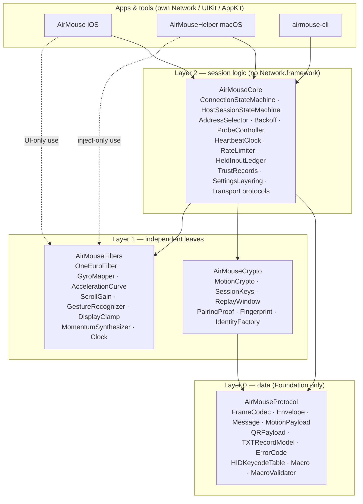
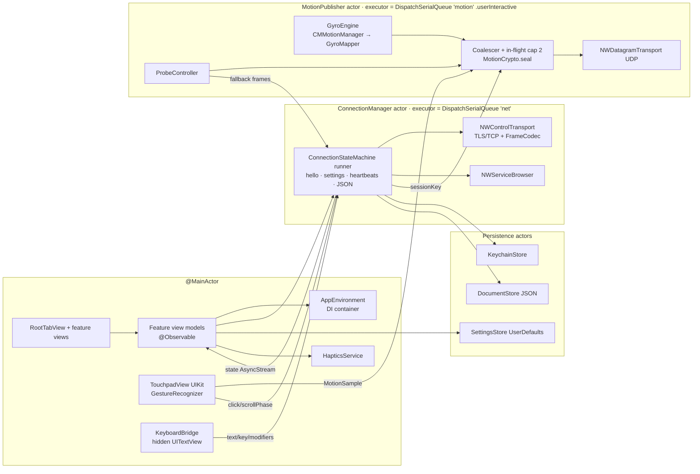
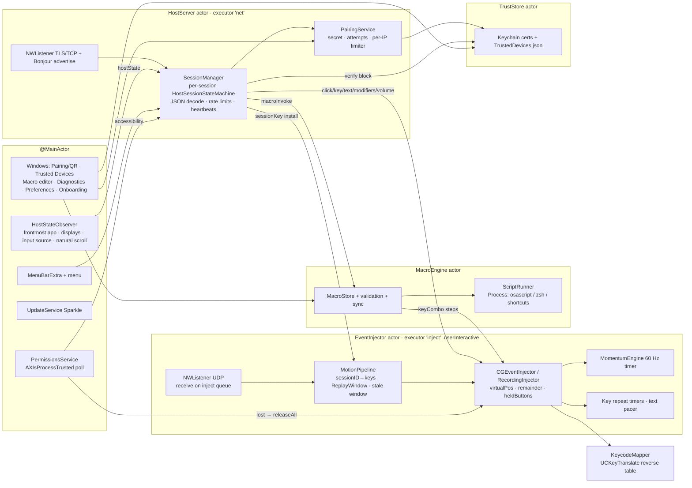
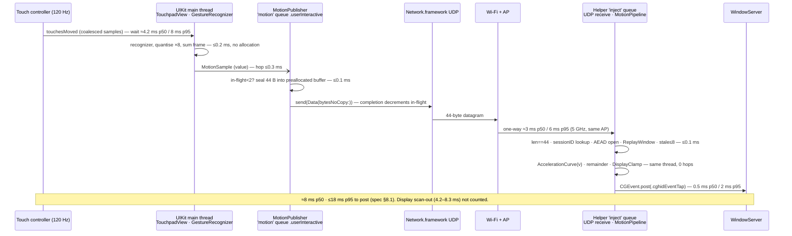
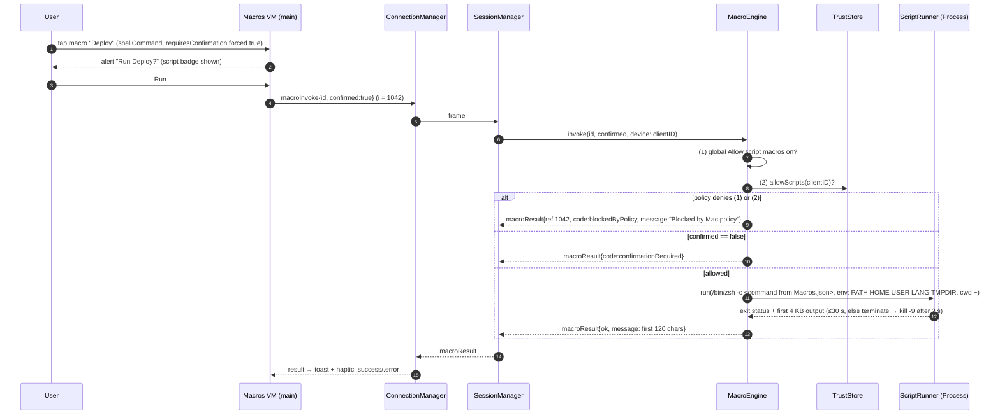
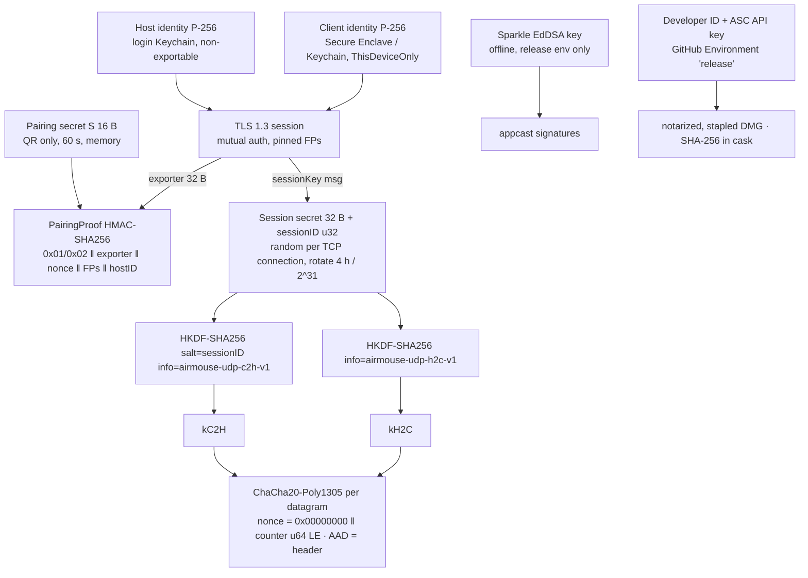
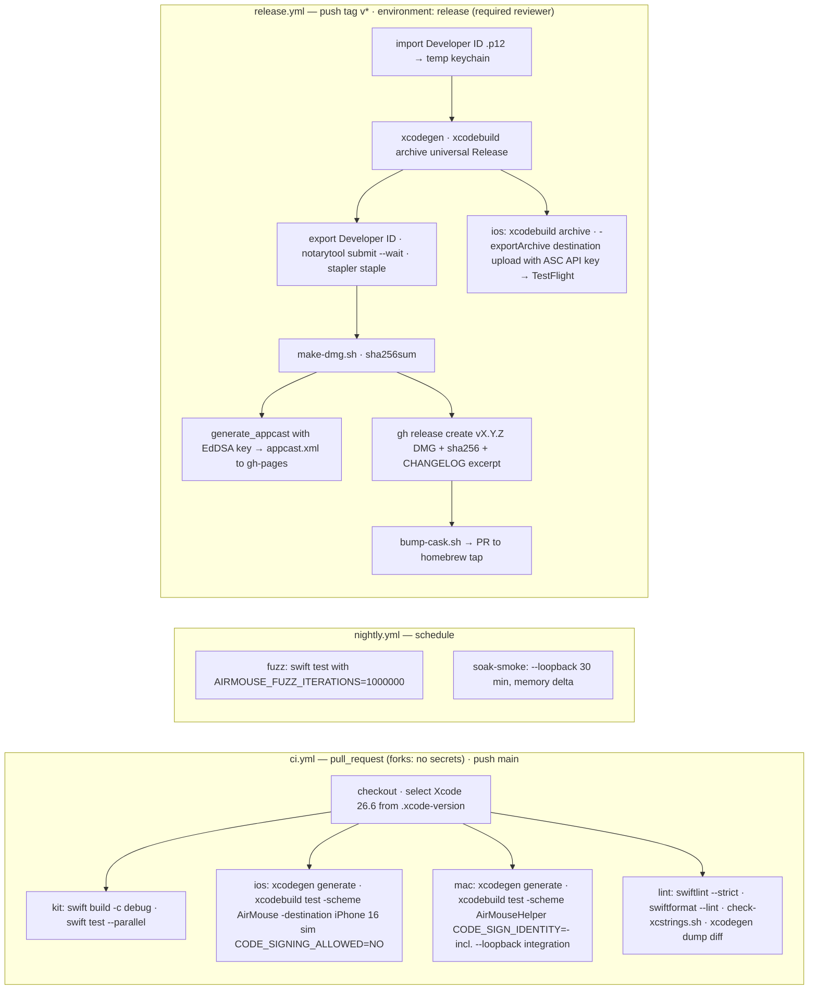
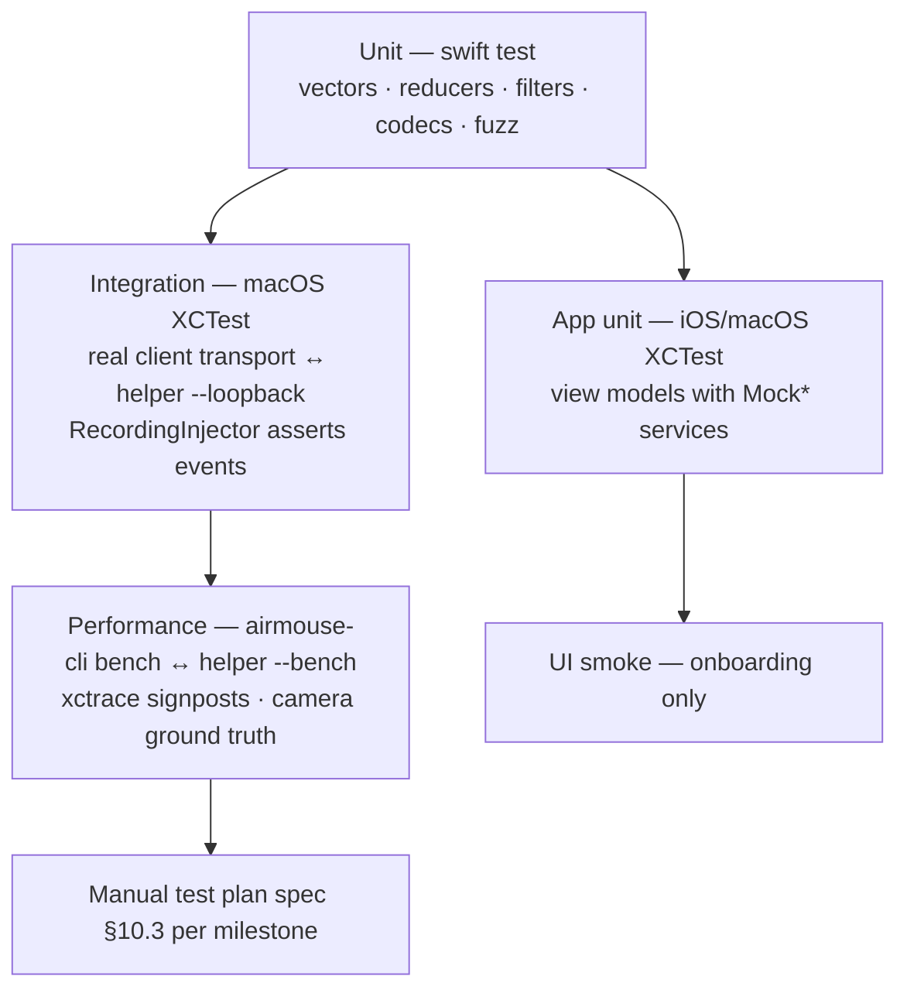

# Air Mouse — System Architecture (v1)

| Field | Value |
|---|---|
| Document | 04-architecture.md |
| Status | Draft for owner review |
| Date | 2026-09-03 |
| Upstream (authoritative, in precedence order) | `00-decisions.md` Addendum A → `03-specifications.md` → `01-requirements.md`, `02-technical-research.md` |
| Downstream | `05-plan.md`, `CONTRIBUTING.md`, `docs/protocol.md` (extracted from spec §3) |
| Audience | Implementers, reviewers, security auditors, contributors deciding where code goes |

**Reading rules.** This document adds *structure* to the specification; it does not change any wire format, constant, state machine or UX decision in `03-specifications.md`. Where a spec section is referenced it is written as *spec §n*. Two deliberate refinements to spec §2.1/§2.4 (packaging and project generation) are made here and recorded as ADR-001; the spec's *behaviour* is untouched and its §2.1/§2.4/§6.1 should be amended to the names below when `docs/protocol.md` is extracted.

| Spec §2.1 / §6.1 name | This document | Why |
|---|---|---|
| Package `AirMouseProtocol` | Package **`AirMouseKit`** | The package now also hosts platform-agnostic session logic and a CLI; "Protocol" becomes one target's name |
| Target `AirMouseWire` | **`AirMouseProtocol`** (framing, envelope, messages, `MotionPayload`, `QRPayload`, TXT model, error codes, keycode table, macro models) + **`AirMouseCrypto`** (`MotionCrypto`, `SessionKeys`, `ReplayWindow`, `PairingProof`, `Fingerprint`, `IdentityFactory`) | Crypto isolated for audit and fuzzing; Protocol has no CryptoKit or Security dependency |
| Target `AirMouseInputCore` | **`AirMouseFilters`** | Same contents (One-Euro, gyro mapper, acceleration, scroll gain, gesture recognizer, display clamp, momentum) |
| Target `AirMouseMacroModel` | folded into **`AirMouseProtocol`** (`Macro`, `MacroAction`, `MacroValidator`, `MacroDocument`) | `macroList` carries these on the wire; one fewer target to explain |
| — (new) | **`AirMouseCore`** | Client connection state machine, host session state machine, heartbeat/RTT, probe/fallback controller, address selection, backoff, trust records, settings layering — all transport-agnostic and testable with `swift test` |
| One `AirMouse.xcodeproj` with buildable folders | Two XcodeGen-generated projects under `apps/` | See §2.3 and ADR-001 |

---

## 1. Architecture goals & constraints

| # | Goal | Source | Architectural consequence |
|---|---|---|---|
| G1 | **Trackpad-grade latency**: p50 ≤ 12 ms, p95 ≤ 20 ms sample → `CGEvent.post` | NFR-PERF-001, spec §8.1 | Binary 44-byte UDP datagrams; one datagram per input frame; zero main-thread hops on the motion path on either side; a single high-priority serial executor per side owns the hot path; in-flight cap of 2; no `Codable`, no `String`, no logging (except signposts) on that path |
| G2 | **Secure by default, no plaintext mode** | NFR-SEC-001…012, spec §7 | mTLS 1.3 with pinned self-signed P-256 identities; per-datagram ChaCha20-Poly1305 with HKDF-derived per-direction keys and an RFC 6479 replay window; all crypto in one auditable target (`AirMouseCrypto`); decoders fuzzed in CI; deny-by-default trust; scripts gated three ways |
| G3 | **Open source, contributor friendly** | NFR-OSS-001…007, persona Ines | Text-only project definitions (XcodeGen `project.yml`), `swift test` runs everything in the package with no signing, a loopback harness so CI never needs Accessibility, `airmouse-cli` to exercise the Mac without a phone, no secrets on PR builds |
| G4 | **OS floor iOS 18 / macOS 15** | Decision, Addendum A4 | `NWConnection`/`NWListener`/`NWBrowser` callback APIs only; `@Observable`, `MenuBarExtra`, `SMAppService`, String Catalogs are all available; iOS 26-only APIs (`NetworkConnection`, `InlineArray` runtime) are forbidden by a lint rule |
| G5 | **Swift 6 strict concurrency** | Decision (stack), Xcode 26.6 toolchain | `swift-tools-version: 6.0`, language mode 6, `-strict-concurrency=complete` everywhere; every public type in `AirMouseKit` is `Sendable` with no `@unchecked`; mutable state lives in actors; real-time work runs on actors with custom `DispatchSerialQueue` executors so isolation is compiler-checked |
| G6 | **Never leave the Mac in a bad state** | NFR-REL-002, FR-MB-009, spec §5.3.11 | `releaseAll()` is a single function on the injector, invoked from every exit path plus a 60 s watchdog; held-input state has exactly one owner |
| G7 | **Privacy: nothing leaves the LAN, nothing typed is stored** | NFR-PRIV-*, NFR-SEC-010 | No telemetry SDKs; OSLog with privacy annotations; diagnostics are local files; typed text exists only in transient buffers |
| G8 | **Accessibility permission only** | Addendum A5 | No `CGEvent.tapCreate`, no `IOHIDManager`, no Screen Recording anywhere; enforced by a SwiftLint custom rule so a contributor cannot add an event tap by accident |
| G9 | **Reproducible, notarized releases** | NFR-OSS-005, A6 | Pinned Xcode via `.xcode-version`; tag-driven release workflow in a protected GitHub Environment; SHA-256 published and consumed by the Homebrew cask |

**Hard constraints inherited from the platform** (PRD §6): iOS is foreground-only (C3) so the session model must tolerate suspension and resume in ≤ 1 s; the Accessibility grant is keyed to the code signature (C6) so debug builds need a stable signing identity; CI runners have no Accessibility grant so no automated test may post a real `CGEvent`; trackpad-native gestures cannot be synthesized (C7) so pinch/swipes are keystrokes; macOS applies no acceleration to synthesized absolute positions (C8) so the host owns the curve.

**Non-goals for the architecture** (from PRD §7.1): multi-Mac switching, Apple Watch, QUIC in v1, Mac App Store/sandbox, phone-side macro editing, any cloud component. The transport is nevertheless behind a protocol so QUIC can be added in v2 without touching the apps (ADR-003).

---

## 2. Repository & package layout

### 2.1 Tree

```
air-mouse/
├── .github/
│   ├── ISSUE_TEMPLATE/                 bug.yml, feature.yml, latency-report.yml, config.yml
│   ├── PULL_REQUEST_TEMPLATE.md
│   ├── CODEOWNERS
│   ├── dependabot.yml                 (SwiftPM + GitHub Actions, weekly)
│   └── workflows/
│       ├── ci.yml                     PR + main: kit tests, iOS build/test, Mac build/test+integration, lint
│       ├── nightly.yml                schedule: fuzzers (10^6 iterations), soak smoke
│       └── release.yml                tag v*: notarize Mac, appcast, GitHub Release, cask PR; iOS → TestFlight
├── .xcode-version                     26.6
├── .swiftlint.yml  .swiftformat  .editorconfig  .gitignore  .gitattributes
├── Package.swift                      → thin manifest re-exporting Packages/AirMouseKit (so `swift test` at root works)
├── Packages/
│   └── AirMouseKit/
│       ├── Package.swift
│       ├── Sources/
│       │   ├── AirMouseProtocol/      Framing/, Messages/, Motion/, Discovery/, Macros/, Keycodes/, Errors/
│       │   ├── AirMouseCrypto/        MotionCrypto.swift, SessionKeys.swift, ReplayWindow.swift, PairingProof.swift,
│       │   │                          Fingerprint.swift, Identity/ (IdentityFactory, CertificateBuilder)
│       │   ├── AirMouseFilters/       OneEuroFilter, GyroMapper, AccelerationCurve, ScrollGain, GestureRecognizer/,
│       │   │                          DisplayClamp, MomentumSynthesizer, Clock.swift
│       │   ├── AirMouseCore/          Client/ (ConnectionStateMachine, AddressSelector, Backoff, ProbeController,
│       │   │                          HeartbeatClock), Host/ (HostSessionStateMachine, RateLimiter, HeldInputLedger),
│       │   │                          Transport/ (protocols only), Trust/ (records), Settings/ (layering), Diagnostics/
│       │   └── airmouse-cli/          main.swift + Commands/ (pair, connect, move, click, type, bench, replay)
│       ├── Tests/
│       │   ├── AirMouseProtocolTests/ (+ Vectors/)
│       │   ├── AirMouseCryptoTests/   (+ Vectors/)
│       │   ├── AirMouseFiltersTests/  (+ Vectors/)
│       │   └── AirMouseCoreTests/
│       └── README.md
├── apps/
│   ├── AirMouse-iOS/
│   │   ├── project.yml                XcodeGen spec (→ AirMouse.xcodeproj, git-ignored)
│   │   ├── Sources/
│   │   │   ├── App/                   AirMouseApp.swift, AppEnvironment.swift, RootTabView.swift
│   │   │   ├── Features/              Onboarding/ Pairing/ Devices/ Touchpad/ AirMouse/ Keyboard/ Remote/ Macros/ Settings/ Diagnostics/
│   │   │   ├── Services/              ConnectionManager/, MotionPublisher/, GyroEngine/, KeyboardBridge/, HapticsService/,
│   │   │   │                          KeychainStore/, DocumentStore/, TouchInput/ (TouchpadView UIKit bridge), NetworkTransport/
│   │   │   ├── Support/               Logging.swift, ErrorPresentation.swift, Labs.swift
│   │   │   └── Info.plist             (generated by XcodeGen from project.yml `info:`)
│   │   ├── Resources/                 Assets.xcassets, Localizable.xcstrings, Sounds/
│   │   ├── Tests/                     AirMouseTests (view-model + service tests with mocks)
│   │   └── UITests/                   AirMouseUITests (onboarding smoke only)
│   └── AirMouse-Mac/
│       ├── project.yml                (→ AirMouseHelper.xcodeproj, git-ignored)
│       ├── Sources/
│       │   ├── App/                   AirMouseHelperApp.swift, MenuBarScene.swift, AppEnvironment.swift, LaunchArguments.swift
│       │   ├── Features/              Onboarding/ Pairing/ TrustedDevices/ MacroEditor/ Diagnostics/ Preferences/
│       │   ├── Services/              HostServer/, SessionManager/, PairingService/, TrustStore/, EventInjector/,
│       │   │                          MomentumEngine/, KeycodeMapper/, MacroEngine/ (ScriptRunner), PermissionsService/,
│       │   │                          UpdateService/, DisplayTopology/, HostStateObserver/
│       │   ├── Support/               Logging.swift, Signposts.swift
│       │   └── AirMouseHelper.entitlements
│       ├── Resources/                 Assets.xcassets, Localizable.xcstrings
│       ├── Tests/                     AirMouseHelperTests
│       └── IntegrationTests/          AirMouseHelperIntegrationTests (drives --loopback)
├── Config/
│   ├── Base.xcconfig                  committed; `#include? "Local.xcconfig"`
│   ├── Local.xcconfig.example         committed template
│   └── Local.xcconfig                 git-ignored: DEVELOPMENT_TEAM, BUNDLE_ID_SUFFIX
├── Formula/                           (project tap) Casks/air-mouse.rb  — R-14: start with `brew tap <owner>/airmouse`
├── scripts/
│   ├── bootstrap.sh                   brew bundle, xcodegen generate ×2, copy Local.xcconfig.example
│   ├── gen-vectors.swift              regenerates Tests/*/Vectors/*.json (spec §6.4)
│   ├── gen-keycodes.swift             hid-kvk.csv → HIDKeycodeTable.swift (spec §11.2)
│   ├── check-xcstrings.sh             fails on referenced-but-missing `en` keys
│   ├── latency-rig/                   xctrace template, camera-annotation helper, bench runner
│   ├── release/                       notarize.sh, make-dmg.sh, appcast.sh, bump-cask.sh
│   └── Brewfile                       xcodegen swiftlint swiftformat gh create-dmg
├── docs/                              00…05 + protocol.md, threat-model.md, LOCALIZATION.md, MDM-PPPC.md
├── CHANGELOG.md  LICENSE (MIT)  README.md  CONTRIBUTING.md  SECURITY.md  CODE_OF_CONDUCT.md
```

Generated `.xcodeproj` directories, `DerivedData`, `Config/Local.xcconfig`, `*.xcuserdata`, and `.build/` are git-ignored. Contributors run `scripts/bootstrap.sh` once; CI runs `xcodegen generate` in every job.

### 2.2 `Packages/AirMouseKit/Package.swift`

```swift
// swift-tools-version: 6.0
import PackageDescription

let strict: [SwiftSetting] = [
    .swiftLanguageMode(.v6),
    .enableUpcomingFeature("ExistentialAny"),
    .enableUpcomingFeature("InternalImportsByDefault"),
    .unsafeFlags(["-warnings-as-errors"], .when(configuration: .debug)),   // CI builds debug
]

let package = Package(
    name: "AirMouseKit",
    platforms: [.iOS(.v18), .macOS(.v15)],
    products: [
        .library(name: "AirMouseProtocol", targets: ["AirMouseProtocol"]),
        .library(name: "AirMouseCrypto",   targets: ["AirMouseCrypto"]),
        .library(name: "AirMouseFilters",  targets: ["AirMouseFilters"]),
        .library(name: "AirMouseCore",     targets: ["AirMouseCore"]),
        .executable(name: "airmouse-cli",  targets: ["airmouse-cli"]),
    ],
    dependencies: [
        // Apple-authored; the only third-party SwiftPM dependency in the kit (needed to mint self-signed X.509).
        .package(url: "https://github.com/apple/swift-certificates.git", from: "1.5.0"),
        .package(url: "https://github.com/apple/swift-argument-parser.git", from: "1.5.0"),
    ],
    targets: [
        // Layer 0 — pure data. Foundation only. No CryptoKit, no Security, no Network.
        .target(name: "AirMouseProtocol", swiftSettings: strict),

        // Layer 1a — crypto. Foundation + CryptoKit + Security (identity) + swift-certificates.
        .target(name: "AirMouseCrypto",
                dependencies: ["AirMouseProtocol",
                               .product(name: "X509", package: "swift-certificates")],
                swiftSettings: strict),

        // Layer 1b — numerics. Foundation + simd. Independent of Protocol on purpose.
        .target(name: "AirMouseFilters", swiftSettings: strict),

        // Layer 2 — platform-agnostic session logic. Still no Network.framework: transports are injected.
        .target(name: "AirMouseCore",
                dependencies: ["AirMouseProtocol", "AirMouseCrypto", "AirMouseFilters"],
                swiftSettings: strict),

        // Tooling — the one place in the package that imports Network.framework.
        .executableTarget(name: "airmouse-cli",
                          dependencies: ["AirMouseCore",
                                         .product(name: "ArgumentParser", package: "swift-argument-parser")],
                          swiftSettings: strict),

        .testTarget(name: "AirMouseProtocolTests", dependencies: ["AirMouseProtocol"], resources: [.copy("Vectors")]),
        .testTarget(name: "AirMouseCryptoTests",   dependencies: ["AirMouseCrypto"],   resources: [.copy("Vectors")]),
        .testTarget(name: "AirMouseFiltersTests",  dependencies: ["AirMouseFilters"],  resources: [.copy("Vectors")]),
        .testTarget(name: "AirMouseCoreTests",     dependencies: ["AirMouseCore"]),
    ]
)
```

The root `Package.swift` is a one-line manifest whose only target depends on the local package, so `swift test` from the repository root runs the whole kit — contributors and CI never need Xcode to work on the protocol.

### 2.3 Project generation: XcodeGen (recommended) vs Tuist vs raw `.pbxproj`

| Criterion | Raw `.xcodeproj` (research D2's proposal) | Tuist | **XcodeGen** |
|---|---|---|---|
| Reviewability of project changes in a PR | Binary-ish `project.pbxproj` diffs; buildable folders remove *file-add* churn but not build-setting/plist/scheme churn | Swift DSL (`Project.swift`), readable but executes code | Declarative YAML; a reviewer can read a plist key or a setting change without opening Xcode |
| Contributor toolchain | Xcode only | Tuist binary + its own version management + generated `Derived/` | One Homebrew formula, no daemon, no cache directory |
| Merge conflicts | Still frequent on schemes, settings, targets | Rare | Rare — the pbxproj is not committed |
| Fit for two small apps + one package | Fine | Over-featured (module caching, graph, cloud) | Right-sized |
| Maintainer without Xcode open (this repo today) | Cannot edit the project meaningfully | Can | Can — `project.yml` is plain text |
| Risk | Low | Tuist major versions churn; DSL breaking changes | XcodeGen lags new Xcode features by weeks; mitigated by pinning the version in `Brewfile` and committing generated projects on release tags if needed |

Decision (ADR-001): **XcodeGen**, one `project.yml` per app, generated projects git-ignored. The research's buildable-folders argument is valid for file additions but does not cover the things that actually get reviewed in an open-source project — Info.plist keys, entitlements, signing settings, schemes — all of which live in `project.yml`. Both apps consume `AirMouseKit` as a local package by path.

### 2.4 `apps/AirMouse-iOS/project.yml`

```yaml
name: AirMouse
options:
  bundleIdPrefix: com.airmouse
  xcodeVersion: "26.6"
  deploymentTarget: { iOS: "18.0" }
  createIntermediateGroups: true
  generateEmptyDirectories: true
  defaultConfig: Debug
configs:
  Debug: debug
  Release: release
configFiles:                      # Base.xcconfig includes the git-ignored Local.xcconfig optionally
  Debug:   ../../Config/Base.xcconfig
  Release: ../../Config/Base.xcconfig
packages:
  AirMouseKit: { path: ../../Packages/AirMouseKit }
settings:
  base:
    SWIFT_VERSION: "6.0"
    SWIFT_STRICT_CONCURRENCY: complete
    SWIFT_UPCOMING_FEATURE_EXISTENTIAL_ANY: YES
    ENABLE_USER_SCRIPT_SANDBOXING: YES
    CODE_SIGN_STYLE: Automatic
    DEVELOPMENT_TEAM: $(DEVELOPMENT_TEAM)          # from Local.xcconfig; empty on CI (CODE_SIGNING_ALLOWED=NO)
    ASSETCATALOG_COMPILER_GENERATE_SWIFT_ASSET_SYMBOL_EXTENSIONS: YES
    LOCALIZATION_PREFERS_STRING_CATALOGS: YES
    SWIFT_EMIT_LOC_STRINGS: YES
  configs:
    Debug:   { SWIFT_ACTIVE_COMPILATION_CONDITIONS: DEBUG, ONLY_ACTIVE_ARCH: YES }
    Release: { SWIFT_COMPILATION_MODE: wholemodule }
targets:
  AirMouse:
    type: application
    platform: iOS
    supportedDestinations: [iOS, iPadOS]
    sources:
      - path: Sources
      - path: Resources
    dependencies:
      - package: AirMouseKit
        product: AirMouseCore
    settings:
      base:
        PRODUCT_BUNDLE_IDENTIFIER: com.airmouse.app$(BUNDLE_ID_SUFFIX)
        PRODUCT_NAME: Air Mouse
        TARGETED_DEVICE_FAMILY: "1,2"
        INFOPLIST_KEY_UIApplicationSceneManifest_Generation: YES
        INFOPLIST_KEY_UILaunchScreen_Generation: YES
    info:
      path: Sources/Info.plist
      properties:
        CFBundleDisplayName: Air Mouse
        CFBundleShortVersionString: $(MARKETING_VERSION)
        CFBundleVersion: $(CURRENT_PROJECT_VERSION)
        UIRequiresFullScreen: false                       # good multitasking citizen (spec §2.3)
        UISupportedInterfaceOrientations: [UIInterfaceOrientationPortrait, UIInterfaceOrientationLandscapeLeft, UIInterfaceOrientationLandscapeRight]
        UISupportedInterfaceOrientations~ipad: [UIInterfaceOrientationPortrait, UIInterfaceOrientationPortraitUpsideDown, UIInterfaceOrientationLandscapeLeft, UIInterfaceOrientationLandscapeRight]
        UIRequiredDeviceCapabilities: [arm64]
        ITSAppUsesNonExemptEncryption: false               # OS-provided TLS/CryptoKit; confirm export answer at M9
        NSLocalNetworkUsageDescription: "Air Mouse finds and connects to your Mac on your local network. Nothing is sent over the internet."
        NSBonjourServices: [_airmouse._tcp, _airmouse._udp]
        NSCameraUsageDescription: "The camera is used only to scan the pairing QR code shown on your Mac."
        NSMotionUsageDescription: "Motion sensors turn your iPhone into an air mouse: pointing the phone moves the Mac's cursor. Sensor data never leaves the device except as cursor movement."
        CFBundleURLTypes:
          - CFBundleURLName: com.airmouse.pair
            CFBundleURLSchemes: [airmouse]
            CFBundleTypeRole: Viewer
        UIBackgroundModes: []                              # deliberately none (PRD C3)
    entitlements:
      path: AirMouse.entitlements
      properties: {}                                       # no special entitlements needed (no multicast, no groups)
  AirMouseTests:
    type: bundle.unit-test
    platform: iOS
    sources: [Tests]
    dependencies: [{ target: AirMouse }]
  AirMouseUITests:
    type: bundle.ui-testing
    platform: iOS
    sources: [UITests]
    dependencies: [{ target: AirMouse }]
schemes:
  AirMouse:
    build: { targets: { AirMouse: all, AirMouseTests: [test], AirMouseUITests: [test] } }
    run:  { config: Debug }
    test:
      config: Debug
      gatherCoverageData: true
      targets: [AirMouseTests, AirMouseUITests]
    archive: { config: Release }
```

`NSMotionUsageDescription` is not strictly required for CoreMotion gyro/accelerometer (PRD NFR-PRIV-002) but is declared anyway: it costs nothing, protects against App Review's static scan for `CMMotionManager`, and satisfies the "explain sensor use" requirement.

### 2.5 `apps/AirMouse-Mac/project.yml`

```yaml
name: AirMouseHelper
options:
  bundleIdPrefix: com.airmouse
  xcodeVersion: "26.6"
  deploymentTarget: { macOS: "15.0" }
  createIntermediateGroups: true
configs: { Debug: debug, Release: release }
configFiles:
  Debug:   ../../Config/Base.xcconfig
  Release: ../../Config/Base.xcconfig
packages:
  AirMouseKit: { path: ../../Packages/AirMouseKit }
  Sparkle: { url: https://github.com/sparkle-project/Sparkle, from: "2.6.4" }
settings:
  base:
    SWIFT_VERSION: "6.0"
    SWIFT_STRICT_CONCURRENCY: complete
    ARCHS: "arm64 x86_64"                                  # universal (NFR-MAC-001)
    ENABLE_HARDENED_RUNTIME: YES
    ENABLE_APP_SANDBOX: NO                                 # direct distribution; CGEvent + scripts (NFR-MAC-003)
    CODE_SIGN_STYLE: Automatic
    DEVELOPMENT_TEAM: $(DEVELOPMENT_TEAM)
    LOCALIZATION_PREFERS_STRING_CATALOGS: YES
  configs:
    Debug:
      ONLY_ACTIVE_ARCH: YES
      CODE_SIGN_IDENTITY: "Apple Development"              # stable identity → TCC grant survives rebuilds (A10)
    Release:
      CODE_SIGN_IDENTITY: "Developer ID Application"
      OTHER_CODE_SIGN_FLAGS: "--timestamp"
      SWIFT_COMPILATION_MODE: wholemodule
targets:
  AirMouseHelper:
    type: application
    platform: macOS
    sources: [{ path: Sources }, { path: Resources }]
    dependencies:
      - package: AirMouseKit
        product: AirMouseCore
      - package: Sparkle
        product: Sparkle
        embed: true
        codeSign: true                                     # re-sign the framework with our identity (A8)
    settings:
      base:
        PRODUCT_BUNDLE_IDENTIFIER: com.airmouse.helper$(BUNDLE_ID_SUFFIX)
        PRODUCT_NAME: Air Mouse
        LD_RUNPATH_SEARCH_PATHS: "$(inherited) @executable_path/../Frameworks"
    info:
      path: Sources/Info.plist
      properties:
        CFBundleDisplayName: Air Mouse
        CFBundleShortVersionString: $(MARKETING_VERSION)
        CFBundleVersion: $(CURRENT_PROJECT_VERSION)
        LSUIElement: true                                   # menu-bar only (FR-MB-001)
        LSMinimumSystemVersion: "15.0"
        LSApplicationCategoryType: public.app-category.utilities
        NSHumanReadableCopyright: "© 2026 Air Mouse contributors. MIT License."
        NSLocalNetworkUsageDescription: "Air Mouse finds and connects to your Mac on your local network. Nothing is sent over the internet."
        NSBonjourServices: [_airmouse._tcp, _airmouse._udp]
        NSAppleEventsUsageDescription: "Only used by macros you create on this Mac that run AppleScript. Off by default."
        SUFeedURL: https://<owner>.github.io/air-mouse/appcast.xml
        SUPublicEDKey: "<base64 EdDSA public key — generated at M9-04>"
        SUEnableAutomaticChecks: false                      # opt-in (FR-MB-007)
        SUScheduledCheckInterval: 86400
        SUAutomaticallyUpdate: false
    entitlements:
      path: Sources/AirMouseHelper.entitlements
      properties:
        com.apple.security.automation.apple-events: true    # the only entitlement (spec §5.1.1)
  AirMouseHelperTests:
    type: bundle.unit-test
    platform: macOS
    sources: [Tests]
    dependencies: [{ target: AirMouseHelper }]
  AirMouseHelperIntegrationTests:
    type: bundle.unit-test
    platform: macOS
    sources: [IntegrationTests]
    dependencies: [{ target: AirMouseHelper }]
    settings: { base: { TEST_HOST: "" } }                    # launches the built app with --loopback itself
schemes:
  AirMouseHelper:
    build: { targets: { AirMouseHelper: all, AirMouseHelperTests: [test], AirMouseHelperIntegrationTests: [test] } }
    run:
      config: Debug
      commandLineArguments: { "--log-level debug": false, "--loopback": false, "--bench": false }
    test:
      config: Debug
      gatherCoverageData: true
      targets: [AirMouseHelperTests, AirMouseHelperIntegrationTests]
    archive: { config: Release }
```

### 2.6 xcconfig files

```
// Config/Base.xcconfig — committed
MARKETING_VERSION = 0.1.0
CURRENT_PROJECT_VERSION = 1
BUNDLE_ID_SUFFIX =
DEVELOPMENT_TEAM =
SWIFT_TREAT_WARNINGS_AS_ERRORS = $(AIRMOUSE_WARNINGS_AS_ERRORS)
AIRMOUSE_WARNINGS_AS_ERRORS = NO
#include? "Local.xcconfig"

// Config/Local.xcconfig.example — copy to Local.xcconfig (git-ignored)
DEVELOPMENT_TEAM = ABCDE12345          // your Apple Development team (free personal team works)
BUNDLE_ID_SUFFIX = .dev-yourname       // avoids TCC / Launch Services collisions with a release install
```

CI sets `AIRMOUSE_WARNINGS_AS_ERRORS=YES` via `xcodebuild … AIRMOUSE_WARNINGS_AS_ERRORS=YES`.

### 2.7 Other top-level files

| File | Content architecture |
|---|---|
| `LICENSE` | MIT (Addendum A7) |
| `CONTRIBUTING.md` | bootstrap runbook (plan §8), architecture map (this doc §3), "how to add a message type", "how to add a macro action kind" (touch `AirMouseProtocol/Macros`, `MacroEngine`, `MacroEditor` — never the transport), TCC troubleshooting (`tccutil reset Accessibility com.airmouse.helper.dev-*`), PR checklist |
| `SECURITY.md` | spec §7.7 policy; GitHub Security Advisories; 72 h ack, 90 d disclosure; supported versions |
| `CODE_OF_CONDUCT.md` | Contributor Covenant 2.1 |
| `CHANGELOG.md` | Keep-a-Changelog; separate "Protocol" heading per release |
| `Formula/Casks/air-mouse.rb` | cask in the project tap; `sha256` updated by `release.yml` |
| `docs/protocol.md` | spec §3 + §6.4 vectors, extracted verbatim at M2 |

---

## 3. Module architecture

### 3.1 Shared package `AirMouseKit`



**Layering rules** (enforced by target dependencies, so violations do not compile):

1. `AirMouseProtocol` imports only `Foundation`. No CryptoKit, no Security, no Network, no simd. It is the thing a future Android/Windows port re-implements, so it must be describable on paper.
2. `AirMouseCrypto` imports CryptoKit, Security and `X509`; it depends on `AirMouseProtocol` only for `MotionPayload` and the b64u helpers. All key material types are `Sendable` structs wrapping `SymmetricKey`/`Data`; none is `CustomStringConvertible` (so an accidental interpolation prints the type name, not bytes).
3. `AirMouseFilters` imports `Foundation` and `simd` and nothing of ours. Pure functions and small value-type state machines with an injected `Clock` protocol (`now() -> Duration`), so every test is deterministic.
4. `AirMouseCore` depends on all three and defines the **transport protocols** the apps implement with Network.framework: `ControlTransport` (`send(Frame)`, `AsyncStream<Frame>` inbound, `state`), `DatagramTransport` (`send(Data)`, `AsyncStream<Data>`), `ServiceBrowser`, `ServiceAdvertiser`. Core never imports `Network`; the apps and `airmouse-cli` provide `NWControlTransport`, `NWDatagramTransport`, `NWServiceBrowser`. This is what keeps the QUIC option open (ADR-003) and what makes `ConnectionStateMachine` testable with a scripted `MockTransport`.
5. Apps depend on `AirMouseCore` and may import `AirMouseFilters` directly for UI-adjacent use (gesture recognizer in the touch view, acceleration table in the settings preview).
6. Only `airmouse-cli` (an executable, not a library) imports `Network` inside the package.

**Public API surface (selected, all `public` and `Sendable`)**

| Target | Types |
|---|---|
| `AirMouseProtocol` | `ProtocolVersion`, `Frame`, `FrameKind`, `FrameCodec` (+ `FrameCodec.Decoder` with partial-buffer state), `Envelope`, `Message` (enum, spec §3.4.7), every payload struct of spec §3.4.5 (`Hello`, `HelloAck`, `SessionKeyMessage`, `Settings`, `Click`, `ScrollPhase`, `Modifiers`, `Key`, `Text`, `DeleteBackward`, `MediaKey`, `Volume`, `MacroInvoke`, `Heartbeat`, `Pong`, `HostState`, `MacroList`, `MacroResult`, `ProtocolError`, `Goodbye`, `PairChallenge`, `PairProof`, `PairConfirm`), `MotionPayload` (16 bytes; `pack(into:)`/`unpack(from:)`), `MotionFlags`, `MotionSource`, `QRPayload`, `TXTRecordModel`, `ErrorCode`, `Capability`, `HIDKeycodeTable`, `VirtualKey`, `Modifier`, `Macro`, `MacroAction`, `SequenceStep`, `MacroValidator`, `MacroDocument`, `Data.b64u` |
| `AirMouseCrypto` | `Fingerprint` (32 bytes; `init(certificateDER:)`), `SessionSecret`, `SessionKeys` (`derive(secret:sessionID:) -> (c2h, h2c)`), `MotionCrypto` (`seal(_:sessionID:counter:key:into:)`, `open(_:keys:window:) -> MotionPayload?` + `OpenFailure` side channel), `ReplayWindow`, `PairingProof` (`binding`, `clientProof`, `hostProof`, `verify` constant-time), `IdentityFactory` (`makeIdentity(commonName:) async throws -> SecIdentity`, `loadIdentity(label:)`), `TrustedCertificateStore` protocol (Keychain-backed implementations live in the apps) |
| `AirMouseFilters` | `Clock`, `OneEuroFilter`, `GyroMapper` (+ `Orientation`, `BiasEstimator`, `StillnessDetector`), `AccelerationCurve`, `ScrollGain`, `GestureRecognizer` (+ `TouchSample`, `GestureEvent`, `GestureConfig`), `DisplayClamp` (+ `DisplayRect`), `MomentumSynthesizer` |
| `AirMouseCore` | `ConnectionStateMachine` (spec §4.5.1, pure reducer: `(State, Event) -> (State, [Effect])`), `AddressSelector` (spec §3.3.2), `Backoff`, `ProbeController` (spec §3.5.8), `HeartbeatClock`/`RTTEstimator` (spec §8.2 maths), `HostSessionStateMachine` (pending → unauthenticated → authenticated → stale → closed), `RateLimiter` (token bucket, per-IP handshake limiter), `HeldInputLedger` (what `releaseAll()` must undo), `TrustedHostRecord`, `TrustedDeviceRecord`, `KnownAddress`, `SettingsSnapshot`/`SettingsPatch`/`EffectiveSettings`, `ControlTransport`, `DatagramTransport`, `ServiceBrowser`, `ServiceAdvertiser`, `DiagnosticsCounters` |

**Sendable / actor boundaries inside the kit.** The kit contains **no actors**. Everything is value types plus a few `final class` reducers that are `Sendable` because they are immutable after init. State machines are pure reducers returning effects; the apps own the actors that run them. This keeps the kit free of executor assumptions so the Mac can run `HostSessionStateMachine` on its `net` executor and the CLI can run it on a plain task, and it keeps `swift test` fast (no scheduling).

### 3.2 iOS app



**Pattern: MVVM with `@Observable`.** Each feature folder holds `<Feature>View.swift`, `<Feature>ViewModel.swift` (`@MainActor @Observable final class`) and, where needed, `<Feature>Models.swift`. View models receive their dependencies as protocols from `AppEnvironment`, never construct services, and expose plain properties that views read; commands are `func`s that `Task { await connection.send(...) }`.

| Feature module | Responsibilities | Spec |
|---|---|---|
| **Onboarding** | 3-page intro; triggers the first `NWBrowser` only on "Continue"; stores `am.onboardingCompleted` | §4.1.1 |
| **Pairing** | `DataScannerViewController` / `AVCaptureSession` fallback wrapper; QR URL parsing via `QRPayload`; pairing sheet states; paste-link field; drives `ConnectionManager.pair(with:)` | §4.1.2, §3.2 |
| **Devices** | trusted hosts + browse results; connect / forget; empty-state guidance after 5 s; E-LOCALNET handling | §4.1.3, §4.5.5 |
| **Touchpad** | hosts `TouchpadView`; mode ribbon; modifier strip; click buttons; sensitivity quick-slider; idle dim; tutorial overlay | §4.1.4, §4.2 |
| **AirMouse (Gyro)** | clutch (hold/toggle), click areas, recenter (double-tap / shake), calibration card; owns `GyroEngine` lifecycle (starts on appear, stops on disappear) | §4.1.5, §4.3 |
| **Keyboard** | live/commit modes, trail label, extended key bar, modifier row, shortcut palette, secure entry; owns `KeyboardBridge` | §4.1.6, §4.4 |
| **Remote** | Presenter/Media segments, app-aware profiles from `hostState.frontmostApp`, timer with haptics, volume slider (≤ 20 Hz coalesced), launcher row | §4.1.7 |
| **Macros** | paged grid, confirmation alert, result toasts, cached list per host | §4.1.8 |
| **Settings** | all sections of §4.1.9; per-host overrides; export/import JSON; Labs; About | §4.1.9 |
| **Diagnostics** | Latency HUD overlay (RTT p50/p95, probe RTT, one-way estimate, loss %, channel), bench runner, log export | §8.2 |

**Services**

- **`ConnectionManager` (actor).** Owns `NWServiceBrowser`, one `NWControlTransport`, the `ConnectionStateMachine`, heartbeat timer, RTT ring, settings push, macro cache refresh, trusted-record updates. Its executor is a `DispatchSerialQueue(label: "com.airmouse.app.net")`; the same queue is passed to every `NWConnection.start(queue:)` and `NWBrowser.start(queue:)`, so Network.framework callbacks arrive already on the actor's executor and are entered with `assumeIsolated` — no hop and no data race. It publishes `AsyncStream<ConnectionState>` and `AsyncStream<HostState>` for view models (which observe on the main actor). Background/foreground transitions (`scenePhase`) are forwarded by `AirMouseApp`.
- **`MotionPublisher` (actor).** Executor: `DispatchSerialQueue(label: "com.airmouse.app.motion", qos: .userInteractive)`. Holds the current `SessionKeys`, `counter`, two preallocated 44-byte send buffers, an in-flight counter (cap 2), the pending accumulator (spec §3.5.7), the `ProbeController`, and the UDP `NWDatagramTransport` started on the same queue. Input: `MotionSample` values from the touch view (main → motion, one hop) and from `GyroEngine` (CoreMotion's `OperationQueue.underlyingQueue` is the motion queue, so zero hops). When `ProbeController` says *fallback*, the publisher hands 16-byte payloads to `ConnectionManager` for `kind = 0x02` frames at ≤ 60 fps instead of sealing them.
- **`TouchInputView` (UIKit bridge).** `TouchpadView: UIView` in a `UIViewRepresentable`, `isMultipleTouchEnabled`, coalesced touches, palm rejection; owns a `GestureRecognizer` instance (main actor) configured from `EffectiveSettings`; emits `GestureEvent`s: motion deltas → `MotionPublisher`, clicks/scroll phases/keys/modifiers → `ConnectionManager`. It is also the single `UIAccessibilityElement` for the surface.
- **`GyroEngine`.** Thin CoreMotion wrapper that runs `GyroMapper` (dead zone, bias estimator, One-Euro, orientation) and emits `MotionSample(source: .gyro)`; suppressed unless the clutch is engaged; stops updates when the tab is not visible.
- **`KeyboardBridge`.** The 1 × 1 pt `UITextView` host with the sentinel-diff algorithm (spec §4.4.2), IME marked-text guard, `pressesBegan` hardware passthrough with `HIDKeycodeTable`, `UIKeyCommand`s with `wantsPriorityOverSystemBehavior`.
- **`HapticsService`.** Pre-`prepare()`d generators; visual-pulse fallback when `supportsHaptics == false`; respects the Feedback settings.
- **`KeychainStore`.** Client identity (`IdentityFactory`, Secure Enclave when available, `ThisDeviceOnly`), trusted host certificates (`kSecClassCertificate`, label `AirMouse Trusted Host <hostID>`); implements `TrustedCertificateStore`.
- **`DocumentStore` (actor).** Atomic JSON documents in Application Support with schema versions and migrations (§6).
- **`SettingsStore`.** `UserDefaults`-backed `@Observable` snapshot with `am.` keys; produces `EffectiveSettings` by layering the per-host patch.

**Dependency injection.** `AppEnvironment` is a plain `struct` of protocol-typed dependencies (`any ConnectionControlling`, `any MotionPublishing`, `any SettingsProviding`, `any HapticsProviding`, `any KeychainStoring`, …) built once in `AirMouseApp` and injected through the SwiftUI environment (`@Environment(\.appEnvironment)`). View models are constructed by the views from the environment. Every protocol has a `Mock*` implementation in `Tests/Support` and a `Preview*` implementation in `Sources/Support/Previews` (e.g. `PreviewConnection` that simulates Connected with fake RTT), so every screen has a working `#Preview` without a network. No third-party DI framework.

### 3.3 Mac helper



| Component | Isolation | Responsibilities | Spec |
|---|---|---|---|
| **`MenuBarExtra` app** | main | `MenuBarExtra("Air Mouse", systemImage:)` `.menu` style; icon state from `SessionManager` snapshots; windows opened via `openWindow`; `Settings` scene for Preferences; falls back to `NSStatusItem` + `NSPopover` only if `.menu` style focus quirks bite (kept behind one `MenuHost` protocol) | §5.1.2, §5.1.3 |
| **`HostServer` (actor)** | `net` `DispatchSerialQueue` executor | `NWListener` with TLS options (min 1.3, local identity, peer auth required, verify block consulting `TrustStore` and `PairingService.isWindowOpen`), Bonjour `NWListener.Service` with the TXT of spec §3.1.2, `serviceRegistrationUpdateHandler`, connection cap (6), per-IP handshake limiter before accept, wake/sleep restart, port-busy fallback (ephemeral for both, advertised in TXT/QR) | §3.1, §3.2.1, §5.1.5 |
| **`SessionManager`** | same executor as `HostServer` (an `actor` sharing the queue) | One `ControlSession` per TCP connection running `HostSessionStateMachine`; `FrameCodec.Decoder` per session; JSON decode; `hello`/`helloAck` negotiation; issues `sessionKey` (random 32 B + u32 ID, rotation at 4 h / 2³¹); heartbeat/pong with host timestamps; stale (2 s) → `releaseAll` + drop motion; close (6 s); token-bucket per session; routes input messages to `EventInjector`, macros to `MacroEngine`; broadcasts `hostState`, `macroList` | §3.3, §3.4, §3.5.5, §5.3.9 |
| **`PairingService`** | `net` executor | Secret lifecycle (60 s, regenerate while window open, 3 attempts, invalidate on close), `PairChallenge` nonce, exporter via `sec_protocol_metadata_create_secret` (contingency "pair-binding-certs"), proof verification through `PairingProof`, persists the client cert via `TrustStore`, produces the QR URL (`QRPayload`) with ordered interface addresses from `getifaddrs` | §3.1.3, §3.1.4, §3.2 |
| **`TrustStore` (actor)** | own executor | `kSecClassCertificate` items labelled `AirMouse Trusted Client <clientID>` + `TrustedDevices.json`; certificate is source of truth; revoke → delete cert, mark record, notify `SessionManager` to `goodbye{revoked}` and close within 1 s; `allowScripts` per device; 20-device cap | §3.2.4, §5.6 |
| **`EventInjector` (actor)** | `inject` `DispatchSerialQueue(qos: .userInteractive)` executor — the **dedicated injection thread** | Sole owner of `virtualPos`, `remainder`, `heldButtons`, latched modifiers, repeating keys, text queue; `EventInjecting` protocol with `CGEventInjector` (production, one `CGEventSource(.hidSystemState)`, `localEventsSuppressionInterval = 0`) and `RecordingInjector` (tests); `releaseAll()`; per-session injection caps; Accessibility/paused gating | §5.3 |
| **`MotionPipeline`** | runs on the `inject` executor (struct owned by the actor) | UDP receive → 44-byte check → `sessionID` lookup → `MotionCrypto.open` → `ReplayWindow` → 8-datagram stale window → probe echo (`flags.echo`, on the H2C key) or → `AccelerationCurve` (touch/pointer only) → `DisplayClamp` → post. Receives on the `inject` queue directly so decrypt and post happen on one thread with zero hops | §3.5, §5.3.2 |
| **`MomentumEngine`** | `inject` executor | 60 Hz `DispatchSourceTimer` (leeway 1 ms) running `MomentumSynthesizer`; posts momentum-phase scroll events; cancelled by new scroll deltas, `scrollPhase{cancel}`, session end, pause; implicit-end timer (120 ms) | §3.6.3 |
| **`KeycodeMapper`** | `inject` executor (table rebuilt on main-actor notification, then swapped in atomically as an immutable value) | Reverse table `Character → (keycode, needsShift)` built with `UCKeyTranslate` over all keycodes × {none, shift} on `kTISNotifySelectedKeyboardInputSourceChanged`; `ansi` flag for `hostState.inputSource`; used when `key.char` is present and layout is non-ANSI | §5.3.6 |
| **`MacroEngine` (actor)** | own executor | `Macros.json` (schema `macros/1`, revision bump on save), starter set, import/export merge, `MacroValidator`, sync to all sessions ≤ 1 s, execution dispatch per kind with timeouts, three-way script gating, `macroResult`; key steps are forwarded to `EventInjector` | §5.5 |
| **`ScriptRunner`** | inside `MacroEngine` | `Process` for `/usr/bin/osascript -`, `/bin/zsh -c`, `/usr/bin/shortcuts run`; reduced environment (`PATH HOME USER LANG TMPDIR`), cwd `~`, one concurrent process, 30/60 s timeout → `terminate()` then `kill -9` after 2 s, output capped at 4 KB, first 120 chars into `macroResult.message`; **never** `NSAppleScript` in-process (ADR-012) | §5.5.4 |
| **`PermissionsService`** | main | `AXIsProcessTrustedWithOptions`, deep links, polling (2 s onboarding / 10 s runtime), `SMAppService` registration, firewall state probe, `hostState.accessibility` updates; on loss → `EventInjector.releaseAll()` | §5.2 |
| **`HostStateObserver`** | main | `NSWorkspace.didActivateApplicationNotification` (≤ 500 ms), `didChangeScreenParametersNotification` → `DisplayTopology` refresh, input source change, `com.apple.swipescrolldirection`; publishes `HostState` snapshots to `SessionManager` and `EventInjector` | §5.3.8, §5.7.3 |
| **`UpdateService`** | main | Sparkle 2 `SPUStandardUpdaterController`, opt-in, 24 h; Caskroom detection hides Sparkle UI and shows the `brew upgrade` hint | §5.7.2 |
| **`Logging`** | nonisolated | `Logger(subsystem: "com.airmouse.helper", category:)` per module; `os_signpost` intervals `udp.receive→inject.post`; redaction helpers | §5.7.3 |

**Why `EventInjector` is not on the main thread.** (1) The main thread runs the AppKit/SwiftUI run loop; `CGEvent.post` is a synchronous Mach IPC to WindowServer taking 0.5–2 ms, and doing it 120× per second on the main thread would steal 6–25 % of every UI frame. (2) The reverse also holds: any main-thread work — opening the menu, rendering the QR window, a SwiftUI layout pass — would add 10–100 ms of jitter to injection; worse, while an `NSMenu` is open the main run loop is in a modal tracking mode and dispatch-to-main blocks entirely, so the cursor would freeze whenever the user clicks the menu-bar icon. (3) Injection needs a single writer for the pointer state; making that writer a dedicated `.userInteractive` executor gives it scheduling priority above default UI work and lets the compiler enforce isolation (it is an actor). (4) UDP receive can be scheduled on the very same queue, so decrypt → accelerate → post happens on one thread with no hop; the main thread is never in the path.

---

## 4. Runtime views

### 4.1 (a) Cold start and QR pairing

```mermaid
sequenceDiagram
  autonumber
  participant U as User
  participant iOS as iOS: Pairing VM (main)
  participant CM as ConnectionManager (net)
  participant KS as KeychainStore
  participant HS as HostServer / SessionManager (net)
  participant PR as PairingService
  participant TS as TrustStore
  participant MB as Mac UI (main)
  U->>MB: Menu › Pair new device…
  MB->>PR: openWindow() → secret S, expiry 60 s
  PR-->>MB: QR URL airmouse://pair?… (addresses ordered, fp, s)
  U->>iOS: Scan QR
  iOS->>CM: pair(QRPayload)
  CM->>KS: loadOrCreateIdentity() [first pairing: SecKeyCreateRandomKey + self-signed cert]
  KS-->>CM: SecIdentity
  CM->>HS: TCP connect (AddressSelector, 700 ms stagger)
  CM->>HS: TLS 1.3 ClientHello, client cert on CertificateRequest
  Note over CM,HS: Client verify block: FP == QR fp. Host verify block: unknown FP, window open, pending<2 → unauthenticated
  CM->>HS: hello{pairing:true}
  HS->>PR: challenge()
  PR-->>CM: pairChallenge{nonce, hostID, hostName}
  CM->>CM: exporter = TLS exporter 32 B; proof = HMAC(S, 0x01‖binding)
  CM->>HS: pairProof
  HS->>PR: verify(proof, exporter, nonce, FPs)
  PR->>TS: add(clientCert, metadata)
  PR-->>HS: consumed S
  HS-->>CM: pairConfirm{hostProof}
  CM->>CM: verify hostProof
  CM->>KS: store hostCert (label AirMouse Trusted Host hostID)
  HS-->>CM: helloAck, sessionKey, hostState, macroList
  CM->>HS: settings
  CM-->>iOS: state = Connected
  iOS-->>U: "Paired" → Touchpad tab
  HS-->>MB: "Paired with <device>"
```

Budget: QR scanned → touchpad usable ≤ 3 s (AM-DP-02). Identity creation on first pairing (Secure Enclave key + certificate build) is the only step that can take > 100 ms and is started as soon as the scanner opens, in parallel with the camera.

### 4.2 (b) Steady-state motion datagram: `UITouch` → `CGEvent.post`



Thread hops on the whole path: exactly **one** (iOS main → motion queue). The Mac side has zero because the UDP `NWConnection`s are started on the inject queue. Control-derived injections (clicks, keys) take the slower `net → inject` hop, which is fine within the 30 ms control budget.

### 4.3 (c) Reconnect after a Wi-Fi blip

```mermaid
sequenceDiagram
  autonumber
  participant UI as Touchpad VM (main)
  participant CM as ConnectionManager (net)
  participant MP as MotionPublisher
  participant HS as SessionManager (net)
  participant EI as EventInjector
  Note over CM,HS: Wi-Fi drops mid-drag at t=0
  HS->>HS: no heartbeat for 2 s → session stale
  HS->>EI: releaseAll() (mouseUp, flagsChanged up, stop momentum/text)
  CM->>CM: NWPathMonitor: Wi-Fi unsatisfied → Reconnecting immediately (no 2 s wait)
  CM-->>UI: state Reconnecting → banner E-RECONNECTING
  CM->>MP: suspend sending (keys retained until new sessionKey)
  loop Backoff 250·500·1000·2000·4000 ms ±20 %
    CM->>CM: AddressSelector: Bonjour result → lastKnownAddresses → qrAddresses
    CM->>HS: TCP+TLS attempt (old connection kept ≤6 s)
  end
  Note over CM,HS: Wi-Fi returns at t≈5 s
  CM->>HS: TLS ready (client FP in TrustStore) · hello{pairing:false, macroRevision}
  HS->>HS: no-heartbeat 6 s timer had closed the old TCP; new ControlSession authenticated
  HS-->>CM: helloAck · sessionKey (new sessionID) · hostState (macroList skipped: revision equal)
  CM->>HS: settings (re-pushed)
  CM->>MP: install new SessionKeys, reset counters, open UDP to helloAck.udpPort, first probe
  CM-->>UI: Connected (banner dismissed) — target ≤3 s after network return
```

The `GestureRecognizer` on the phone is also reset to `Idle` on `Reconnecting` so a drag that was in progress does not resume with a phantom button-down; the user simply lifts and starts again.

### 4.4 (d) Macro invoke with confirmation (script kind)



Only the `id` ever crosses the wire; the command text lives in `Macros.json` on the Mac (NFR-SEC-007). A phone cannot escalate by sending `confirmed: true` because (1) and (2) are host-side facts.

### 4.5 (e) UDP-blocked fallback to the TCP motion channel

```mermaid
sequenceDiagram
  autonumber
  participant TV as TouchpadView
  participant MP as MotionPublisher + ProbeController
  participant CM as ConnectionManager
  participant SM as SessionManager
  participant IQ as MotionPipeline (inject)
  Note over MP,IQ: After connect: probes at 4 Hz (flags.probe, source 255)
  MP--xIQ: probe 1…8 lost (router drops UDP 47800)
  MP->>MP: first 8 probes after connect unanswered (2 s) AND pong seen <1 s → enter fallback
  MP-->>TV: badge "Elevated latency" (E-UDP-FALLBACK)
  loop while in fallback, ≤60 frames/s
    TV-)MP: MotionSample(s)
    MP->>CM: [MotionPayload] (1–16) coalesced ≥16.7 ms apart
    CM->>SM: frame kind=0x02 (TLS protects; no AEAD, no counter)
    SM->>IQ: payloads with channel=tcp → same pipeline (accel · clamp · post)
  end
  MP--xIQ: probes continue at 1 Hz
  IQ-->>MP: 5 consecutive echoes answered (network fixed)
  MP->>MP: exit fallback → UDP sealing resumes, badge removed
```

---

## 5. Concurrency & threading model

### 5.1 Principles

1. **Language mode 6 with complete strict concurrency** in every target. No `@unchecked Sendable`, no `nonisolated(unsafe)` outside the two documented preallocated-buffer sites (`MotionPublisher.sendBuffers`, `MotionPipeline.scratch`), each with a comment explaining the single-owner invariant.
2. **Actors own mutable state; executors decide the thread.** Real-time actors use a custom executor: `DispatchSerialQueue` conforms to `SerialExecutor` on iOS 18 / macOS 15, so an actor can declare `nonisolated var unownedExecutor: UnownedSerialExecutor { queue.asUnownedSerialExecutor() }` and run on a queue whose QoS we control, while the compiler still checks isolation.
3. **Executor-matched callbacks.** Every `NWConnection`/`NWListener`/`NWBrowser` is started on its owning actor's queue, and callbacks enter the actor with `assumeIsolated`. This removes the classic "hop into the actor from a completion handler" latency and eliminates the data race where a callback touches actor state.
4. **`@MainActor` only where UIKit/AppKit/SwiftUI demand it**: views, view models, `TouchpadView` touch handling (UIKit delivers on main), `KeyboardBridge` (text view delegate), haptics generators, `MenuBarExtra`, windows, `PermissionsService` (System Settings deep links, `SMAppService`), Sparkle, `NSWorkspace` observers, `NSEvent` local monitor in the macro recorder, `NSAppleEventsUsageDescription`-triggering `NSWorkspace.open`.
5. **Kit code is executor-agnostic**: pure functions and reducers; no `Task`, no `DispatchQueue`, no timers inside the kit. Timers live in the apps and feed `Clock`-driven reducers.

### 5.2 Isolation domains

| Domain | Platform | Executor | Owns | Talks to |
|---|---|---|---|---|
| Main actor | both | main thread | UI, view models, touch/keyboard views, permissions, Sparkle, workspace observers | actors via `await`; receives `AsyncStream`s |
| `ConnectionManager` | iOS | `DispatchSerialQueue("net")`, default QoS `.userInitiated` | control transport, browser, state machine, heartbeats, RTT ring, trust updates | `MotionPublisher` (key install, fallback frames), stores |
| `MotionPublisher` | iOS | `DispatchSerialQueue("motion", qos: .userInteractive)` | UDP transport, keys, counters, buffers, probe controller, gyro delivery | `ConnectionManager` for fallback; nothing else |
| `HostServer` + `SessionManager` + `PairingService` | macOS | shared `DispatchSerialQueue("net", qos: .userInitiated)` | listener, sessions, decoders, secrets, limiters | `EventInjector` (key install, input commands), `MacroEngine`, `TrustStore` |
| `EventInjector` (+ `MotionPipeline`, `MomentumEngine`, key repeat, text pacer) | macOS | `DispatchSerialQueue("inject", qos: .userInteractive)` | UDP listener/connections, pointer state, held inputs, timers | posts to WindowServer; publishes counters to Diagnostics via a lock-free snapshot struct |
| `MacroEngine` | macOS | default actor executor | macros document, running `Process` | `EventInjector` for key steps |
| `TrustStore`, `DocumentStore`, `KeychainStore` | both | default actor executors | Keychain + JSON I/O | callers via `await` |

### 5.3 Real-time-ish constraints on the motion path

- **No allocation in our code on the hot path.** `MotionSample`, `MotionPayload`, `MotionFlags`, `ReplayWindow`, `AccelerationCurve`, `DisplayClamp`, `OneEuroFilter`, `GyroMapper` are value types with fixed-size storage. `MotionPayload.pack(into:)` writes into a caller-provided 16-byte `UnsafeMutableRawBufferPointer` (the single sanctioned unsafe site, fuzzed). `MotionCrypto.seal(_:into:)` writes into a caller-provided 44-byte buffer. The two send buffers on the phone and the receive scratch on the Mac are allocated once per session. Network.framework and CryptoKit allocate small objects internally (the `Data` wrapper handed to `send`, the `SealedBox`); these are sub-microsecond and inside the 0.1 ms budget; the rule is that *we* add none.
- **No `Codable`, no JSON, no `String`, no `os_log` on the UDP path.** Only `os_signpost` intervals (`udp.receive → inject.post`) which are cheap and off unless a trace is recording. Diagnostics counters are plain integers incremented on the inject queue and snapshotted by the Diagnostics window at 4 Hz.
- **No locks on the hot path.** Each side's hot path runs on one serial executor that exclusively owns its state; cross-executor inputs (new session keys, settings changes, pause) are delivered as messages onto that executor, never via shared mutable memory.
- **Bounded work per datagram.** Fixed 44-byte length check before any crypto; unknown `sessionID` dropped before AEAD (T11); per-session cap 250/s.
- **Timers.** Only `DispatchSourceTimer` with explicit leeway (1 ms for momentum, 5 ms for heartbeats), never `Timer` on the main run loop for anything input-related; `usleep`/`Thread.sleep` are banned by lint.
- **Priority.** `.userInteractive` on both hot queues; Network.framework inherits the QoS of the queue passed to `start(queue:)`.

### 5.4 Backpressure and coalescing

Client (spec §3.5.7): in-flight cap 2 tracked by send completions; overflow adds deltas into a pending accumulator (`samples` increments) and sends when a slot frees; never a batching timer; zero-delta frames not sent except the `motionEnd` / `scrollBegan` / `scrollEnded` carriers. In TCP fallback the publisher coalesces to ≤ 60 frames/s and hands ≤ 16 payloads per frame to `ConnectionManager`. Host: per-session token bucket for control messages (200/s, burst 400), injection caps per §5.3.9, and `Deque`-free design — nothing is queued on the host except the text pacer (bounded by the 16 KB message cap) and key-sequence macro steps (≤ 16).

### 5.5 Cancellation and lifecycle

Session-scoped work is structured under a per-session `Task` tree in `ConnectionManager` / `SessionManager` so cancelling the session cancels heartbeats, probes, pacers and repeat timers together; `releaseAll()` is called synchronously on the inject executor *before* the cancellation propagates so no held input outlives its session.

---

## 6. Data & persistence architecture

### 6.1 Keychain items

| Item | Side | Class / attributes | Notes |
|---|---|---|---|
| Client identity private key | iOS | `kSecClassKey`, P-256, `kSecAttrTokenIDSecureEnclave` when available, `kSecAttrIsPermanent`, `kSecAttrApplicationTag = com.airmouse.app.identity`, `kSecAttrAccessibleAfterFirstUnlockThisDeviceOnly`, no iCloud sync | never exported; "Reset identity" deletes and regenerates (all hosts must re-pair) |
| Client identity certificate | iOS | `kSecClassCertificate`, label `AirMouse Client Identity` | paired with the key by public-key hash → `SecIdentity` |
| Trusted host certificates | iOS | `kSecClassCertificate`, label `AirMouse Trusted Host <hostID b64u>` | one per host; deleted on Forget |
| Host identity private key | macOS | `kSecClassKey`, P-256, login Keychain, non-exportable (`kSecAttrIsExtractable = false`), `kSecAttrAccessibleAfterFirstUnlock` | created on first launch |
| Host identity certificate | macOS | `kSecClassCertificate`, label `AirMouse Host Identity` | |
| Trusted client certificates | macOS | `kSecClassCertificate`, label `AirMouse Trusted Client <clientID b64u>` | deleted on Revoke |
| Nothing else | — | pairing secret, session keys, typed text are memory-only | spec §7.3 |

Bundle-ID suffixes (`.dev-yourname`) automatically give each developer build its own Keychain access scope, so a debug helper and a release helper on one Mac do not share trust.

### 6.2 UserDefaults keys

| Side | Key | Type | Default |
|---|---|---|---|
| iOS | `am.onboardingCompleted`, `am.tutorial.touchpadDone`, `am.tutorial.gyroDone` | Bool | false |
| iOS | `am.settings.v1` | JSON blob of `SettingsSnapshot` (pointer, gestures, gyro, keyboard, remote, appearance, feedback) | spec §4.1.9 defaults |
| iOS | `am.shortcutPalette` | `[Chord]` JSON | spec §4.4.5 list |
| iOS | `am.defaultTab`, `am.autoConnectLastHost`, `am.lastHostID` | String / Bool / String | touchpad / true / nil |
| iOS | `am.labs.prediction`, `am.labs.latencyHUD`, `am.labs.tcpMotionOnly` | Bool | false |
| macOS | `am.helper.hostID` | 16 B b64u | generated first launch |
| macOS | `am.helper.setupCompleted`, `am.helper.launchAtLogin`, `am.helper.updateCheckOptIn`, `am.helper.relaunchWatchdog` | Bool | false / true / false / false |
| macOS | `am.helper.allowScriptsGlobal`, `am.helper.requireConfirmationAll` | Bool | false / false |
| macOS | `am.helper.naturalScrollOverride` (`system`/`natural`/`inverted`), `am.helper.minClickDurationMs`, `am.helper.textRateCap` | String / Int / Int | system / 15 / 2000 |
| macOS | `am.helper.tcpPort`, `am.helper.udpPort` | Int | 47800 |
| macOS | `am.helper.logLevel`, `am.helper.labs.prediction` | String / Bool | info / false |

Sparkle keeps its own `SU*` defaults.

### 6.3 Application Support JSON documents

| Document | Path | Schema id | Writer |
|---|---|---|---|
| Trusted hosts (client) | `Application Support/AirMouse/TrustedHosts.json` | `trusted-hosts/1` | `DocumentStore` |
| Macro cache (client) | `Application Support/AirMouse/Macros/<hostID>.json` | `macros/1` (same as host) | `DocumentStore` |
| Settings export (client) | user-chosen via Files | `settings-export/1` | Settings feature |
| Trusted devices (host) | `~/Library/Application Support/AirMouseHelper/TrustedDevices.json` | `trusted-devices/1` | `TrustStore` |
| Macros (host) | `~/Library/Application Support/AirMouseHelper/Macros.json` | `macros/1` | `MacroEngine` |
| Diagnostics export | user-chosen via Save panel | `diagnostics/1` | Diagnostics window |

Every document is `{ "schema": "<name>/<int>", ... }`, written atomically (`.atomic`, plus `.completeUntilFirstUserAuthentication` file protection on iOS), read through `DocumentStore.load(_:migrating:)`.

**Migration policy.** Migrators are pure functions `(JSONObject, fromVersion) -> JSONObject` registered per schema name and applied in sequence; a document with a *newer* schema than the app knows is not loaded — it is copied to `<name>.json.bak-<timestamp>` and the user sees a one-line notice; a corrupt document is backed up the same way and replaced by defaults; the Keychain, not JSON, is the source of truth for trust, so a lost `TrustedHosts.json` degrades to "trusted but nameless" records that are rebuilt from the certificate CN on next connect (`AirMouse Host <hostID>`). Schema bumps are listed in `CHANGELOG.md` under "Storage".

---

## 7. Security architecture

### 7.1 Identity generation and `SecIdentity` strategy

Security.framework has no public certificate-minting API, so identities are built in `AirMouseCrypto.IdentityFactory`:

**Path A (preferred, both platforms).**
1. `SecKeyCreateRandomKey` — P-256, `kSecAttrIsPermanent = true`, on iOS with `kSecAttrTokenIDSecureEnclave` and an access control of `kSecAttrAccessibleAfterFirstUnlockThisDeviceOnly` (no user presence — TLS must work silently); on macOS in the login Keychain, non-extractable.
2. Export the public key (`SecKeyCopyExternalRepresentation`, X9.63) and build a `TBSCertificate` with swift-certificates: v3, random 16-byte serial, CN `AirMouse Host <hostID>` / `AirMouse Client <clientID>`, validity 10 years, EKU serverAuth + clientAuth, `ecdsa-with-SHA256`.
3. DER-serialize the TBS, sign it with `SecKeyCreateSignature(key, .ecdsaSignatureMessageX962SHA256, tbs)` (returns DER `ECDSA-Sig-Value`, which is what X.509 expects), and assemble the outer `Certificate` SEQUENCE with swift-asn1.
4. `SecCertificateCreateWithData` → `SecItemAdd` (with label). Because the private key is permanent in the Keychain and its public-key hash matches the certificate, `SecItemCopyMatching(kSecClassIdentity, kSecAttrLabel)` returns the `SecIdentity`, which becomes `sec_identity_create(...)` for TLS.

**Path B (fallback if spike R-1 shows identity lookup fails for Secure Enclave keys on some iOS versions).** Generate a software `P256.Signing.PrivateKey` with CryptoKit, let swift-certificates sign natively, import the key as a permanent `SecKey` (`SecKeyCreateWithData` + `SecItemAdd`), add the certificate, query the identity. Loses SE binding (FR-DP-005 says "where available", so this is permitted) and is recorded in `hostState`/diagnostics as `identity: software`.

Both paths are selected at runtime by `IdentityFactory` and covered by an on-device test in the iOS test target (CI simulators have no SE, so Path B is what CI exercises; Path A is a manual M1 spike and a nightly device-lab check).

### 7.2 TLS configuration and verify blocks

```swift
// AirMouse-Mac/Services/HostServer/TLSConfiguration.swift (host side; client mirrors it)
let tls = NWProtocolTLS.Options()
let o = tls.securityProtocolOptions
sec_protocol_options_set_min_tls_protocol_version(o, .TLSv13)
sec_protocol_options_set_local_identity(o, sec_identity_create(hostIdentity)!)
sec_protocol_options_set_peer_authentication_required(o, true)
sec_protocol_options_set_verify_block(o, { _, trust, complete in
    // Runs on `netQueue` (the HostServer executor). Never touches UI. Never logs the certificate.
    let secTrust = sec_trust_copy_ref(trust).takeRetainedValue()
    guard let chain = SecTrustCopyCertificateChain(secTrust) as? [SecCertificate], chain.count == 1 else { return complete(false) }
    let fp = Fingerprint(certificateDER: SecCertificateCopyData(chain[0]) as Data)
    switch trustStore.decision(for: fp, pairingWindowOpen: pairing.isWindowOpen, pendingCount: sessions.pendingCount) {
    case .trusted:         sessions.markAuthenticated(fp); complete(true)
    case .pendingPairing:  sessions.markUnauthenticated(fp); complete(true)   // only hello{pairing} + pair* accepted
    case .reject:          complete(false)                                      // TLS alert certificate_unknown
    }
}, netQueue)
```

Client side: same minimum version; `sec_protocol_options_set_challenge_block` supplies the client identity on `CertificateRequest`; verify block accepts iff `fp == pinnedFP` (from the QR during pairing, from the Keychain afterwards); SNI/hostname validation disabled by never setting a server name. The exporter for the pairing proof is `sec_protocol_metadata_create_secret(metadata, label.count, "EXPORTER-airmouse-pairing-v1", 32)` read from the connection's `NWProtocolTLS.Metadata` once `.ready`; if unavailable on either side (spike R-1), both advertise `pair-binding-certs` and use 32 zero bytes (spec §3.2.3 contingency).

### 7.3 Key hierarchy



### 7.4 Threat → mitigation → module

| Threat (spec §7.1) | Mitigation | Module that implements it | Test |
|---|---|---|---|
| T1 passive sniffing | TLS 1.3 AEAD; ChaChaPoly datagrams | `HostServer`/`ConnectionManager` TLS options; `MotionCrypto` | 10.5 cipher audit |
| T2 inject/replay motion or clicks | per-datagram AEAD + `ReplayWindow`; clicks/keys only on TLS | `MotionPipeline`, `AirMouseCrypto` | replay vector; bit-flip test |
| T3 evil-twin Bonjour host | FP pinned from QR/Keychain; TXT never trusted | client verify block, `Devices` (badge from `id` only) | E-PAIR-FP integration test |
| T4 unknown phone connects | mTLS + trust store; unknown → reject unless window open, then `pair*` only | host verify block, `HostSessionStateMachine` | integration: non-pair message while unauthenticated closes |
| T5 replayed QR | 60 s, single use, 3 attempts, exporter-bound proof | `PairingService`, `PairingProof` | reuse/expiry tests |
| T6 malicious QR | grammar + 512 B limit, FP must match, public IPs only from QR and still pinned | `QRPayload`, `AddressSelector` | malformed-URL vectors |
| T7 stolen phone | Revoke ≤ 1 s; SE key, `ThisDeviceOnly` | `TrustStore`, `KeychainStore` | revoke integration test |
| T8 stolen Mac Keychain/list | non-exportable key; list holds public certs only | `IdentityFactory`, `TrustStore` | attribute assertion test |
| T9 compromised phone runs scripts | 3-way gating; Mac-defined macros only; subprocess, minimal env, timeouts | `MacroEngine`, `ScriptRunner` | gating matrix test |
| T10 handshake flood | 5/min/IP pre-TLS; 6-connection cap; 3 proof attempts | `HostServer.RateLimiter`, `PairingService` | limiter unit tests |
| T11 datagram flood | length check → sessionID lookup → AEAD; 250/s cap | `MotionPipeline` | 10 k pps flood with `airmouse-cli` |
| T12 malformed frames | 256 KiB cap, JSON depth ≤ 8, fuzzed decoders, no unsafe in decode | `FrameCodec`, `Envelope` | nightly fuzz |
| T13 stuck inputs | stale → `releaseAll`, 60 s watchdog, sleep/quit/permission-loss paths | `EventInjector`, `HeldInputLedger` | loopback test |
| T14 update tampering | Sparkle EdDSA over HTTPS; notarized; cask SHA-256 | `UpdateService`, `release.yml` | appcast tamper test |
| T15 repudiation | local OSLog for pair/revoke/rejects | `Logging` | log audit |
| T16 downgrade | TLS min 1.3; highest common protocol; no unauthenticated mode exists | TLS options, `hello` negotiation | TLS 1.2 client rejected |

### 7.5 Secure logging rules

- Subsystems `com.airmouse.app`, `com.airmouse.helper`, `com.airmouse.kit`; categories `net`, `tls`, `pairing`, `session`, `inject`, `macro`, `store`, `ui`, `motion`.
- `SensitiveBytes` / `SessionSecret` / `PairingSecret` types have no `description`; interpolating them is a compile error (`CustomStringConvertible` deliberately not implemented and a `@available(*, unavailable)` `description`).
- Peer identifiers use `privacy: .private`; FP prefixes (8 hex) are `.public`; IPs are masked to /24 above `.debug`.
- Never logged: typed text, `key.char`, secrets, session keys, private keys, full certificates, script stdout.
- `.debug` per-message traces are compiled out of Release (`#if DEBUG`).
- Lint: custom SwiftLint rules forbid `print(` outside `airmouse-cli`, forbid `CGEvent.tapCreate`/`CGEventTapCreate`/`IOHIDManager`, and flag `Logger` calls whose interpolation contains identifiers matching `/secret|key|text|password/i` without a privacy annotation.
- Diagnostics export = counters and timings only, validated by a unit test that serialises a synthetic session and asserts no string field longer than 64 chars.

---

## 8. Cross-cutting concerns

**Logging.** `Logger` per category, wrapped by `Log.net`, `Log.inject`, … static lets; signposts in `Signposts.swift` with `OSSignposter`; runtime log level from `--log-level` / `am.helper.logLevel`. The Diagnostics windows read counters, not logs.

**Diagnostics HUD.** iOS: an overlay view fed at 4 Hz by `ConnectionManager` (`RTTEstimator` snapshot) and `MotionPublisher` (probe RTT, loss, channel, in-flight). Mac: the Diagnostics window reads a `DiagnosticsSnapshot` struct that the inject and net executors publish through `OSAllocatedUnfairLock<Snapshot>`-guarded copies (a lock is acceptable off the hot path at 4 Hz). Both expose "Export diagnostics…" as JSON `diagnostics/1`.

**Feature flags / Labs.** `Labs` is a small `@Observable` wrapper over `am.labs.*` keys: `prediction` (host `hostState`-independent; the client sets `flags.predicted` and the host honours its own Labs toggle), `latencyHUD`, `tcpMotionOnly` (debug forcing fallback), and, later, `quicTransport`. Labs items are hidden behind Settings › Advanced and always default off. Compile-time flags are avoided; the helper's `--loopback`, `--bench`, `--port`, `--identity`, `--pairing-secret`, `--log-level` are runtime arguments parsed in `LaunchArguments.swift`.

**Localization.** `Localizable.xcstrings` per app; the kit has no user-facing strings — it exposes `ErrorCode` and the apps map codes to the E-* copy of spec §9 in `ErrorPresentation.swift`. `scripts/check-xcstrings.sh` fails CI if a referenced key lacks an `en` value. RTL mirroring is disabled on the touchpad surface, click buttons and gyro click areas; key glyphs are locale-independent.

**Accessibility.** Rules of spec §4.8.1 are architectural in two places: `TouchpadView` is one `UIAccessibilityElement` with direct-touch trait and the Z-escape; every haptic has a visual pulse alternative via `HapticsService.feedback(_:)` which decides based on hardware and settings. The Mac windows use SwiftUI tables and standard controls so full keyboard access works by default; the QR window exposes the pairing link as an accessibility value.

**Error taxonomy.** `AirMouseCore.AirMouseError` is an enum with associated data: `.transport(TransportFailure)`, `.protocol(ErrorCode, message)`, `.pairing(PairingFailure)`, `.auth(.untrusted | .revoked)`, `.version(min, max, side)`, `.localNetworkDenied`, `.cameraDenied`, `.rateLimited`, `.host(.noAccessibility | .paused)`, `.macro(MacroResultCode)`, `.store(StoreFailure)`, `.internal(String)`. Each case maps to exactly one E-* id in `ErrorPresentation` (iOS) or `HelperErrorPresentation` (Mac); unmapped peer `error.code`s fall back to "Connection problem / <code>". Errors are values, never thrown across actor boundaries as `any Error` (they are `Sendable` enums), and the wire `error` message is developer-facing English only.

---

## 9. Build, CI/CD & release architecture

### 9.1 Workflows



Runners: `macos-26` (GitHub-hosted) with Xcode selected by `xcodes select $(cat .xcode-version)` (falls back to `sudo xcode-select -s /Applications/Xcode_26.6.app`). The iOS and Mac jobs run in parallel with the kit job; total PR wall time target ≤ 15 min. SwiftPM and DerivedData are cached by `Package.resolved` hash.

### 9.2 Branch protection and PR checks

`main` is protected: PRs required; required checks `kit`, `ios`, `mac`, `lint`; linear history (squash merge); at least one review for changes under `Packages/AirMouseKit/Sources/AirMouseCrypto`, `docs/protocol.md`, `.github/workflows` (CODEOWNERS = maintainer); Dependabot for SwiftPM and Actions; signed tags for releases. The PR template asks for the spec section touched, screenshots for UI, and a "protocol change? → bump `docs/protocol.md` CHANGELOG" checkbox.

### 9.3 Secrets and the fork-PR problem

- `pull_request` events from forks run **without secrets** and with a read-only `GITHUB_TOKEN`; `ci.yml` must therefore need none: iOS builds with `CODE_SIGNING_ALLOWED=NO`, the Mac target builds with ad-hoc signing (`CODE_SIGN_IDENTITY=-`), and the integration tests use `--loopback --identity test` (in-memory identity, `RecordingInjector`), so no Accessibility grant is needed.
- **Never** use `pull_request_target` with a checkout of the PR head; the repo has no such workflow and CODEOWNERS covers `.github/workflows`.
- All signing/notary/Sparkle secrets (`DEVELOPER_ID_P12`, `DEVELOPER_ID_P12_PASSWORD`, `ASC_KEY_ID`, `ASC_ISSUER_ID`, `ASC_KEY_P8`, `SPARKLE_ED_PRIVATE_KEY`, `HOMEBREW_TAP_TOKEN`) live only in the GitHub **Environment `release`**, which has a required reviewer (the maintainer) and a deployment rule restricting it to tags matching `v*`; the release job declares `environment: release` and `permissions: contents: write`; every other job has `permissions: contents: read`.
- Fork-originated tags cannot trigger `release.yml` because tags are pushed to the upstream repo only by the maintainer (branch protection on tags `v*`).
- The ASC key has the Developer role only; rotation runbook in `docs/RELEASING.md`.

### 9.4 Release artefacts

| Artefact | Produced by | Consumed by |
|---|---|---|
| `AirMouse-<ver>.dmg` (universal, notarized, stapled) + `.sha256` | `release.yml` | GitHub Release, cask `sha256`, Sparkle appcast `enclosure` |
| `appcast.xml` (EdDSA-signed) | `generate_appcast` | Sparkle `SUFeedURL` on GitHub Pages (HTTPS) |
| `Formula/Casks/air-mouse.rb` bump PR | `bump-cask.sh` via `gh` | `brew install --cask <owner>/airmouse/air-mouse` (project tap first; homebrew-cask after notability, R-14) |
| iOS `.ipa` upload | `xcodebuild -exportArchive` with `destination: upload` and `-authenticationKeyPath/-authenticationKeyID/-authenticationKeyIssuerID` (fastlane optional, not required) | TestFlight → App Store submission is manual |
| `CHANGELOG.md` excerpt | release notes | GitHub Release body |

Versioning: apps use SemVer in `Config/Base.xcconfig` (`MARKETING_VERSION`), bumped by the release PR; protocol version is independent (spec §3.7) and printed in About/Diagnostics.

---

## 10. Testing architecture



| Level | What | Where | Runs |
|---|---|---|---|
| **Unit (kit)** | spec §10.1 matrix: `FrameCodec` split delivery + fuzz, every `Message` round trip, `MotionPayload`, `MotionCrypto`/`SessionKeys`, `ReplayWindow` (incl. 10⁶ random vs set oracle), `PairingProof`, `QRPayload`, `OneEuroFilter` golden + lag, `GyroMapper` grips, `AccelerationCurve`/`ScrollGain` tables, `GestureRecognizer` every transition with injected clock, `DisplayClamp` fixtures, `MomentumSynthesizer`, `MacroValidator`, `ConnectionStateMachine` every edge with scripted `MockTransport`, `HostSessionStateMachine` stale/close/revoke/rotation, `RateLimiter`, `ProbeController` enter/exit rules | `Packages/AirMouseKit/Tests` | every PR (`swift test`), nightly with `AIRMOUSE_FUZZ_ITERATIONS=1000000` |
| **Golden vectors** | spec §6.4 JSON vectors generated by `scripts/gen-vectors.swift`; CI asserts byte-exact decode → re-encode | `Tests/*/Vectors` | every PR |
| **Loopback integration** | helper launched with `--loopback --port 0 --identity test [--pairing-secret <b64u>]`; `RecordingInjector` logs would-be events; a local JSON control socket exposes the log and counters; `AirMouseHelperIntegrationTests` drives the *real* `NWControlTransport`/`NWDatagramTransport` (shared source between the iOS app and the CLI) and asserts: pairing success/failure paths, reconnect with re-key, motion → moves with correct acceleration/remainders, clicks with `clickState`, scroll phases + momentum ticks, text pacing, media NX keys, macro gating matrix, `releaseAll` on stale/revoke/pause | `apps/AirMouse-Mac/IntegrationTests` | every PR (`mac` job) |
| **`airmouse-cli`** | SwiftPM executable speaking the full protocol: `pair --url <airmouse://…>` (stores a test identity in `~/.airmouse-cli/`), `connect --host <name or addr>`, `move --dx --dy --hz 120 --seconds 10`, `scroll`, `click --button left --count 2`, `type "text"`, `key cmd+shift+4`, `macro list` / `macro run <id>`, `bench --hz 120 --seconds 10` (probe RTT p50/p95/p99, loss), `replay <gesture-script.json>` (deterministic motion traces for regression), `flood --pps 10000` (T11 CPU check). Used by contributors without an iPhone, by the perf rig, and by the manual test plan | `Sources/airmouse-cli` | on demand; `bench` in nightly against `--loopback` for trend only |
| **App unit** | view models with `Mock*` services; `KeyboardBridge` sentinel-diff and IME guard with a scripted `UITextView`; `TouchpadView` sample → `GestureRecognizer` wiring; `HapticsService` fallback; `KeychainStore` on simulator (Path B); Mac: `KeycodeMapper` for US/Dvorak/German layouts, `MacroEngine` import merge, `PairingService` secret lifecycle | `apps/*/Tests` | every PR |
| **UI tests** | onboarding smoke only (3 pages → pre-prompt → scanner placeholder) | `apps/AirMouse-iOS/UITests` | every PR |
| **Performance rig** | (1) `airmouse-cli bench` vs `--bench` for RTT; (2) `xctrace` with the checked-in template measuring `udp.receive→inject.post` and inter-event jitter (p95 ≤ 12 ms); (3) camera ground truth per spec §10.4 with `scripts/latency-rig/annotate.py`; (4) reconnect script toggling the AP 100×; (5) 72 h soak with `leaks`/`footprint` snapshots | `scripts/latency-rig` | performance gate before M4 exit and before each release |
| **Security checklist** | spec §10.5 executed manually before M9; the automatable parts (TLS 1.2 rejected, replay, bit-flip, flood, gating) are integration tests | — | M3 exit, M9 gate |

Rule: no test anywhere posts a real `CGEvent`; `CGEventInjector` is exercised only by humans in the manual plan.

---

## 11. Architecture decision records

| ADR | Decision | Context | Consequences |
|---|---|---|---|
| **ADR-001** XcodeGen + `AirMouseKit` split | Two `project.yml` files, generated projects git-ignored; one package with `AirMouseProtocol`/`Crypto`/`Filters`/`Core` targets and a CLI | Open-source reviewability of plist/entitlement/signing changes; maintainer machine has Xcode but the project must be editable as text; spec §2.1 named a single package with three targets | `brew install xcodegen` is a contributor prerequisite; spec §2.1/§2.4/§6.1 to be amended to the new names; crypto is independently auditable |
| **ADR-002** TCP + mTLS 1.3 control, UDP + app-layer ChaChaPoly motion | Addendum A1/A2; TLS-PSK is 1.2-only on Apple platforms; DTLS undocumented | Two sockets, two ports (47800/47800); `sessionKey` delivered over TLS; HKDF per direction; replay window; TCP fallback for motion | Simple, auditable, testable in `swift test`; two-socket bookkeeping; key rotation logic needed |
| **ADR-003** No QUIC in v1; transport behind protocols | Addendum A3; datagram flow thinly documented; interop debugging hard | `ControlTransport`/`DatagramTransport` protocols in `AirMouseCore`; apps provide NW implementations | QUIC becomes an additive v2 transport with a capability flag; slight indirection cost (none on the hot path — the protocol witness is resolved once) |
| **ADR-004** JSON `Codable` envelope for control | spec §3.4.3: < 200 msg/s, debuggable, no schema toolchain | `Envelope` custom `Codable` maps `t`/`p`; unknown `t` → `.unknown`; sorted keys, ints for dates | Trivial contributor onboarding; ~120 B messages; must never be used on the motion path |
| **ADR-005** Fixed 16-byte little-endian motion payload | spec §3.5.2: fixed-point i16 deltas at 1/8 pt, flags, source, samples, µs timestamp | `MotionPayload.pack/unpack` into fixed buffers; 44-byte datagram exactly | Zero-allocation hot path; layout frozen within a protocol major; ±4095 pt per datagram is ample |
| **ADR-006** `EventInjector` on a dedicated `.userInteractive` serial executor | §3.3 rationale: main-thread stalls and modal menu tracking would freeze the cursor; single-writer pointer state | Actor with `DispatchSerialQueue` executor; UDP received on the same queue; `releaseAll()` there | Zero hops on the Mac; compiler-checked isolation; Diagnostics reads snapshots not state |
| **ADR-007** Host-side pointer acceleration | FR-TP-004, C8: macOS applies no acceleration to synthesized absolute positions; host knows display geometry | Client sends raw deltas ×8; host applies `base(s)·accel(v)`, sub-pixel remainders; not for gyro | One implementation of the curve, in the kit, table-tested; settings pushed on change |
| **ADR-008** Host-side momentum synthesis, client-side decision | spec §3.6.3 reconciling FR-TP-013 with research A2 | Client sends `scrollPhase{ended, vx, vy, momentum}`; host runs a 60 Hz decay with proper momentum phases | Survives datagram loss; no 60 Hz stream from the phone after lift; cancel on any new touch |
| **ADR-009** Accessibility permission only | Addendum A5; research A7 | No event taps, no `IOHIDManager`, no Screen Recording; macro chord recorder uses a local `NSEvent` monitor only while the editor is key; lint rule bans tap APIs | Single, explainable permission; some HID-reading games never see events (documented) |
| **ADR-010** MIT license | Addendum A7 | `LICENSE`, SPDX headers optional | Maximum contributor uptake; no patent clause (accepted) |
| **ADR-011** No SwiftData; JSON documents + Keychain | spec §4.7.2: a handful of small documents | `DocumentStore` with schema ids and migrators; certificates in Keychain are source of truth | Testable in the package, exportable, diffable; manual migrations |
| **ADR-012** Script macros run in subprocesses | spec §5.5.4: `osascript -`, `zsh -c`, `shortcuts run` via `Process` | `ScriptRunner` with reduced env, cwd `~`, timeouts, kill escalation, one at a time | Hung scripts never block the helper; Automation TCC prompts still apply to AppleScript targets |
| **ADR-013** Sparkle 2 for updates (opt-in) | Addendum A6; FR-MB-007 | EdDSA appcast on GitHub Pages; Caskroom detection hides Sparkle UI; only non-LAN network access | Standard, audited updater; framework must be re-signed with our identity |
| **ADR-014** String Catalogs | NFR-L10N-001 | `Localizable.xcstrings` per app; kit has no UI strings; CI key check | Community translations via PR; no runtime concatenation |
| **ADR-015** No telemetry, local diagnostics only | NFR-SEC-010, NFR-PRIV-001 | No analytics/crash SDKs; Apple's opt-in crash reports; Diagnostics export to file | Privacy label "Data Not Collected"; success metrics measured by rig, TestFlight feedback and issue templates (plan §10) |

---

## 12. Open architectural risks and de-risking spikes

Two identifiers are in use upstream: **R-01…R-20** are the PRD risk register (`01-requirements.md` §8); **R-1…R-12** are the research spike list (`02-technical-research.md` "Risks needing a spike"), which the spec references as "spike R-1" (§3.2.3) and "spike R-3" (§3.6.4). The table below uses both.

| Risk | Affects | Spike (plan M1 task) | Decision it unlocks | Fallback already designed |
|---|---|---|---|---|
| **R-1** `SecIdentity` from a generated certificate; exporter availability | §7.1, §7.2, pairing | M1-01/M1-02: prototype Path A on iOS device + macOS, Path B on simulator; read `sec_protocol_metadata_create_secret` after `.ready` on both | Path A vs B per platform; exporter vs `pair-binding-certs` | Path B; zero exporter with certs binding (spec §3.2.3) |
| **R-2** macOS 26 synthesized-event acceptance (mouse, keys, third-party hotkeys, NX media keys) from a signed GUI helper | `EventInjector`, macros | M1-03 on the maintainer's macOS 26.3.1 machine | Whether any event type needs a different tap location or `combinedSessionState` | Document unsupported hotkey listeners; none for media keys |
| **R-3** Scroll fidelity: natural-scroll inversion applied by WindowServer or not; phases/momentum in Safari, Xcode, Electron | `EventInjector.invertForNatural`, `MomentumEngine` | M1-04 | The one-line `invertForNatural` sign; whether `.pixel` events are system-accelerated | Boolean switch already isolated |
| **R-4** End-to-end latency budget on real Wi-Fi; `DispatchSerialQueue` executor jitter | §4.2, §5 | M1-05 with the CLI + `--bench` first, camera later (M4) | Whether the inject executor needs to become a pinned `Thread` with a mach-port loop | `InjectExecutor` is a protocol; a pinned-thread `SerialExecutor` is a drop-in |
| **R-5** Gesture disambiguation feel (80 ms two-finger settle, tap thresholds) | `GestureRecognizer` config | M4 tuning tasks using `replay` traces | Default constants (ranges fixed in spec §11.3) | All constants user-adjustable |
| **R-6** Gyro mapping across grips; One-Euro parameters; creep | `GyroMapper` | M6 spike day | `G₀`, dead zone, slider mapping | Clutch + recenter + auto-freeze exist regardless |
| **R-7** Local-network prompt behaviour on iOS 18.6+/26 and macOS 15/26, including "denied before answered" and helper Bonjour under denial | `ConnectionManager`, `HostServer` | M1-06 | Retry timing; whether the helper needs a manual-IP-only mode banner earlier | E-LOCALNET / E-MAC-LOCALNET flows |
| **R-8** Personal Hotspot and client isolation | `AddressSelector`, QR addresses | M1-07 | Address ordering; E-ISOLATED heuristic thresholds | QR carries all addresses |
| **R-9** IME handling via hidden `UITextView` diff | `KeyboardBridge` | M5 spike task | Whether marked-text guard suffices for Japanese/Chinese/Korean | Commit mode always works |
| **R-10** Hardware keyboard capture limits; `GCMouse` passthrough | `KeyboardBridge`, iPad | M8 spike task | Non-passable key list copy; whether `GCMouse` deltas are usable | Feature is P1; documented exceptions |
| **R-11** QUIC datagram flow | v2 transport | Deferred (backlog) | — | ADR-003 indirection |
| **R-12** TCC stability of the dev loop with stable identity + bundle-ID suffix | M0/M2 developer experience | M1-08 | Whether `Local.xcconfig` + suffix suffices or a `scripts/tcc-reset.sh` is needed | `tccutil reset` documented |
| **New A** Swift 6 strict concurrency vs Network.framework closures (`Sendable` annotations vary by SDK) | all NW wrappers | M2 (first wrapper) | Whether `assumeIsolated` pattern compiles cleanly on Xcode 26.6 | Wrap callbacks in `@Sendable` closures that only capture the actor |
| **New B** swift-certificates compile time / binary size in the kit | CI time, app size | M1-01 measures | Keep in `AirMouseCrypto` or move identity minting to an `AirMouseIdentity` target | Target split is a one-line change |
| **New C** `MenuBarExtra(.menu)` focus/dismissal quirks for the QR window | Mac UI | M2 | Keep SwiftUI or switch to `NSStatusItem` + `NSPopover` behind `MenuHost` | Protocol seam exists |
| **New D** Universal-binary build time on CI; Sparkle re-signing under hardened runtime | release.yml | M9-01 dry run | Whether to build Intel only on tags | `ARCHS` is a setting |
| **R-09** (PRD) name collision "Air Mouse" | bundle IDs, tap name, App Store | M9 trademark check; bundle IDs use `com.airmouse.*` as codename | Final name before repo goes public | Rename touches `project.yml` ×2, cask, docs |
| **R-08** (PRD) App Store review of a remote-control app | iOS release | M9 reviewer notes + demo video + TestFlight Mac build link | — | One rejection cycle budgeted in plan §7 |

Everything above is scheduled in `05-plan.md` M1 unless noted; no M2+ work depends on an un-run spike except where a designed fallback exists.

*End of architecture document.*
