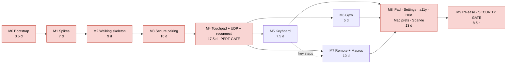

# Air Mouse — Delivery Plan (v1)

| Field | Value |
|---|---|
| Document | 05-plan.md |
| Status | Draft for owner review |
| Date | 2026-09-03 |
| Upstream | `00-decisions.md` (Addendum A wins) · `03-specifications.md` · `04-architecture.md` · `01-requirements.md` · `02-technical-research.md` |
| Audience | The maintainer, contributors picking up issues, anyone estimating or reviewing scope |

**Units.** Estimates are in **ideal engineering days (d)** — 8 focused hours of one experienced Swift engineer who has read the spec — or hours (h) in the work-breakdown tables. Calendar time is derived in §7. Spec sections are written *§n* and refer to `03-specifications.md`; architecture sections are *arch §n*.

**Environment fact-check (2026-09-03, maintainer's machine).** macOS 26.3.1 (25D771280a). `/Applications/Xcode.app` **is present — Xcode 26.6 (17F113), all platforms installed — but its license has not been accepted**, which is why `xcodebuild`, `python3` and simulator use fail today; Command Line Tools provide Swift 6.2.3. Homebrew, `xcodegen`, `swiftlint`, `swiftformat` are absent. M0 therefore starts with accepting the license, not installing Xcode; the install path via `xcodes` is kept in the runbook only as the fallback if a different version is ever needed.

---

## 1. Delivery strategy

**Milestones, not sprints.** A solo maintainer with variable weekly capacity gets more value from ten well-cut milestones with hard exit criteria than from fixed-length sprints. Each milestone is a **vertical slice**: it touches the kit, the iOS app and the Mac helper, and ends with something a human can hold and try.

**Walking skeleton first (M2).** Before pairing, before UDP, before anything pretty: Bonjour → TCP/TLS (temporary trust-all) → one `click` from the phone lands on the Mac, then raw deltas over TCP move the cursor. Every later milestone replaces a stub in that skeleton with the specified implementation, so integration risk is paid down early and there is always a demo.

**Spikes before commitments (M1).** The research list of twelve spikes is the first real milestone. The two on the critical path — `SecIdentity` creation and the TLS exporter — decide the pairing implementation; the others decide constants and copy. Every spike has a question, a method, a time-box and the decision it unlocks; spikes are thrown away, not merged.

**Solo-maintainer assumptions.** One engineer, the owner, does M0–M4 alone (the skeleton, security core and motion path must have one author). From M5 the work forks into three largely independent streams (Keyboard, Gyro, Macros/Remote) that contributors can take; M8 and M9 converge again. Estimates assume no contributors; §5 shows what parallelism buys.

**Definition of done, per milestone.** A milestone is done when all of the following hold:
1. Every task in its WBS table is merged to `main` with its acceptance check passing.
2. CI is green (kit tests, iOS build/test, Mac build/test incl. loopback integration, lint).
3. The relevant rows of the manual test plan (§10.3) have been executed on **both** iOS 18.6+/26 and macOS 15/26 and recorded in the milestone issue.
4. `docs/protocol.md` and `CHANGELOG.md` reflect any protocol or storage change.
5. A short demo video (or GIF) is attached to the milestone issue — this becomes README material.
6. The milestone's quality gate (§6) is passed: performance gate for M4, security gate for M9.

---

## 2. Milestone roadmap

| # | Milestone | Goal | Exit criteria | Effort | Depends on |
|---|---|---|---|---|---|
| **M0** | Environment & repo bootstrap | Toolchain, signing, repo skeleton, CI green on empty targets | `swift test` passes in the kit; both apps build in CI; `xcodegen generate` reproducible; stable Apple Development identity signs the helper; branch protection on | 3.5 d (+ up to 48 h waiting on Apple enrollment) | — |
| **M1** | Spikes | Answer the twelve research spikes; lock the pairing implementation path | Spike report merged into arch §7.1/§12 and spec §3.2.3 contingency resolved; latency baseline number recorded | 7 d | M0 |
| **M2** | Walking skeleton | Phone discovers Mac, connects over TLS (trust-all stub), a tap clicks and a drag moves the cursor via TCP | First cursor move end-to-end video; loopback integration test passes in CI; `airmouse-cli connect/click/move` works; `docs/protocol.md` extracted | 9 d | M1 |
| **M3** | Secure pairing | QR → mTLS with pinned identities, exporter-bound proof, trust stores, revocation, rate limits | Trust-all stub deleted; pairing ≤ 3 s; revoke ≤ 1 s; all §3.2.6 failure cases produce the right E-* copy; TLS 1.2 client rejected | 10 d | M2 |
| **M4** | Touchpad mode complete | Full gesture engine, AEAD UDP motion, host acceleration, scroll + host momentum, fallback, reconnect, latency HUD | **Performance gate**: p95 ≤ 20 ms on the reference setup; every §4.2.3 transition tested; fallback enters/exits per §3.5.8; reconnect ≤ 3 s in 99/100 AP toggles | 17.5 d | M3 |
| **M5** | Keyboard mode | Live/commit typing, Unicode path, layout-aware keycodes, modifiers latch/lock, extended keys, media keys, volume, hardware passthrough | "ñ日本語🎉" arrive intact; Dvorak host gets correct ⌘ shortcuts; live typing ≤ 50 ms; media keys show the macOS HUD | 7.5 d | M4 |
| **M6** | Gyro air-mouse | Gravity-aware mapping, One-Euro, dead zone, bias/auto-freeze, clutch, recenter, calibration | 0 px creep resting 10 min; < 20 px/min creep in a 45-min hold; flat and upright grips move the same way; p95 ≤ 20 ms | 5 d | M4 |
| **M7** | Presenter/remote + macros | Host macro editor with recorder, sync, invoke, subprocess scripts with three-way gating; presenter/media pages with app-aware profiles | Macro appears on two phones ≤ 1 s after save; gating matrix passes; Keynote/PowerPoint/PDF profiles verified; volume slider vs HUD agree | 10 d | M4 (M5 for key steps) |
| **M8** | iPad, settings, a11y, l10n, polish; Mac prefs, login item, Sparkle | Everything in §4.1.9/§4.1.10/§4.8/§5.1–5.2/§5.7 not yet built | VoiceOver pass on every screen; Dynamic Type XXXL; String Catalog check green; battery ≤ 8/12 %/h; Sparkle update from a signed appcast works | 13 d | M5, M6, M7 |
| **M9** | Release engineering | Notarized universal DMG, appcast, cask, TestFlight, docs, security review, name check, v1.0.0 | Tag → notarized release with SHA-256 and cask PR without manual steps; §10.5 checklist clean; TestFlight build live; trademark search done and name final; README + SECURITY + CONTRIBUTING complete | 8.5 d | M8 |
| | **Total** | | | **≈ 91 d ideal (158 tasks, 732 h)** | |

---

## 3. Detailed work breakdown structure

Column key: **ID** · **Task** · **Component** (`Kit/Protocol`, `Kit/Crypto`, `Kit/Filters`, `Kit/Core`, `CLI`, `iOS`, `Mac`, `Repo`, `CI`, `Docs`) · **Spec §** · **Est** (hours) · **Acceptance check**.

### M0 — Environment & repo bootstrap (25 h ≈ 3.5 d)

| ID | Task | Component | Spec § | Est | Acceptance check |
|---|---|---|---|---|---|
| M0-01 | Accept the Xcode 26.6 license, run first-launch setup, install the iOS 26 simulator runtime, confirm `python3` works again | Repo | arch §9.1 | 1 | `xcodebuild -version` prints 26.6 (17F113); `xcrun simctl list runtimes` shows iOS 26; `python3 --version` runs |
| M0-02 | Install Homebrew; `brew bundle` from `scripts/Brewfile` (xcodegen, swiftlint, swiftformat, gh, create-dmg, xcodes) | Repo | arch §2.1 | 1 | `xcodegen --version`, `swiftlint version`, `swiftformat --version`, `gh --version` all succeed |
| M0-03 | Enroll in the Apple Developer Program (paid, needed for TestFlight + Developer ID); add the account in Xcode; create an Apple Development certificate; record the Team ID in `Config/Local.xcconfig` | Repo | A10, NFR-OSS-006 | 2 (+ wait) | Xcode › Settings › Accounts shows the team; `security find-identity -v -p codesigning` lists "Apple Development" |
| M0-04 | `git init`; `LICENSE` (MIT), `README.md` stub, `.gitignore` (xcodeproj, DerivedData, Local.xcconfig, .build), `.editorconfig`, `.xcode-version` = `26.6`, `CODE_OF_CONDUCT.md` (Covenant 2.1), `SECURITY.md` and `CONTRIBUTING.md` stubs, `CHANGELOG.md` | Repo | NFR-OSS-002 | 2 | Files exist; `git status` clean after `xcodegen generate` (generated projects ignored) |
| M0-05 | Create `Packages/AirMouseKit/Package.swift` exactly as arch §2.2 with four empty library targets, four test targets (one placeholder test each), and an `airmouse-cli` stub printing its version; root `Package.swift` shim | Kit | arch §2.2 | 3 | `swift build` and `swift test` succeed from the repo root with language mode 6 and strict concurrency; `swift run airmouse-cli --version` prints |
| M0-06 | `apps/AirMouse-iOS/project.yml` per arch §2.4 with a "Hello" `TabView`; Info.plist keys (`NSLocalNetworkUsageDescription`, `NSBonjourServices`, `NSCameraUsageDescription`, `NSMotionUsageDescription`, `airmouse` URL scheme) | iOS | §2.3 | 3 | `xcodegen generate` then `xcodebuild -scheme AirMouse -destination 'platform=iOS Simulator,name=iPhone 16' build CODE_SIGNING_ALLOWED=NO` succeeds; plist keys visible in the built app |
| M0-07 | `apps/AirMouse-Mac/project.yml` per arch §2.5 with a `MenuBarExtra` "Hello", `LSUIElement`, hardened runtime, universal `ARCHS`, entitlement file; `Config/Base.xcconfig` with `#include? "Local.xcconfig"`; stable Apple Development signing in Debug | Mac | §2.3, A10 | 3 | Built app shows only a menu-bar icon (no Dock icon); `codesign -dv --verbose=2` shows the Apple Development identity and `runtime` flag; rebuilding twice keeps the same designated requirement |
| M0-08 | `.swiftlint.yml` + `.swiftformat` with custom rules: ban `CGEventTapCreate`/`CGEvent.tapCreate`/`IOHIDManager`, ban `print(` outside `airmouse-cli`, ban `usleep`/`Thread.sleep`, flag `Logger` interpolations naming secrets without a privacy annotation | Repo | arch §7.5, ADR-009 | 2 | A test file containing `CGEvent.tapCreate(` fails `swiftlint --strict`; `swiftformat --lint .` passes on the skeleton |
| M0-09 | `.github/workflows/ci.yml` with jobs `kit`, `ios`, `mac`, `lint` on `macos-26`, Xcode selected from `.xcode-version`, SwiftPM/DerivedData caching, `permissions: contents: read` | CI | §10.6, arch §9.1 | 4 | All four jobs green on the empty repo in ≤ 15 min; a fork PR (test from a second account) runs without secrets |
| M0-10 | Issue templates (`bug.yml`, `feature.yml`, `latency-report.yml` asking for HUD numbers, network type, devices), PR template, `CODEOWNERS` covering `AirMouseCrypto`, `docs/protocol.md`, `.github/workflows`; `dependabot.yml`; enable branch protection (required checks, squash, tag protection `v*`) | Repo | NFR-OSS-002, arch §9.2 | 2 | A PR without green checks cannot merge; new issue shows the three templates |
| M0-11 | `scripts/bootstrap.sh` (brew bundle → copy `Local.xcconfig.example` if missing → `xcodegen generate` ×2 → `swift test`), `scripts/Brewfile`, `Config/Local.xcconfig.example` | Repo | arch §2.6 | 1 | Fresh clone + `scripts/bootstrap.sh` yields two opening `.xcodeproj`s and passing tests |
| M0-12 | Create the GitHub repository (private until M9-11 name check), push, create milestones M0–M9, file the first 10 issues (§8.2) | Repo | — | 1 | Repo has 10 milestones and 10 labelled issues |

### M1 — Spikes (56 h = 7 d)

Each spike is a throwaway branch `spike/<id>` with a `SPIKE.md` answering: question, method, result, decision. Time-boxes are hard; if a box expires the fallback in arch §12 is adopted.

| ID | Task (question → method) | Component | Spec § | Est | Acceptance check (decision unlocked) |
|---|---|---|---|---|---|
| M1-01 | **R-1a, macOS**: can we mint a self-signed P-256 cert for a Keychain `SecKey` via swift-certificates + `SecKeyCreateSignature` and obtain a `SecIdentity`? → implement arch §7.1 Path A in a CLI script | Kit/Crypto | §3.2.1, arch §7.1 | 8 | `SecItemCopyMatching(kSecClassIdentity)` returns an identity; an `NWListener` serves TLS 1.3 with it. **Unlocks** `IdentityFactory` design |
| M1-02 | **R-1b, iOS**: same with a Secure Enclave key on a physical iPhone, and Path B on the simulator → tiny test app | iOS | §3.2.1 | 8 | Identity lookup works on device with SE key (or is documented as failing → Path B on iOS). **Unlocks** Path A/B selection per platform |
| M1-03 | **R-1c**: is `sec_protocol_metadata_create_secret` available and stable on both sides after `.ready`? → read the exporter in the M1-04 prototype; compare values | Kit/Crypto | §3.2.3 | 3 | Both sides derive identical 32 bytes → exporter binding; otherwise `pair-binding-certs` capability adopted. **Unlocks** spec §3.2.3 contingency |
| M1-04 | mTLS prototype: `NWListener` with verify block (pinned FP) ↔ `NWConnection` with challenge block; measure handshake time on LAN | Mac, iOS | §3.2.1, §3.3.1 | 6 | Handshake ≤ 60 ms p95 warm; unknown cert rejected with `certificate_unknown`; chain length 1 enforced |
| M1-05 | **R-2**: on macOS 26.3.1 from a signed GUI helper: `mouseMoved`/`leftMouseDragged` with deltas, `clickState` 2/3, `kVK` shortcuts reaching a third-party global hotkey (e.g. a test app using `RegisterEventHotKey`), NX media keys → scratch app | Mac | §5.3 | 5 | Table of event type × works/doesn't on 26.3.1 (and 15.x if a VM/second Mac is available). **Unlocks** any tap-location changes |
| M1-06 | **R-3**: are `.pixel` scroll events posted at `.cghidEventTap` already inverted by the natural-scroll preference? Do phases/momentum give rubber-banding in Safari, Xcode, an Electron app? → scratch app | Mac | §3.6.4, §5.3.4 | 4 | The `invertForNatural` sign is decided; momentum phase sequence confirmed |
| M1-07 | **R-7**: iOS 18.6/26 and macOS 15/26 local-network prompt: timing, "denied before answered" retry, `kDNSServiceErr_PolicyDenied` and `.localNetworkDenied` detection, helper Bonjour registration under denial | iOS, Mac | §4.5.5, §5.1.5 | 5 | Written sequence of states per OS; retry delay chosen (default 1 s) |
| M1-08 | **R-8**: Personal Hotspot and a client-isolated network: does Bonjour resolve; does direct IP work; which addresses `getifaddrs` reports (bridge/en0 order) | iOS, Mac | §3.1.3, §3.3.2 | 4 | Address ordering rule confirmed or amended; E-ISOLATED heuristic (all candidates time out + empty browse) validated |
| M1-09 | **R-4 baseline**: throwaway UDP echo iPhone ↔ Mac at 120 Hz with `DispatchSerialQueue(.userInteractive)` executors; RTT p50/p95; check inject-queue jitter with `os_signpost` | iOS, Mac | §8.1 | 6 | Recorded one-way estimate on the reference Wi-Fi; if inter-event jitter p95 > 12 ms with an idle Mac, plan the pinned-`Thread` executor (arch §12 R-4) |
| M1-10 | **R-12**: TCC stability: rebuild the helper 10× with the stable identity + `BUNDLE_ID_SUFFIX`; move the app between DerivedData and /Applications; document `tccutil reset` | Mac | §5.2, A10 | 2 | Accessibility grant survives all rebuilds; runbook paragraph in CONTRIBUTING |
| M1-11 | Swift 6 strict concurrency + Network.framework: does the "executor-matched callback + `assumeIsolated`" pattern compile warning-free on Xcode 26.6? | iOS, Mac | arch §5.1 | 3 | Prototype actor compiles with `-strict-concurrency=complete`, no `@unchecked`; pattern pasted into CONTRIBUTING |
| M1-12 | Spike report: amend arch §7.1 (path per platform), spec §3.2.3 contingency, constants (retry, sign), risk table; delete spike branches | Docs | — | 2 | PR updating `04-architecture.md` §12 statuses merged |

### M2 — Walking skeleton (74 h ≈ 9 d)

| ID | Task | Component | Spec § | Est | Acceptance check |
|---|---|---|---|---|---|
| M2-01 | `FrameCodec` (u32 LE length + kind + body) with a stateful `Decoder.feed(_:)`; 256 KiB cap → `frameTooLarge`; unknown kind error | Kit/Protocol | §3.4.1, §6.2 | 5 | Tests: round trip, split delivery at every byte boundary of a 3-frame buffer, 256 KiB + 1 rejected, kind 0x03 rejected |
| M2-02 | `Envelope` + `Message` enum with custom `Codable` (`v`,`t`,`i`,`p`), payloads `Hello`, `HelloAck`, `Click`, `Heartbeat`, `Pong`, `ProtocolError`, `Goodbye`; unknown `t` → `.unknown`; `JSONEncoder` sorted keys, ms dates | Kit/Protocol | §3.4.2–3.4.5 | 6 | Round-trip test per type; unknown `t` decodes; missing required field throws; extra fields ignored |
| M2-03 | `TXTRecordModel` (v, n, id, fp, m, tp, up; ≤ 400 B) and `QRPayload` parse/format (`airmouse://pair?…`, ≤ 512 B, address ordering preserved) | Kit/Protocol | §3.1.2, §3.1.3 | 4 | §6.4 QR vectors incl. malformed cases (missing `s`, 513 B, bracketed IPv6) pass |
| M2-04 | `AirMouseCore` transport protocols (`ControlTransport`, `DatagramTransport`, `ServiceBrowser`, `ServiceAdvertiser`), `HostSessionStateMachine` (pending → authenticated → stale → closed) and `ConnectionStateMachine` reducer with Idle/Browsing/Connecting/Connected/Reconnecting/Failed | Kit/Core | §4.5.1, arch §3.1 | 8 | Reducer tests for the implemented edges; `MockTransport` scripted test drives Idle → Connected |
| M2-05 | Mac `HostServer` actor on the `net` `DispatchSerialQueue`: `NWListener` TLS 1.3 with an ephemeral `IdentityFactory` identity, **temporary trust-all verify block** (`// TODO M3`), Bonjour advertise with TXT, `serviceRegistrationUpdateHandler` name capture, port-busy ephemeral fallback | Mac | §3.1.1, §5.1.5 | 6 | `dns-sd -B _airmouse._tcp` shows the service with the TXT keys; a second instance falls back to an ephemeral port and advertises it |
| M2-06 | Mac `SessionManager`: `ControlSession` per connection, `FrameCodec.Decoder`, `hello`/`helloAck` version negotiation, heartbeat → `pong` with `t2`/`t3`, stale at 2 s, close at 6 s, 6-connection cap | Mac | §3.3, §3.4.4, §3.4.6 | 6 | Unit test with `RecordingInjector`: no heartbeat 2 s → `releaseAll` called; 6 s → closed; version mismatch → `protocol.versionMismatch` |
| M2-07 | Mac `EventInjector` actor on the `inject` `.userInteractive` queue; `EventInjecting` protocol; `CGEventInjector` (single `hidSystemState` source, `mouseMoved` with deltas, left down/up with 15 ms timer) and `RecordingInjector`; `releaseAll()`; `HeldInputLedger` | Mac | §5.3.1–5.3.3, §5.3.11 | 6 | Manual: cursor moves and clicks from the CLI; unit: `RecordingInjector` log shape; `releaseAll` after a `down` records an `up` |
| M2-08 | Mac `PermissionsService` minimal: `AXIsProcessTrusted` check, prompt, deep link, menu warning state; injection gated with `host.noAccessibility` | Mac | §5.2 | 2 | Without the grant, input messages return the error at most once per 5 s; with it, injection proceeds |
| M2-09 | iOS `NWServiceBrowser` + Devices list (browse results, "Not paired" badge from TXT `id`), Local Network pre-prompt page that triggers the first browse, E-LOCALNET detection | iOS | §4.1.3, §4.5.3, §4.5.5 | 5 | Mac appears in ≤ 2 s; denying the prompt shows E-LOCALNET with a working Settings deep link |
| M2-10 | iOS `ConnectionManager` actor with `NWControlTransport` (TLS, **temporary trust-all**), `hello`, heartbeat timer, RTT ring, state stream to the UI, connection pill | iOS | §3.3, §3.4.6 | 6 | Tapping a Mac connects; pill shows Connected + RTT; killing the helper shows Reconnecting within 2 s |
| M2-11 | iOS Touchpad tab with `TouchpadView` UIKit bridge sending raw ×8 deltas as `kind = 0x02` TCP frames (temporary) and `click{tap}` on a simple tap | iOS | §4.2.1, §3.5.9 | 6 | Cursor follows the finger; a tap clicks; no crash at 120 Hz for 5 min |
| M2-12 | **First cursor move end-to-end**: demo video; `os_signpost` skeleton on both sides; note baseline latency from the RTT ring | Docs | §8.2 | 2 | Video attached to the M2 issue; signposts visible in Instruments |
| M2-13 | `--loopback [--port N] [--identity test]` launch mode (127.0.0.1, in-memory identity, `RecordingInjector`, JSON control socket exposing the event log); `AirMouseHelperIntegrationTests` target with the first test: connect → `hello`/`helloAck` → `click` recorded | Mac, CI | §10.2 | 6 | `xcodebuild test` runs the integration test in CI without any TCC grant |
| M2-14 | `airmouse-cli connect --host <addr or name>`, `click`, `move --dx --dy --hz --seconds` over the TCP path; shares `NWControlTransport` source with the iOS app via a symlinked/shared source folder or a small `AirMouseNetwork` module inside the CLI | CLI | §10.2 | 4 | `swift run airmouse-cli connect --host 127.0.0.1:47800 --insecure` moves the cursor on a dev Mac |
| M2-15 | Extract `docs/protocol.md` from spec §3 + §6.4 with a CHANGELOG section; link from README | Docs | §3.7 | 2 | Document reviewed against the implemented messages; CI link check passes |

### M3 — Secure pairing (79 h ≈ 10 d)

| ID | Task | Component | Spec § | Est | Acceptance check |
|---|---|---|---|---|---|
| M3-01 | `Fingerprint` (SHA-256 of DER) and `PairingProof` (`binding = exporter‖nonce‖clientFP‖hostFP‖hostID`; 0x01/0x02 prefixes; `HMAC.isValidAuthenticationCode` constant-time verify) | Kit/Crypto | §3.2.3 | 4 | §6.4 pairing vectors + negative vector (one `hostID` byte changed) pass |
| M3-02 | `IdentityFactory` production implementation per M1 decisions (Path A/B selection, Keychain labels `AirMouse Host/Client Identity`, load-or-create, "Reset identity") for both platforms | Kit/Crypto, iOS, Mac | §3.2.1, arch §7.1 | 8 | On-device iOS test creates and loads an identity; macOS unit test does the same; identity survives relaunch; reset regenerates |
| M3-03 | Mac `TrustStore` actor: `kSecClassCertificate` items labelled `AirMouse Trusted Client <clientID>` + `TrustedDevices.json` (`trusted-devices/1`), records dropped when no cert matches, 20-device cap, revoke (delete cert, mark record) | Mac | §3.2.4, §5.6 | 6 | Unit tests with a temp keychain: add/lookup/revoke; JSON without cert is pruned on load |
| M3-04 | Mac verify block per §3.2.1: chain length 1 → FP → `trusted` / `pendingPairing` (window open and pending < 2) / `reject`; session state set accordingly; non-`pair*` message while unauthenticated → `auth.untrusted` + close. **Delete the trust-all stub** | Mac | §3.2.1, §3.2.6 | 4 | Integration: unknown cert with window closed → TLS failure; with window open → only `hello{pairing}`/`pair*` accepted |
| M3-05 | Mac `PairingService`: secret (16 B CSPRNG, 60 s, auto-regenerate while window open, invalidate on close/3 failures), `PairChallenge` nonce, exporter read, proof verify, `pairConfirm` with `hostProof`, persist via `TrustStore`, QR URL with `getifaddrs` addresses ordered bridge → en0 → Ethernet → link-local, ≤ 512 B truncating addresses not the secret | Mac | §3.1.3, §3.1.4, §3.2.2 | 8 | Unit: expiry, reuse, 3-attempt invalidation, address ordering, 512 B truncation; integration: full pairing succeeds |
| M3-06 | Mac Pairing/QR window: 420 × 520 pt, `.floating`, white in both appearances, QR ≥ 300 pt ECC-M, countdown ring, "Can't scan?" copyable link, status text, closes 2 s after success unless ⌥ held; closing invalidates the secret | Mac | §5.1.3 | 5 | A phone camera scans the QR from arm's length in dark mode; closing the window makes an in-flight proof fail with `pairing.expired` |
| M3-07 | Mac Trusted Devices window: table (name alias, model, OS, first paired, last seen, Allow scripts checkbox, Revoke with confirmation sheet); revoke → `goodbye{revoked}`, close ≤ 1 s, `releaseAll` | Mac | §5.6 | 4 | Revoking a connected device disconnects it within 1 s and its next TLS attempt fails |
| M3-08 | iOS `KeychainStore` (identity via `IdentityFactory`, trusted host certs labelled `AirMouse Trusted Host <hostID>`) + `DocumentStore` actor with `TrustedHosts.json` (`trusted-hosts/1`, atomic, file protection) and `TrustedHostRecord` | iOS | §3.2.4, §4.7 | 6 | Unit tests on simulator (Path B); Forget deletes cert + record + macro cache |
| M3-09 | iOS Scan QR screen: `DataScannerViewController` with `AVCaptureSession` fallback, reticle, stop on `airmouse://pair?`, haptic, torch, "Paste pairing link" field with validation, camera-denied E-CAMERA | iOS | §4.1.2, §4.5.5 | 6 | Scans a QR in < 1 s; pasted URL pairs; denial shows E-CAMERA with Settings deep link |
| M3-10 | iOS pairing flow in `ConnectionManager`: pin `fp` before connect, `hello{pairing:true}`, exporter, `pairProof`, verify `hostProof`, persist host cert + record, then normal session; map every §3.2.6 case to E-PAIR-* | iOS | §3.2.2, §3.2.6, §9 | 6 | Each failure case shows the specified title/message; success lands on Touchpad ≤ 3 s after scan |
| M3-11 | iOS client TLS: verify block (pinned FP from QR or Keychain; chain length 1), challenge block supplying the client identity, min TLS 1.3, no SNI. **Delete the trust-all stub** | iOS | §3.2.1 | 3 | Evil-twin test (helper with a different identity, same name) → E-PAIR-FP / E-AUTH-UNTRUSTED |
| M3-12 | iOS Devices: trusted hosts (Connected/Available/Not found, last connected), Connect/Forget swipe actions, auto-connect on foreground, E-AUTH-UNTRUSTED vs E-AUTH-REVOKED by local record presence | iOS | §4.1.3, §4.5 | 4 | Trusted Mac connects in ≤ 2 s on warm Wi-Fi without prompts (AM-DP-04) |
| M3-13 | `AddressSelector`: candidate order (Bonjour → `lastKnownAddresses` → QR), 700 ms stagger, 4 s per candidate, 12 s overall, private-range guard with QR exception; LRU update of known addresses | Kit/Core, iOS | §3.3.2, §4.5.4 | 4 | Reducer tests for ordering, stagger timing, guard; `172.20.10.x` treated as private |
| M3-14 | Integration tests: pairing success; expired secret; wrong proof ×3 invalidates; secret reuse; revoke while connected ≤ 1 s; unknown cert rejected; tooManyDevices at 21 | Mac, CI | §3.2.6, §10.2 | 6 | All pass in CI using `--pairing-secret` |
| M3-15 | Pre-TLS per-IP handshake limiter (5/min, closed for 60 s) and 6-connection cap in `HostServer`; `RateLimiter` in Core | Kit/Core, Mac | §3.0, §7.6 | 3 | Unit: 6th attempt in a minute rejected; integration: 7th TCP connection closed immediately |
| M3-16 | Security sub-checklist: `openssl s_client -tls1_2` rejected; cipher list AEAD-only; log audit for secrets | Mac | §10.5 | 2 | Checklist rows recorded in the M3 issue |

### M4 — Touchpad mode complete (140 h ≈ 17.5 d)

| ID | Task | Component | Spec § | Est | Acceptance check |
|---|---|---|---|---|---|
| M4-01 | `MotionPayload` 16-byte pack/unpack into fixed buffers; flags/source enums; boundary values | Kit/Protocol | §3.5.2 | 3 | §6.4 payload vector byte-exact; ±32767 round trip; reserved byte tolerated on decode; fuzz 10⁴ iterations |
| M4-02 | `SessionKeys.derive` (HKDF-SHA256, salt = sessionID LE, infos `airmouse-udp-c2h-v1`/`h2c-v1`) and `MotionCrypto.seal/open` (nonce `0000 ‖ counter LE`, AAD = header, exactly 44 B) with `OpenFailure` side channel | Kit/Crypto | §3.5.1, §3.5.3 | 5 | §6.4 AEAD vector; flipping each of the 44 byte positions fails; wrong sessionID → nil; counter 2³² boundary stops sending |
| M4-03 | **Implement the RFC 6479 replay window in `AirMouseCrypto`** (`highest`, 64-bit bitmap; accept newer with saturating shift; reject ≥ 64 behind; reject seen) **with tests for wraparound** (jump > 64 clears the bitmap; `highest − counter == 64` rejected) | Kit/Crypto | §3.5.4 | 4 | §6.4 sequence → `[A,A,A,R,A,R,A,R,A,A,R]`; 10⁶ random counters vs a `Set` oracle agree |
| M4-04 | Mac `sessionKey` issuance (random 32 B secret, u32 ID unique for process lifetime) on every TLS connection; rotation at 2³¹ datagrams or 4 h with 2 s overlap; max two live keys | Mac | §3.5.5 | 4 | Unit: rotation timer issues a new key; old accepted for 2 s then dropped; IDs never reissued |
| M4-05 | Mac UDP `NWListener` receiving **on the inject queue**; `MotionPipeline`: 44-byte check → sessionID map → `open` → replay → 8-datagram stale window → dispatch; counters for dropped/replayed/stale/AEAD failures; `flags.probe` echo on the H2C key within 1 ms | Mac | §3.5.1, §3.5.4, §3.5.8 | 6 | Integration: 1000 datagrams → 1000 moves; replayed capture rejected; stale-by-9 discarded; probe echoed with `dx` = service µs |
| M4-06 | `AccelerationCurve` (`base(s)` geometric 0.6→4.0, `accel(v) = 1 + a·min(v/1500,1)²`, presets) and `ScrollGain` (0.5→3.0) in Filters | Kit/Filters | §5.4, §3.6.1 | 3 | Table test: all ten `base(s)` values to 2 dp; `accel` at v ∈ {0, 750, 1500, 3000}; gyro source gets `accel = 1` |
| M4-07 | Mac pointer pipeline: `virtualPos` resync from `CGEvent(source:nil).location` after ≥ 100 ms idle, velocity from client timestamps (clamped 4–50 ms), gain, sub-pixel remainder, `DisplayClamp` with `DisplayTopology` observer (`didChangeScreenParametersNotification`), drag event types per held button | Mac, Kit/Filters | §5.3.2, §5.3.8 | 6 | `DisplayClamp` fixtures: single, side-by-side, L-shaped gap, vertical stack; manual: cursor never disappears into the gap; 1-pt/frame movement has no dead spots |
| M4-08 | Mac clicks complete: `count` → `clickState` with the 1.5× interval / 16 pt sanity clamp, middle button (`otherMouse`, number 2), modifiers as flags, `tap` = down + 15 ms `DispatchSourceTimer` up | Mac | §5.3.3 | 4 | Integration: `click{tap,count:2}` records two pairs with clickState 1 then 2; manual: double-tap selects a word in TextEdit |
| M4-09 | Mac scroll: `scrollWheelEvent2Source` pixel units, `IsContinuous`, phases began/changed/ended, `invertForNatural` per M1-06 and `settings.scrollDirection`, scroll remainder, axis conversion | Mac | §3.6.2, §3.6.4, §5.3.4 | 4 | Safari rubber-bands at the top; direction follows System Settings and flips with the override |
| M4-10 | `MomentumSynthesizer` (pure: `v ← v·exp(−Δt/τ)`, τ 350 ms, stop < 0.5 px/frame) + Mac `MomentumEngine` 60 Hz timer with leeway 1 ms, momentum phases begin/continue/end, cancel on new delta / `scrollPhase{cancel}` / session end / pause; implicit end after 120 ms without deltas | Kit/Filters, Mac | §3.6.3 | 5 | Unit: decay reaches stop within τ·ln(v₀/0.5·60); integration: `ended{vx,vy}` above 300 pt/s produces a momentum tick series ending with `.end` |
| M4-11 | Mac injection gating (Accessibility, paused, authenticated, not stale) and per-session caps (motion 250/s, clicks 30/s, keys 60/s, media 20/s; 3 control-cap breaches in 10 s → `rate.limited`) | Mac | §5.3.9 | 3 | Unit tests on the limiter; `airmouse-cli flood --pps 10000` keeps helper CPU flat and the session alive at 250 applied/s |
| M4-12 | `releaseAll()` on every path: stale, close, `goodbye`, revoke, pause, Accessibility loss, `willSleepNotification`, `applicationWillTerminate`, 60 s held-input watchdog; sleep → `goodbye{sleep}`, wake → listeners restart ≤ 2 s | Mac | §5.3.11, §5.1.5 | 4 | Integration: each trigger leaves `HeldInputLedger` empty and records the `up`s; manual: quit mid-drag releases the button |
| M4-13 | iOS `MotionPublisher` actor on `DispatchSerialQueue("motion", .userInteractive)`: `SessionKeys`, counter, two preallocated 44-byte buffers, in-flight cap 2 via send completions, pending accumulator with `samples`, `motionEnd`/`scrollBegan`/`scrollEnded` carriers, UDP `NWDatagramTransport` started on the same queue, key install/reset from `ConnectionManager` | iOS | §3.5.7, arch §3.2 | 8 | Unit (mock transport): 3 samples with 2 slots busy → 1 coalesced datagram with `samples = 2`; zero-delta frames not sent except carriers; Instruments shows no allocation growth over 60 s of movement |
| M4-14 | `GestureRecognizer` full state machine of §4.2.3 with injected `Clock`: tap/double/triple (≤ 3, within interval and 16 pt), two-finger precedence, 80 ms finger-count settle, long-press right-click, tap-and-drag, drag-lock (3 s timeout), 80 ms suppression after taps, scroll begin/axis lock (20°/30 pt), pinch steps (40 pt), three-finger swipe once at 60 pt / drag, four-finger tap; `GestureConfig` from settings | Kit/Filters | §4.2.2, §4.2.3, §4.2.5 | 12 | Every transition in the diagram has a test; edge cases 199/201 ms, 7.9/8.1 pt; count caps at 3; suppression window; swipe fires once per gesture |
| M4-15 | iOS `TouchpadView`: `isMultipleTouchEnabled`, coalesced touches with `preciseLocation`, palm rejection (radius > 30 pt, 4 pt edge, > 4 touches), Pencil as finger, prediction hook (Labs, off), wiring to recognizer (main) and publisher; single `UIAccessibilityElement` with direct-touch + Z-escape | iOS | §4.2.1, §4.2.6, §4.8.1 | 6 | 120 Hz sampling confirmed with signposts on a ProMotion device; palm on the edge ignored; VoiceOver announces "Trackpad, touchpad" |
| M4-16 | iOS multi-finger → wire: scroll deltas on datagrams with `scrollBegan`; pinch keys (⌘= / ⌘−) or zoom-scroll with ⌃; three-finger swipes as ⌃ arrows (left/right swapped when inverted) or drag as `click{down}` + motion + `click{up}`; four-finger tap fn-F11 | iOS | §4.2.5, §3.6.5 | 6 | Manual: pinch zooms Safari and Preview; swipes trigger Mission Control/Spaces; enabling three-finger drag disables swipes |
| M4-17 | iOS `scrollPhase{ended, vx, vy, momentum}` (velocity = mean of last 3 frames, ≥ 300 pt/s), `scrollPhase{cancel}` on the next touch, momentum setting | iOS | §3.6.2, §4.2.5 | 3 | Fling then touch stops the Mac's momentum within one tick |
| M4-18 | `ProbeController` (4 Hz probes, 12-probe window, enter on ≥ 11 lost with fresh `pong` or first 8 lost, exit on 5 answered, 1 Hz in fallback) in Core + iOS fallback path: payloads to `ConnectionManager` as `kind = 0x02` frames (1–16 per frame) at ≤ 60 fps; "Elevated latency" badge (E-UDP-FALLBACK) | Kit/Core, iOS, Mac | §3.5.8, §3.5.9 | 6 | Reducer tests for every enter/exit rule; integration with UDP blocked (`--drop-udp` loopback flag) → fallback within 2 s, motion continues, exit after unblocking |
| M4-19 | `settings` message + iOS `SettingsStore` (pointer/gestures subset: sensitivity, acceleration, scroll speed/direction, momentum, double-click interval, pinch mode, text rate) pushed on connect and on change; live sensitivity quick-slider from the mode ribbon | iOS, Mac | §3.4.5, §4.1.4, §4.7.3 | 5 | Changing sensitivity moves the cursor differently on the next frame without reconnecting (AM-TP-10) |
| M4-20 | iOS Touchpad chrome: mode ribbon (host, latency dot, "Dragging", banners), optional modifier strip (`modifiers` absolute set, latch/lock visuals), optional click buttons (≥ 44 pt, 60/40 split, mirrored for left-handed, hold-drag), idle dim 30 s → 25 % opacity, `isIdleTimerDisabled` while connected, hidden status bar / home indicator / deferred edge gestures | iOS | §4.1.4 | 6 | ⌘ on the strip + tap selects multiple Finder items; screen stays awake; UI dims after 30 s and restores on touch |
| M4-21 | Latency HUD (iOS, Labs): RTT p50/p95 from 32 pongs, probe RTT, one-way estimate via clock offset θ from 8 pongs and `pong.motion`, loss %, channel; Mac Diagnostics window v1 with rate, RTT histogram (1–512 ms log buckets), drop/replay/stale/AEAD counters, cipher, peer FP prefix, channel, `injectP50Us` | iOS, Mac | §8.2, §5.1.3 | 6 | HUD one-way estimate agrees with the camera ground truth within 3 ms at p50 (M4-25) |
| M4-22 | Reconnect complete: `ConnectionStateMachine` Reconnecting/Suspended/Failed edges, backoff 250→4000 ms ±20 % jitter, old connection kept ≤ 6 s, `NWPathMonitor` (Wi-Fi lost → Reconnecting immediately), `scenePhase` handling (`beginBackgroundTask`, `modifiers{[]}`, `click{left,up}` if dragging, `goodbye{background}`, cancel; resume → Connecting), re-push `settings`, 10 min give-up, E-RECONNECTING banner | Kit/Core, iOS | §4.5.1, §4.5.2, §4.5.5 | 8 | Reducer tests for every edge and the backoff sequence bounds; manual: AP off 5 s → reconnected ≤ 3 s after return; lock/unlock → cursor moves on first swipe ≤ 1 s |
| M4-23 | `HapticsService`: pre-prepared generators for tap/right-click/button/drag-lock/pairing, `supportsHaptics` visual-pulse fallback, settings toggles | iOS | §4.6 | 3 | Haptic within 10 ms of tap recognition; iPad without Taptic Engine shows the pulse |
| M4-24 | Integration tests: motion → moves with expected acceleration and remainders, clicks with `clickState`, scroll phases + momentum ticks, replay rejected, stale → `releaseAll`, UDP fallback, key rotation overlap | Mac, CI | §10.1, §10.2 | 8 | All pass in CI; test runtime ≤ 3 min |
| M4-25 | **Performance gate run** (spec §10.4): `airmouse-cli bench` vs `--bench`; `xctrace` inter-event jitter p95 ≤ 12 ms; 240 fps camera ground truth on a 120 Hz iPhone with the Mac at 60 and 120 Hz; tune `fingerCountSettle`/tap thresholds (R-5); fix hot-path regressions | iOS, Mac, CLI | §8.1, §10.4 | 8 | p50 ≤ 12 ms, p95 ≤ 20 ms (+ display half-frame) to post on the reference setup; numbers recorded in `docs/perf/M4.md` |
| M4-26 | First-connect gesture tutorial overlay (move, tap, two-finger tap, scroll, pinch), each step advanced by recognizer events, skippable, replay from Settings | iOS | §4.1.4, FR-OB-005 | 4 | Tutorial completes by performing the gestures; skip works; replay resets the flag |

### M5 — Keyboard mode + media keys + hardware passthrough (60 h = 7.5 d)

| ID | Task | Component | Spec § | Est | Acceptance check |
|---|---|---|---|---|---|
| M5-01 | Messages `key`, `text`, `deleteBackward`, `modifiers`, `mediaKey`, `volume` with enums and limits (16 KB text, count ≤ 1000) | Kit/Protocol | §3.4.5 | 3 | Round-trip tests; 16 385-byte `text` rejected at encode |
| M5-02 | `HIDKeycodeTable` generated by `scripts/gen-keycodes.swift` from `scripts/hid-kvk.csv` (~110 entries); `VirtualKey` constants | Kit/Protocol | §11.2 | 3 | Test asserts every row of the §11.2 table; regenerating produces an identical file |
| M5-03 | Mac `KeycodeMapper`: reverse table `Character → (keycode, shift)` via `UCKeyTranslate` for all keycodes × {none, shift}, rebuilt on `kTISNotifySelectedKeyboardInputSourceChanged`, `ansi` detection, swapped in as an immutable value on the inject executor | Mac | §5.3.6 | 6 | Unit tests with US, Dvorak, German layouts: `key{code: 0x08 (C), char: "c", cmd}` lands on the physical key producing "c" |
| M5-04 | Mac key injection: `down`/`up`/`tap` (8 ms gap), auto-repeat (400 ms then 40 ms, or the user's smaller values), `modifiers{flags}` diff → `flagsChanged` per modifier keycode with cumulative mask, caps lock as ⇧ flag, flags persist onto later events | Mac | §5.3.6 | 5 | Integration: held arrow records repeats at 40 ms; `modifiers{[cmd]}` then `click` records a ⌘-click |
| M5-05 | Mac text injection: UTF-16 chunks ≤ 16 units without splitting surrogates/graphemes, `virtualKey 0` + `keyboardSetUnicodeString`, pacing ≤ `textRateCharsPerSec` with ≥ 1 ms gap, per-session queue cancelled on disconnect; `deleteBackward` taps at 2 ms | Mac | §5.3.6 | 4 | Integration: 16 KB text paced at ≤ 500 chars/s; "🎉" arrives as one event; disconnect cancels the queue |
| M5-06 | Mac media keys via `NSEvent.otherEvent(.systemDefined, subtype 8)` with NX constants (0…22), `down`/`up`/`tap` (10 ms), 100 ms repeat for volume/brightness; `volume{level,mute}` via CoreAudio `VirtualMainVolume`/`Mute` with 16-step key fallback; 20/s limit | Mac | §5.3.7 | 5 | Manual: HUD appears for volume and Now Playing reacts to play/pause; slider level matches System Settings within 1/16 |
| M5-07 | Mac `hostState.inputSource` and `naturalScroll` observers broadcast on change | Mac | §3.4.5, §5.7.3 | 2 | Switching layouts on the Mac produces a `hostState` within 500 ms |
| M5-08 | iOS `KeyboardBridge`: 1 × 1 pt `UITextView`, sentinel `"\u{200B}"` diff → `text`/`deleteBackward`, `markedTextRange` guard, Return → `key{0x24}`, live-mode traits (no autocorrect/prediction/smart punctuation/autocap), commit mode editor with Send / Return-sends, trail label (40 chars, 3 s fade), Secure entry, nothing persisted | iOS | §4.4.1–4.4.3 | 8 | Manual: TextEdit shows characters ≤ 50 ms; backspace on an empty field deletes on the Mac; Secure entry hides the trail |
| M5-09 | iOS extended key bar (Esc, Tab, arrows with down/up for repeat, ⌫ ⌦, Home/End/PgUp/PgDn, F1–F12 with fn toggle to media glyphs), modifier row (latch → lock → off with underline + lock glyph), Caps, shortcut palette sheet (defaults §4.4.5, editable, persisted in UserDefaults) | iOS | §4.4.4, §4.4.5 | 6 | ⌘⇧T reopens a Safari tab; double-tap ⌘ locks and stays across keys; palette edits persist |
| M5-10 | IME spike/test (R-9): Japanese romaji → kana → kanji and Chinese pinyin on the hidden text view; marked text never sent early; composed string arrives once | iOS | §4.4.2, FR-KB-004 | 3 | "日本語" typed via the Japanese keyboard arrives exactly once on the Mac |
| M5-11 | Commit-mode paste up to 16 KB chunked at 4 KB on grapheme boundaries; E-TEXT-TOOLONG with Trim | iOS | §4.4.2, §9 | 2 | 16 KB paste arrives in order; 17 KB shows the alert |
| M5-12 | Hardware keyboard passthrough: `pressesBegan/Changed/Ended/Cancelled` → HID usage → macOS keycode, modifiers as own presses → `modifiers{flags}`, `UIKeyCommand`s with `wantsPriorityOverSystemBehavior` for arrows/Tab/Esc/⌘⌃⌥ chords, plain text still via `insertText`; non-passable list in Settings (Globe, ⌘H, ⌘Tab, ⌘Space, ⌘⇧3/4, volume/power) | iOS | §4.4.6 | 6 | On an iPad with Magic Keyboard: ⌘C reaches the Mac and the iPad does not copy; arrows repeat; Globe documented as non-passable |
| M5-13 | Integration tests: text pacing, key repeat cadence, modifier diff sequence, media NX events recorded, Dvorak remap via `RecordingInjector` layout stub | Mac, CI | §10.1, §10.2 | 5 | Pass in CI |
| M5-14 | Manual keyboard test plan rows (§10.3 Keyboard) on iOS 18.6+/26 and macOS 15/26 | — | §10.3 | 2 | Rows recorded in the M5 issue |

### M6 — Gyro air-mouse mode (42 h ≈ 5 d)

| ID | Task | Component | Spec § | Est | Acceptance check |
|---|---|---|---|---|---|
| M6-01 | `OneEuroFilter` (standard formulation, derivative filtered with `dCutoff`, allocation-free, `reset()`, NaN/Inf rejected) applied to integrated angle | Kit/Filters | §4.3.4, §6.3 | 4 | §6.4 200-sample golden vector to 1e-9; lag ≤ 8 ms at 20 °/s for every slider value 1–10 |
| M6-02 | `GyroMapper`: gravity-aware yaw/pitch (`−dot(w,g)`, flattened device X per orientation), `G₀ = 2750 px/rad` with geometric sensitivity 0.5×–2.5×, Δt clamp 5–20 ms, dead zone continuous (`sign·(abs(ω)−dz)`), `BiasEstimator` (EMA α 0.05 after 300 ms still; α 0.2 during calibration), `StillnessDetector` (σ of abs(userAcceleration) < 0.02 g over 500 ms and abs(ω) < dz → 0) | Kit/Filters | §4.3.2, §4.3.3, §4.3.5 | 8 | Tests: flat vs upright grip give identical cursor direction for the same world rotation; orientation remap; boundary continuity; bias converges within 300 ms to a constant offset; freeze zeroes output |
| M6-03 | iOS `GyroEngine`: `CMMotionManager` at 1/100 s, `.xArbitraryCorrectedZVertical`, `OperationQueue.underlyingQueue` = motion queue, start only while the tab/Pointer is visible and active, stop otherwise; fallback to raw `gyroData − bias` when magnetometer uncalibrated > 2 s with "Calibrating" indicator; emits `MotionSample(source: .gyro)` only while the clutch is engaged | iOS | §4.3.1, §4.3.5, FR-GY-011 | 5 | Energy log shows CoreMotion off on other tabs; indicator appears when the fusion is unreliable; motion never blocks |
| M6-04 | iOS Air Mouse tab: status card, click area split left/right (tap = click, hold ≥ 250 ms = drag, two-finger drag = scroll), 80 ms suppression around clicks, clutch ≥ 96 pt Hold/Toggle with `.rigid`/`.light` haptics, double-tap clutch → `recenter`, shake → `recenter` (1 s debounce, optional), landscape trailing clutch, left-handed mirroring | iOS | §4.1.5, §4.3.6 | 8 | Manual: click without cursor jump; clutch released → no motion regardless of movement; double-tap recenters |
| M6-05 | `recenter` and `motionEnd` control messages; Mac recenter → `virtualPos = center(display containing cursor)`, `mouseMoved` with jump deltas, remainder reset; `motionEnd` zeroes velocity/remainder | Kit/Protocol, Mac | §3.4.5, §5.3.8 | 2 | Integration: `recenter` records a move to the display centre; multi-display fixture picks the right display |
| M6-06 | Calibration UX: first-use card "Hold the phone like a remote…" with a 1 s ring seeding the bias estimator, restart if abs(ω) > 5 °/s; "Recalibrate now" in Settings | iOS | §4.3.7 | 3 | A shaky hold restarts the ring; after calibration the cursor is still at rest |
| M6-07 | Settings › Gyro: sensitivity 1–10, smoothing 0–10, dead zone 0–3 °/s, clutch mode, recenter gesture, lock orientation, recalibrate | iOS | §4.1.9 | 3 | Every control changes behaviour immediately without reconnecting |
| M6-08 | Hide the Air Mouse tab when `isDeviceMotionAvailable == false`; Settings › Gyro shows E-GYRO-NONE | iOS | §4.1.5, §9 | 1 | Simulator (no gyro) hides the tab and shows the explanation |
| M6-09 | Grip/parameter spike (R-6): flat vs upright, portrait vs landscape, creep measured 10 min on a table (target 0 px) and 45 min held (< 20 px/min); tune slider → `minCutoff` mapping and dead zone default | iOS | §4.3, §10.3 | 6 | Numbers recorded in `docs/perf/M6.md`; defaults adjusted within the ranges of §11.3 |
| M6-10 | Presenter "Pointer" button = gyro clutch while held (shares `GyroEngine`) | iOS | §4.1.7 | 2 | Holding Pointer on the Remote tab moves the cursor; release stops it |

### M7 — Presenter/remote + macros (82 h ≈ 10 d)

| ID | Task | Component | Spec § | Est | Acceptance check |
|---|---|---|---|---|---|
| M7-01 | `Macro`, `MacroAction` (7 kinds), `SequenceStep`, `Tint`, `MacroValidator` (limits, unique names case-insensitive, forced confirmation for scripts, ≤ 12/page, 64 total, unknown symbol → `command`), `MacroDocument` (`macros/1`), messages `macroList`/`macroInvoke`/`macroResult` | Kit/Protocol | §5.5.1, §3.4.5 | 5 | Validator tests for every limit; import merge/dedupe by id; script kinds always `requiresConfirmation` |
| M7-02 | Mac `MacroEngine` store: `Macros.json` atomic writes, `revision` bump on save, starter set of 8 (FR-MC-010) on first run | Mac | §5.5.2 | 4 | Fresh install shows the 8 starters; each save increments `revision` |
| M7-03 | Mac execution: `keyCombo` / `keySequence` (serial on the inject executor with `interStepDelayMs`, ≤ 30 s), `launchApp` (`urlForApplication` → `openApplication`, activate if running, 10 s), `openURL` (http/https/file/registered, 5 s), `runShortcut` (`/usr/bin/shortcuts run`, 60 s) | Mac | §5.5.4 | 5 | Integration: key steps recorded with delays; manual: Terminal launches or activates; a Shortcut runs |
| M7-04 | Mac `ScriptRunner`: `Process` for `osascript -` (source on stdin) and `zsh -c`, env `PATH HOME USER LANG TMPDIR`, cwd `~`, one at a time ("Another script is running"), 30 s timeout → `terminate()` → `kill -9` after 2 s, output capped 4 KB, `message` = first 120 chars | Mac | §5.5.4 | 5 | Unit: `sleep 100` script is killed at 30 s with `timeout`; concurrent invoke fails fast; stdout never logged |
| M7-05 | Mac three-way script gating (global toggle, per-device `allowScripts`, `confirmed`) → `blockedByPolicy` / `confirmationRequired`; Preferences › Security tab with modal warning on enabling; revoke clears the device flag; imports never enable scripts | Mac | §5.5.5, §7.2 | 4 | Gating matrix test (8 combinations) passes; imported script macros arrive disabled |
| M7-06 | Mac macro editor window: page list (Pages 1–6, drag reorder), grid mirroring the phone layout with drag across pages, inspector (name, searchable SF Symbol picker with preview, tint, show on media page, requires confirmation, action kind + per-kind fields) | Mac | §5.5.3 | 10 | Manual: create/edit/reorder/delete; validation errors shown inline; VoiceOver labels present |
| M7-07 | Mac chord recorder: focused `NSView` with `NSEvent.addLocalMonitorForEvents([.keyDown, .flagsChanged])` active only while the editor window is key; macOS glyph string; stores keycode + modifiers + `keyLabel` | Mac | §5.5.3, FR-MC-004 | 4 | Pressing ⌃⌥⌘T fills "⌃⌥⌘T"; the monitor is removed when the window resigns key (no Input Monitoring prompt ever) |
| M7-08 | Mac pickers: app picker enumerating `/Applications` and `~/Applications` with icons via `NSWorkspace`, Shortcut picker from `shortcuts list` (cached 60 s), URL field with scheme validation | Mac | §5.5.3 | 4 | Pickers populate in < 1 s; invalid URL scheme rejected |
| M7-09 | Mac Export…/Import… via `NSSavePanel`/`NSOpenPanel`: schema check, merge by `id` (imported wins, `updatedAt` refreshed), limits enforced, count preview before applying | Mac | §5.5.2 | 4 | Round trip export → import is a no-op; importing 70 macros is refused with a clear message |
| M7-10 | Mac sync: `macroList` to all authenticated sessions ≤ 1 s after save; on `hello`, compare `macroRevision` and skip when equal | Mac | §5.5.6 | 2 | Integration: revision-equal `hello` receives no `macroList`; save fans out to two sessions |
| M7-11 | iOS Macros tab: pages 0–5 as paged grids (4 columns, Large buttons → 2), icon fallback `command`, tint, script badge, confirmation alert for `requiresConfirmation`, `macroResult` toasts (E-MACRO-*), cache per host (`Macros/<hostID>.json`) rendered instantly on reconnect, empty state | iOS | §4.1.8, §4.7 | 8 | Buttons appear ≤ 1 s after a Mac save; script macro asks "Run <name>?"; blocked shows "Blocked by Mac policy" |
| M7-12 | iOS Remote › Presenter: header with `frontmostApp.name` + profile (Keynote / PowerPoint / Generic mappings for Next/Previous/Blank/Start/Exit), large Previous 40 % / Next 60 %, Pointer (M6-10), timer card (stopwatch, countdown with `.warning` haptics at 5:00 and 1:00), idle dim to 20 % after 10 s (configurable) | iOS | §4.1.7, FR-PR-001…003 | 8 | Manual with Keynote and PowerPoint: Next/Previous/Blank/Start/Exit do the right thing; timer haptics fire |
| M7-13 | iOS Remote › Media: play/pause, previous, next, −10/+10 s (← / → or J / L when the frontmost app is a browser), volume slider 0–1 coalesced to ≤ 20 Hz `volume`, mute, launcher row of ≤ 8 `launchApp` macros flagged `showOnMediaPage` | iOS | §4.1.7, FR-PR-004…006 | 5 | Dragging the slider updates the Mac HUD with ≤ 100 ms lag; launcher opens apps |
| M7-14 | Mac `HostStateObserver`: `didActivateApplicationNotification` → `hostState.frontmostApp` within 500 ms; displays; sessionCount; broadcast coalesced | Mac | §3.4.5, §5.7.3 | 3 | Switching apps on the Mac updates the phone header ≤ 500 ms |
| M7-15 | Mac "Pause input": `releaseAll`, `hostState{paused:true}` to all, drop input but answer heartbeats and sync macros; iOS E-PAUSED banner | Mac, iOS | §5.3.10, §9 | 3 | Toggling pause stops motion within one datagram and shows the banner; untoggle resumes |
| M7-16 | Integration tests: gating matrix, `notFound`, `timeout`, `failed`, revision-skip, sync fan-out | Mac, CI | §10.1, §10.2 | 4 | Pass in CI |
| M7-17 | `CONTRIBUTING.md` walkthrough "Add a macro action kind" (Protocol enum + validator → `MacroEngine` executor → editor inspector; never the transport) | Docs | NFR-OSS-002 | 2 | A reviewer follows it to add a dummy kind in < 1 h |
| M7-18 | Manual test plan rows for Remote and Macros (§10.3) | — | §10.3 | 2 | Rows recorded in the M7 issue |

### M8 — iPad, settings, accessibility, localization, polish; Mac preferences, login item, Sparkle (106 h ≈ 13 d)

| ID | Task | Component | Spec § | Est | Acceptance check |
|---|---|---|---|---|---|
| M8-01 | iPad layouts driven by size class **and** measured size: regular-landscape `HStack` (touchpad ≥ 60 %, min 320 × 240 pt, side panel Keys/Macros/Presenter, 44 pt rail < 700 pt), regular-portrait resizable drawer (30 % / 50 %), compact → phone layout; Split View ⅓ and Stage Manager minimum verified | iOS | §4.1.10, FR-IP-001/002 | 10 | Screenshots at each size; nothing clips at Stage Manager minimum |
| M8-02 | iPad shortcuts ⌘1–⌘5 switch tabs, ⌘K focuses the keyboard field; suspended while Passthrough is on | iOS | §4.1.10, FR-IP-005 | 2 | Shortcuts work; with Passthrough on, ⌘1 reaches the Mac instead |
| M8-03 | "Use iPad trackpad" (R-10 spike + implementation): `GCMouse.current` deltas → `MotionSample(source: .external)`, `UIPointerInteraction` hidden style over the surface, buttons → `click` | iOS | §4.1.10, FR-IP-003 | 6 | Magic Keyboard trackpad moves the Mac cursor; the iPad pointer is hidden over the surface; documented limits if `GCMouse` is unavailable |
| M8-04 | Settings screens complete for every section of §4.1.9 with inline explanations and the live gesture preview area (Pointer, Gestures incl. every timing constant and toggle, Keyboard, Remote, Feedback, Tutorial, Advanced, About) | iOS | §4.1.9, §4.8.1 rule 7 | 10 | Every constant in §11.3 marked user-adjustable has a control within its allowed range |
| M8-05 | Per-host overrides (`SettingsPatch` in `TrustedHostRecord`, layered at read time) + Settings › Macs (rename, overrides, Forget) | iOS, Kit/Core | §4.7.3, FR-ST-007 | 4 | Higher sensitivity for one Mac applies only when connected to it; `settings` message carries effective values |
| M8-06 | Settings export/import (`settings-export/1` JSON via Files) and Reset to defaults | iOS | §4.1.9, FR-ST-006 | 3 | Export → reset → import restores every value |
| M8-07 | Appearance (light/dark/system), left/right-handed (mirrors clutch and buttons), default tab, auto-connect to last Mac | iOS | §4.1.9, FR-ST-004/005 | 3 | Left-handed mirrors the click buttons and clutch; app opens on the chosen tab |
| M8-08 | Accessibility pass: labels/hints/traits everywhere, touchpad element (direct-touch, Z-escape), Dynamic Type to XXXL without clipping (grids drop columns), Reduce Motion (instant trail, static tutorial), contrast ≥ 4.5:1 / 3:1 in both appearances + Increase Contrast, color-never-sole-signal audit, visual pulse fallback verified | iOS | §4.8.1 | 10 | Accessibility Inspector audit clean; VoiceOver walkthrough of every screen recorded; XXXL screenshots |
| M8-09 | String Catalogs: move every string into `Localizable.xcstrings` (both apps), `scripts/check-xcstrings.sh` in CI, `docs/LOCALIZATION.md` PR process, RTL mirroring disabled on the surface/click areas, pseudo-language + RTL pseudo-locale run | iOS, Mac, CI, Docs | §4.8.2 | 6 | CI fails on a deliberately missing key; RTL pseudo-locale keeps the touchpad unmirrored |
| M8-10 | iOS onboarding: 3 pages (value prop; install helper with QR to Releases + copyable `brew install --cask air-mouse`; Local Network pre-prompt), Skip on every page, denial screen E-LOCALNET with re-check on return, camera denial path | iOS | §4.1.1, §4.5.5 | 6 | Fresh install → paired in one sitting; denial → Settings → return re-checks automatically |
| M8-11 | Sounds (click) + full haptics table (§4.6) + individual toggles | iOS | §4.6 | 3 | Every row of the table fires the specified generator; all toggles honoured |
| M8-12 | Error presentation: complete E-* mapping table for both apps (titles, messages, recovery actions of §9), fallback "Connection problem / <code>" | iOS, Mac | §9 | 4 | Snapshot test: every `AirMouseError` case maps to an E-* id; unmapped peer code shows the fallback |
| M8-13 | Mac onboarding window (Accessibility with Request + Open System Settings and 2 s polling; Launch at login with `requiresApproval` handling; Firewall step only when `socketfilterfw --getglobalstate` is on; Pair step embedding the QR), completion flag, re-enterable from Preferences | Mac | §5.2, FR-OB-004 | 6 | Granting Accessibility auto-advances with a checkmark; flow re-opens from Preferences |
| M8-14 | Mac Preferences window tabs: General (launch at login, show latency in menu, update check opt-in, run setup again), Input (natural scroll override, Prediction Labs, min click duration, text rate cap), Security (allow script macros, require confirmation for all, log level), Network (ports, current addresses, firewall guidance link) | Mac | §5.1.3 | 5 | Every preference persists under its `am.helper.*` key and takes effect without relaunch |
| M8-15 | Mac launch at login via `SMAppService.mainApp` (default on, `openSystemSettingsLoginItems` on `requiresApproval`); optional relaunch watchdog `LaunchAgent` (`KeepAlive: {SuccessfulExit: false}`, off by default) | Mac | §5.7.1, FR-MB-003/004 | 4 | Reboot → helper running; killing it with the watchdog on relaunches it within 10 s |
| M8-16 | Mac Sparkle 2: `SPUStandardUpdaterController`, opt-in default off, 24 h interval, `SUAutomaticallyUpdate = NO`, Caskroom detection hides Sparkle and shows E-MAC-UPDATE-BREW with Copy; generate the EdDSA key pair (private key → release environment, public → `SUPublicEDKey`) | Mac | §5.7.2, FR-MB-007 | 4 | "Check for updates…" against a local test appcast offers an update; a Caskroom-installed copy shows the brew hint |
| M8-17 | Mac firewall heuristic (≥ 3 connections in 30 s with no TLS completion, or listener `.waiting`) → E-MAC-FIREWALL deep link; E-MAC-LOCALNET on `PolicyDenied`; E-MAC-PORT when 47800 is busy | Mac | §5.1.3, §5.1.5, §9 | 3 | With the Application Firewall blocking, the menu shows the warning within 30 s |
| M8-18 | Mac Diagnostics window complete + "Export diagnostics…" (`diagnostics/1`, counters/timings only); menu icon states (`cursorarrow.rays` idle/connected, warning badge) and per-device submenu with latency + Disconnect | Mac | §5.1.2, §5.1.3, §7.4 | 5 | Export contains no string > 64 chars (unit test); icon changes on connect and on Accessibility loss |
| M8-19 | Mac helper VoiceOver + full-keyboard-access pass on every window; QR window exposes the pairing link | Mac | §5.1.4, NFR-A11Y-007 | 3 | Every control reachable by Tab; VoiceOver reads device names in tables |
| M8-20 | Battery test (§8.3: 60 min scripted touchpad and gyro sessions on an iPhone 15-class device) and CPU/memory ceilings (§8.4) with Instruments; fix regressions (e.g. stop probes when idle-dimmed, stop browsing) | iOS, Mac | §8.3, §8.4 | 6 | ≤ 8 %/h touchpad, ≤ 12 %/h gyro; helper ≤ 3 % CPU at 120 Hz; results in `docs/perf/M8.md` |
| M8-21 | Sleep/wake (`goodbye{sleep}`, listeners restart ≤ 2 s), `goodbye` reasons everywhere, DHCP renew / AP roaming test (re-resolve Bonjour → last-known → QR) | Mac, iOS | §5.1.5, §4.5.2, FR-CR-004 | 3 | Mac sleep/wake → phone reconnects automatically; forced DHCP renew → reconnect ≤ 3 s |

### M9 — Release engineering (68 h ≈ 8.5 d)

| ID | Task | Component | Spec § | Est | Acceptance check |
|---|---|---|---|---|---|
| M9-01 | `release.yml` on tag `v*` in environment `release`: import Developer ID `.p12` into a temporary keychain, `xcodegen generate`, `xcodebuild archive` (universal, Release), export with Developer ID, `notarytool submit --wait` with the ASC API key, `stapler staple`; dry run on `v0.9.0-rc.1` | CI | §10.6, arch §9 | 8 | Tagged pre-release produces a stapled app that launches on a clean macOS 15 VM without Gatekeeper warnings |
| M9-02 | `scripts/release/make-dmg.sh` (create-dmg or `hdiutil`), `sha256sum`, `gh release create` with DMG + `.sha256` + CHANGELOG excerpt | CI | NFR-OSS-005 | 3 | Release page shows the DMG and matching SHA-256 |
| M9-03 | Sparkle appcast: `generate_appcast` with the EdDSA private key from the environment, publish `appcast.xml` to `gh-pages`, `SUFeedURL`/`SUPublicEDKey` final | CI, Mac | §5.7.2 | 3 | An installed 0.9.0 sees 1.0.0 via Sparkle; a tampered appcast is refused |
| M9-04 | Homebrew project tap repo `homebrew-airmouse` with `Casks/air-mouse.rb`; `scripts/release/bump-cask.sh` opens a PR with the new version/sha256 via `gh`; note the homebrew-cask notability path (R-14) | CI, Repo | NFR-OSS-005, R-14 | 4 | `brew install --cask <owner>/airmouse/air-mouse` installs the notarized app; the release job opens the bump PR |
| M9-05 | iOS release lane: `xcodebuild archive` + `-exportArchive` with `destination: upload` and the ASC API key → TestFlight; export-compliance answer confirmed; public TestFlight link | CI, iOS | NFR-OSS-004, D5 | 5 | Tagged build appears in TestFlight processing without manual upload |
| M9-06 | GitHub Environment `release` (required reviewer, tag rule `v*`), provision secrets, `permissions` minimal per job, `docs/RELEASING.md` incl. ASC key rotation | CI, Docs | arch §9.3 | 3 | A fork PR shows no secrets; a release run waits for approval |
| M9-07 | **Security review gate**: execute spec §10.5 end-to-end (TLS 1.2, unknown cert, secret reuse, replay, bit-flip, flood CPU, public IP guard, script gating, log audit, appcast tamper, fuzzers ≥ 10⁶); threat-model walk-through against `docs/threat-model.md`; fix findings | All | §10.5, §7 | 8 | Signed-off checklist in the M9 issue; zero open high findings |
| M9-08 | `nightly.yml`: fuzzers with `AIRMOUSE_FUZZ_ITERATIONS=1000000`, 30 min loopback soak with memory delta assertion | CI | §10.1, §10.4 | 3 | Nightly green for 7 consecutive nights before release |
| M9-09 | `README.md` (30-second demo GIF, install: DMG / brew / TestFlight, network requirements incl. 5 GHz recommendation and AP-isolation note, Accessibility explanation, protocol link), GitHub Pages docs site from `docs/` | Docs | NFR-OSS-002, NFR-PRIV-003 | 6 | A new user follows README to first cursor move without asking questions (validated in M9-13) |
| M9-10 | Final `SECURITY.md` (advisories, 72 h / 90 d, PGP key, supported versions), `CONTRIBUTING.md` final, `docs/threat-model.md`, `docs/MDM-PPPC.md` (Accessibility pre-grant profile for managed Macs, R-04) | Docs | §7.7, NFR-SEC-011/012 | 4 | Docs reviewed; PPPC profile installs on a test MDM/`profiles` and pre-grants Accessibility |
| M9-11 | Name/trademark check (USPTO, EUIPO, WIPO) and App Store name availability; pick the final name (candidates Waft, Glidepad, Hover Remote); rename codename in bundle IDs, `project.yml` ×2, cask, service type decision (R-10: keep `_airmouse` or register a distinct type), docs; make the repo public | Repo, Docs | A8, R-09, R-10 | 6 | Written search results in the M9 issue; name final; repo public |
| M9-12 | App Store submission package: reviewer notes with demo video and TestFlight-linked Mac build, privacy label "Data Not Collected", screenshots (iPhone + iPad), age rating; budget one rejection cycle | iOS, Docs | R-08, NFR-PRIV-001 | 5 | Submission accepted or a documented response to the first rejection |
| M9-13 | Moderated usability sessions (n ≥ 10) measuring TTFCM and pairing success; fix top findings | — | PRD M1, M5 | 8 | Median TTFCM ≤ 90 s, p90 ≤ 3 min; pairing first-attempt ≥ 95 %; findings triaged |
| M9-14 | `v1.0.0`: CHANGELOG, tag, release run, cask PR merged, TestFlight → App Store release, announcement | Repo | — | 2 | Release live on all three channels |

**Totals**: M0 25 h · M1 56 h · M2 74 h · M3 79 h · M4 140 h · M5 60 h · M6 42 h · M7 82 h · M8 106 h · M9 68 h = **732 h ≈ 91.5 ideal days, 158 tasks**.

---

## 4. Critical path & dependency graph



**Critical path (red)**: M0 → M1 → M2 → M3 → M4 → M8 → M9 = 3.5 + 7 + 9 + 10 + 17.5 + 13 + 8.5 = **68.5 ideal days**. M5, M6 and M7 (22.5 d together) sit off the critical path and are the natural contributor work; for a solo maintainer they are serial and the total is the full 91.5 d.

Inside the critical path the load-bearing tasks are: M1-01/02/03 (`SecIdentity` and exporter — everything in M3 depends on the outcome), M2-05/06/07 (the three Mac actors), M3-02/04/05 (identity, verify block, pairing service), M4-13/14/05 (publisher, recognizer, motion pipeline) and M4-25 (the performance gate — a miss here reopens M4-13/M4-05 and possibly the executor design), then M9-01 (notarization pipeline) and M9-11 (the rename, which touches bundle IDs and must precede going public).

```mermaid
gantt
  title Solo-maintainer schedule in ideal days (no calendar gaps)
  dateFormat  X
  axisFormat  d%s
  section Critical path
  M0 Bootstrap            :m0, 0, 4
  M1 Spikes               :m1, after m0, 7
  M2 Walking skeleton     :m2, after m1, 9
  M3 Secure pairing       :m3, after m2, 10
  M4 Touchpad complete    :crit, m4, after m3, 18
  section Feature streams (serial for one engineer)
  M5 Keyboard             :m5, after m4, 8
  M6 Gyro                 :m6, after m5, 5
  M7 Remote + Macros      :m7, after m6, 10
  section Convergence
  M8 Polish + Mac prefs   :m8, after m7, 13
  M9 Release              :crit, m9, after m8, 9
```



---

## 5. Team & parallelization guide

| Milestone | Split | Notes |
|---|---|---|
| M0–M4 | **Maintainer only** | One author for the skeleton, security core and motion path avoids design drift; contributors can still review |
| M5 Keyboard | iOS contributor (M5-08…M5-12) ∥ Mac contributor (M5-03…M5-07) after M5-01/02 land | Interface is the message catalogue; `RecordingInjector` lets the Mac side test without a phone; `airmouse-cli type/key` lets the iOS side be tested against the Mac without the iOS UI |
| M6 Gyro | Single contributor with an iPhone; kit work (M6-01/02) first, purely `swift test`-driven | Good for someone who likes numerics; M6-09 needs a real device and patience |
| M7 Remote + Macros | Mac contributor (M7-02…M7-10, the editor is the big item) ∥ iOS contributor (M7-11…M7-13) | `macroList` fixtures in the loopback harness decouple the two |
| M8 | Splits by feature: iPad layout, accessibility pass, localization infra, Mac preferences/Sparkle are four independent PR series | Maintainer reviews the a11y and l10n PRs personally (they set precedent) |
| M9 | Maintainer only (secrets, Apple accounts, trademark) | Contributors can write README/docs |

With one iOS and one Mac contributor from M5 onward, M5–M7 compress from 22.5 d to about 12 d of calendar-critical work, and M8 from 13 d to about 8 d, taking the whole plan from ≈ 91 d to ≈ 70 d of maintainer-critical effort.

**"Good first issue" candidates** (self-contained, `swift test`-verifiable, spec section explicit):

- M2-03 `QRPayload`/`TXTRecordModel` parse/format with vectors
- M4-06 `AccelerationCurve` + `ScrollGain` table tests
- M4-10 `MomentumSynthesizer` (pure function) + tests
- M5-02 keycode table generator and CSV
- M6-01 `OneEuroFilter` against golden vectors
- M7-01 `MacroValidator` limits and import merge
- M8-09 `scripts/check-xcstrings.sh`
- M8-12 error-presentation mapping table
- M9-09 README sections; `docs/LOCALIZATION.md`
- `airmouse-cli replay` gesture-trace format and runner (M4 optional)

Each is filed with the label `good first issue`, links the spec section and the acceptance check, and names the test file to create.

---

## 6. Quality gates

**Per PR (automated, required to merge).** `kit` (`swift build` + `swift test --parallel`, language mode 6, warnings as errors), `ios` (xcodegen → `xcodebuild test` on an iPhone 16 simulator, `CODE_SIGNING_ALLOWED=NO`), `mac` (xcodegen → `xcodebuild test` incl. the loopback integration tests), `lint` (`swiftlint --strict`, `swiftformat --lint`, `check-xcstrings.sh`, `xcodegen dump` diff to catch hand-edited projects). Vectors in `Tests/*/Vectors` must decode and re-encode byte-exactly. Coverage is reported but not gated (the reducers and codecs are the real gate).

**Per PR (human).** The PR template requires: spec section(s) touched; protocol change → `docs/protocol.md` CHANGELOG entry; storage schema change → migrator + `CHANGELOG` "Storage" entry; UI change → screenshot in light and dark; any file under `AirMouseCrypto` or `.github/workflows` → CODEOWNER review.

**Per milestone (manual).** The relevant blocks of spec §10.3 run on iOS 18.6+ *and* iOS 26, macOS 15 *and* macOS 26 (a macOS 15 VM or a second Mac is a prerequisite bought at M0), results pasted into the milestone issue. M3 additionally runs the TLS/pairing rows of §10.5.

**Performance gate (M4 exit, and re-run before every release).** Reference setup: 120 Hz iPhone (15 Pro or later), Apple-silicon Mac at 60 Hz and 120 Hz, 5 GHz Wi-Fi 6 AP with both devices on the same AP, no other traffic. Pass criteria: camera ground truth (spec §10.4) **p50 ≤ 12 ms and p95 ≤ 20 ms** to post (plus half a display frame); HUD one-way estimate within 3 ms of ground truth at p50; host inter-event jitter p95 ≤ 12 ms at 120 Hz; reconnect ≥ 99/100 within 3 s; helper ≤ 3 % CPU. Results are committed under `docs/perf/` so regressions are visible.

**Security review gate (before M9-14).** Spec §10.5 checklist executed by the maintainer plus one external reviewer (invited through the private repo before it goes public); threat-model walk-through; nightly fuzzers green for seven nights; `SECURITY.md` live. No release ships with an open high-severity finding.

**Release gate.** Tag from `main` only; `release.yml` requires environment approval; DMG launches on a clean macOS 15 VM; `brew install` from the tap works; Sparkle update from the previous version works; TestFlight build installs on iOS 18.6 and 26.

---

## 7. Risk-adjusted schedule

| Scenario | Assumptions | Ideal days | Calendar, solo at 2.5 d/week | Calendar, solo full-time (4.5 d/week) |
|---|---|---|---|---|
| **Optimistic** | Spikes confirm Path A and the exporter everywhere; latency gate passes first time; no App Store rejection; name chosen quickly | 80 | 32 weeks (~7.5 months) | 18 weeks (~4 months) |
| **Likely** | +20 % for review, CI babysitting, Apple waits, spike fallbacks (Path B on iOS); one App Store review round-trip | 110 | 44 weeks (~10 months) | 24 weeks (~5.5 months) |
| **Pessimistic** | Latency gate fails → pinned-thread executor rework and re-measurement; IME or hardware-keyboard rework; rename late; two App Store cycles; macOS 26 event-injection surprises | 160 | 64 weeks (~15 months) | 36 weeks (~8 months) |

Two contributors from M5 shorten every row by roughly 20 ideal days.

**Top 5 schedule risks**

| # | Risk | Trigger (what you will observe) | Response |
|---|---|---|---|
| 1 | **`SecIdentity` minting fails or is flaky on iOS with Secure Enclave keys** (R-1) | M1-02 cannot obtain an identity for an SE key on a device after 8 h | Adopt Path B on iOS immediately (software P-256, still `ThisDeviceOnly`); note in README; do not extend the spike |
| 2 | **Latency gate miss at M4-25** (R-4, R-06) | Ground truth p95 > 20 ms with p50 in budget → Wi-Fi tail; or p50 > 12 ms → our path | Wi-Fi tail: document, add the 5 GHz recommendation, ship; our path: check the hop count with signposts, then swap the inject executor for a pinned `Thread` (`InjectExecutor` seam), re-measure; budget +5 d |
| 3 | **App Store rejection of a remote-control app** (R-08) | Rejection referencing 2.1/4.2/5.1 guidelines | Respond with the demo video, TestFlight Mac build link and the "no code download; scripts are Mac-defined" explanation; second cycle budgeted (+5 d); iOS EU alternative marketplaces documented as a last resort |
| 4 | **Name/trademark collision forces a late rename** (R-09) | Search in M9-11 finds a live mark or App Store Connect rejects the name | Rename is mechanical (`project.yml` ×2, cask, docs, service type decision); the risk is in *timing*, so M9-11's search is started during M8 and the repo stays private until it concludes |
| 5 | **macOS 26 changes to synthesized-event acceptance** (R-2) | M1-05 shows a class of events (e.g. shortcuts to third-party hotkeys, NX media keys) dropped on 26.x | Ship with the limitation documented per event class; try `combinedSessionState` source and `.cgSessionEventTap` in a follow-up spike; never fall back to event taps or private APIs |

Secondary risks tracked in the register: Local-Network prompt copy confusing users (R-03, mitigated by M9-13 sessions), Accessibility grant resets after updates (R-04, mitigated by stable Developer ID signing and `docs/MDM-PPPC.md`), battery targets (R-13, measured at M8-20), Homebrew cask acceptance (R-14, project tap first).

---

## 8. Repo bootstrap runbook (M0 on this machine)

### 8.1 Exact commands

```bash
# 0. Toolchain: Xcode 26.6 is already at /Applications/Xcode.app; only the license is missing.
sudo xcodebuild -license accept
sudo xcode-select -s /Applications/Xcode.app/Contents/Developer      # already set; harmless
xcodebuild -version                                                    # expect: Xcode 26.6  Build version 17F113
xcodebuild -runFirstLaunch
xcodebuild -downloadPlatform iOS                                       # iOS 26 simulator runtime (skip if present)
xcrun simctl list runtimes | grep -i ios
python3 --version                                                      # works again once the license is accepted

# Fallback only if a different Xcode were ever required (NOT needed today):
#   brew install xcodes && xcodes install 26.6 --select

# 1. Homebrew + tools
/bin/bash -c "$(curl -fsSL https://raw.githubusercontent.com/Homebrew/install/HEAD/install.sh)"
echo 'eval "$(/opt/homebrew/bin/brew shellenv)"' >> ~/.zprofile
eval "$(/opt/homebrew/bin/brew shellenv)"
brew install xcodegen swiftlint swiftformat gh create-dmg xcodes
xcodegen --version && swiftlint version && swiftformat --version && gh --version

# 2. Apple Developer account (browser): enroll at developer.apple.com (paid; needed for TestFlight + Developer ID).
#    Xcode › Settings › Accounts › + › sign in › Manage Certificates › + Apple Development.
security find-identity -v -p codesigning                               # note the team ID (10 chars)

# 3. Repository skeleton
cd "/Users/devashish/Desktop/Projects/Air Mouse"
git init -b main
mkdir -p Packages/AirMouseKit/Sources/{AirMouseProtocol,AirMouseCrypto,AirMouseFilters,AirMouseCore,airmouse-cli} \
         Packages/AirMouseKit/Tests/{AirMouseProtocolTests,AirMouseCryptoTests,AirMouseFiltersTests,AirMouseCoreTests}/Vectors \
         apps/AirMouse-iOS/{Sources/{App,Features,Services,Support},Resources,Tests,UITests} \
         apps/AirMouse-Mac/{Sources/{App,Features,Services,Support},Resources,Tests,IntegrationTests} \
         Config scripts/{release,latency-rig} Formula/Casks .github/{workflows,ISSUE_TEMPLATE} docs/perf
echo "26.6" > .xcode-version
cat > .gitignore <<'EOF'
*.xcodeproj/
*.xcworkspace/
DerivedData/
.build/
.swiftpm/
Config/Local.xcconfig
*.xcuserdata/
.DS_Store
EOF
cat > Config/Base.xcconfig <<'EOF'
MARKETING_VERSION = 0.1.0
CURRENT_PROJECT_VERSION = 1
BUNDLE_ID_SUFFIX =
DEVELOPMENT_TEAM =
AIRMOUSE_WARNINGS_AS_ERRORS = NO
SWIFT_TREAT_WARNINGS_AS_ERRORS = $(AIRMOUSE_WARNINGS_AS_ERRORS)
#include? "Local.xcconfig"
EOF
cat > Config/Local.xcconfig.example <<'EOF'
DEVELOPMENT_TEAM = ABCDE12345
BUNDLE_ID_SUFFIX = .dev-yourname
EOF
cp Config/Local.xcconfig.example Config/Local.xcconfig                 # then edit with your team ID
cat > scripts/Brewfile <<'EOF'
brew "xcodegen"
brew "swiftlint"
brew "swiftformat"
brew "gh"
brew "create-dmg"
EOF
curl -sL https://opensource.org/license/mit -o /dev/null && printf 'MIT License\n\nCopyright (c) 2026 Air Mouse contributors\n...\n' > LICENSE   # paste the full MIT text

# 4. Package manifest (paste arch §2.2), placeholder sources and one test per target, then:
cd Packages/AirMouseKit && swift build && swift test && cd ../..

# 5. XcodeGen specs (paste arch §2.4 and §2.5), then generate and build
xcodegen generate --spec apps/AirMouse-iOS/project.yml --project apps/AirMouse-iOS
xcodegen generate --spec apps/AirMouse-Mac/project.yml --project apps/AirMouse-Mac
xcodebuild -project apps/AirMouse-iOS/AirMouse.xcodeproj -scheme AirMouse \
  -destination 'platform=iOS Simulator,name=iPhone 16' build CODE_SIGNING_ALLOWED=NO
xcodebuild -project apps/AirMouse-Mac/AirMouseHelper.xcodeproj -scheme AirMouseHelper build
codesign -dv --verbose=2 ~/Library/Developer/Xcode/DerivedData/AirMouseHelper-*/Build/Products/Debug/Air\ Mouse.app 2>&1 | grep -E 'Authority|runtime'

# 6. Lint configs, CI, templates (paste from arch §9), first commit, remote
swiftformat --lint . && swiftlint --strict
git add -A && git commit -m "M0: repository bootstrap"
gh auth login
gh repo create air-mouse --private --source=. --push
for m in "M0 Bootstrap" "M1 Spikes" "M2 Walking skeleton" "M3 Secure pairing" "M4 Touchpad" "M5 Keyboard" "M6 Gyro" "M7 Remote+Macros" "M8 Polish" "M9 Release"; do
  gh api repos/{owner}/{repo}/milestones -f title="$m" >/dev/null; done
```

Bundle identifiers stay `com.airmouse.*` as the codename until M9-11; `BUNDLE_ID_SUFFIX` keeps each developer's debug helper distinct from a future release install (TCC and Launch Services both key on it).

### 8.2 First 10 GitHub issues

| # | Title | Milestone | Labels |
|---|---|---|---|
| 1 | M0: CI workflow `ci.yml` green on empty targets (kit / ios / mac / lint) | M0 | infra |
| 2 | M0: SwiftLint custom rules — ban event taps, `print`, `sleep`; secret-interpolation check | M0 | infra, security |
| 3 | M1: Spike R-1 — `SecIdentity` from swift-certificates + `SecKey` on macOS and iOS (Path A/B) | M1 | spike, security, critical-path |
| 4 | M1: Spike R-1c — TLS exporter `sec_protocol_metadata_create_secret` availability | M1 | spike, security |
| 5 | M1: Spike R-2 — synthesized-event acceptance matrix on macOS 26.3.1 | M1 | spike, mac |
| 6 | M1: Spike R-7 — Local Network prompt behaviour on iOS 18.6/26 and macOS 15/26 | M1 | spike, ios, mac |
| 7 | M1: Spike R-4 — UDP echo latency baseline with `DispatchSerialQueue(.userInteractive)` executors | M1 | spike, performance |
| 8 | M2: `FrameCodec` + `Envelope`/`Message` Codable with round-trip and split-delivery tests | M2 | kit, good first issue |
| 9 | M2: `QRPayload` and `TXTRecordModel` parse/format with the §6.4 vectors | M2 | kit, good first issue |
| 10 | M2: `--loopback` mode + `RecordingInjector` + first integration test | M2 | mac, testing, critical-path |

---

## 9. Backlog for v1.x / v2

| Item | Target | Rough size | Notes |
|---|---|---|---|
| QUIC single-connection transport (streams + RFC 9221 datagrams) behind `ControlTransport`/`DatagramTransport` | v2 spike → v2 | 10 d | Capability-negotiated; measure handshake/migration vs TCP+UDP |
| Multi-Mac switching (swipe-down picker, per-Mac accent) | v1.1 | 5 d | Pairing with several Macs already works; this is UI + `ConnectionManager` target switching |
| Apple Watch companion (presenter next/prev, media keys) relayed via the phone | v1.2 | 8 d | Needs a phone-side relay while the app is foregrounded; Watch → phone via WatchConnectivity |
| Clipboard sync (explicit action, bidirectional) | v1.2 | 4 d | New `clipboard` message (≤ 1 MB), user-initiated only |
| File drop phone → Mac Downloads | v2 | 6 d | Chunked transfer over TLS; progress UI |
| Windows / Linux host | v2 (community) | 15 d each | `AirMouseProtocol` is the contract; host needs SendInput / uinput injectors |
| Android client | v2 (community) | 20 d | Kotlin re-implementation of Protocol + Crypto; vectors make this tractable |
| Absolute pointing (UWB / camera) for presenters | v2 research | ? | Depends on NearbyInteraction reach |
| Screen preview thumbnails for headless Macs (Screen Recording opt-in) | v2 | 8 d | Separate permission; keep off by default |
| Phone-side macro editing; per-app macro pages that follow `frontmostApp` | v1.1 | 6 d | Bidirectional sync with conflict rule "host wins" |
| Per-app touchpad profiles (e.g. inverted scroll in one app) | v1.1 | 3 d | Keyed on `hostState.frontmostApp.bundleID` |
| Wake-on-LAN from the phone | v1.1 | 2 d | Magic packet to the Mac's stored MAC address |
| Mac App Store build (sandboxed, no script macros) | v2 | 6 d | Only if demand justifies the entitlement work |
| Bluetooth fallback data channel (non-HID) for isolated networks | v2 research | ? | Latency likely unacceptable for motion; control-only |
| `docs/protocol.md` Wireshark dissector (Lua) | v1.x | 2 d | Contributor-friendly debugging |
| Vision Pro client | v2 | 8 d | Trackpad on a floating panel |

---

## 10. Success-metrics tracking plan (no telemetry)

| PRD metric | Target | How it is measured without telemetry | Owner / cadence |
|---|---|---|---|
| **M1 TTFCM** (App Store "Get" → first cursor move) | median ≤ 90 s, p90 ≤ 3 min | Moderated usability sessions (n ≥ 10, M9-13) with a stopwatch and screen recording; the iOS onboarding also records local timestamps (`am.metrics.firstLaunch`, `am.metrics.firstCursorMove`) that testers read out from Settings › About › "Onboarding timing" — stored on device only | Maintainer, before launch and after each onboarding change |
| **M2 motion latency** | p50 ≤ 12 ms, p95 ≤ 20 ms, p99 ≤ 30 ms | Camera ground truth + `airmouse-cli bench` + `xctrace` per spec §10.4, results committed to `docs/perf/`; the in-app Latency HUD gives every user the same numbers, and the `latency-report.yml` issue template asks for HUD p50/p95, network band, phone/Mac models | Maintainer at M4 gate and each release; community via issues |
| **M3 crash-free sessions** | ≥ 99.5 % | Apple's opt-in crash reports in Xcode Organizer for the App Store build; TestFlight crash feedback for betas; Mac helper: `~/Library/Logs/DiagnosticReports` from users attached to issues; no third-party SDK | Maintainer, weekly during beta |
| **M4 auto-reconnect** | ≥ 99 % within 3 s | Scripted AP toggle (100 cycles) in the perf rig; the iOS Diagnostics log export includes reconnect durations users can attach | Maintainer at M4/M8 gates |
| **M5 pairing first-attempt success** | ≥ 95 % | Usability sessions; TestFlight feedback form asks "did pairing work first time?"; local counters `am.metrics.pairAttempts/pairSuccesses` visible in About | Maintainer, per beta round |
| **M6 battery** | ≤ 8 %/h touchpad, ≤ 12 %/h gyro | Spec §8.3 60-minute scripted sessions on an iPhone 15-class device at each release; results in `docs/perf/` | Maintainer at M8 and each release |

Feedback channels: TestFlight's built-in feedback (screenshots + text), GitHub issue templates (bug, feature, latency report with the HUD fields), and a `docs/perf/` folder that makes the project's own measurements public so users can compare. Nothing is collected automatically; the App Privacy label remains "Data Not Collected".

*End of plan.*
